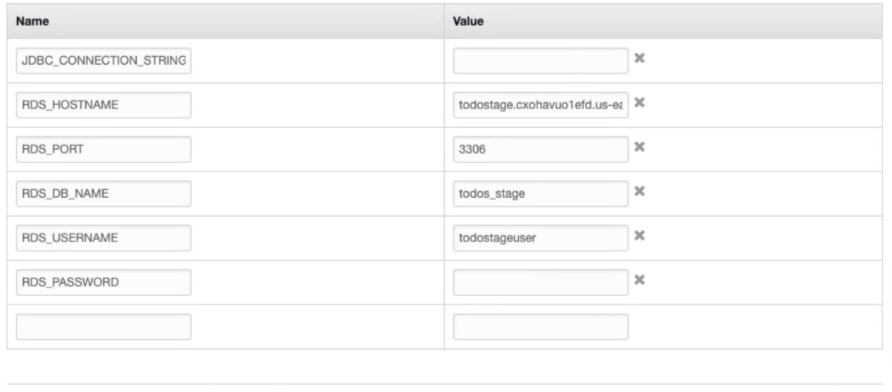

## MySQL 도커 컨테이너 생성

docker 명령어로 Docker hub에서 mysql 컨테이너 이미지를 가져오자.

```
docker pull --platform linux/amd64 mysql
```

가져온 이미지를 확인하려면 docker images(docker image ls)명령을 실행하면 된다

```
REPOSITORY   TAG       IMAGE ID       CREATED        SIZE
mysql        latest    0ef9083d9892   14 hours ago   524MB
```

MySQL 컨테이너 이미지를 컨테이너화 시켜서 로컬환경에서 도커 컨네이너를 기동시켜보자.

```
docker run --detach --env MYSQL_ROOT_PASSWORD=dummypassword --env MYSQL_USER=todos-user --env MYSQL_PASSWORD=dummytodos --env MYSQL_DATABASE=todos --name mysql --publish 3306:3306 mysql
```

> -detach(-d) 백그라운드모드 --env(-e) 환경 변수 설정
> --name 컨테이너 이름 --publish(-p) a:b 포트포워딩

실행중인 컨테이너는 docker ps 명령으로 확인가능하다

```
CONTAINER ID   IMAGE     COMMAND                  CREATED         STATUS         PORTS                               NAMES
98688576db61   mysql     "docker-entrypoint.s…"   5 minutes ago   Up 5 minutes   0.0.0.0:3306->3306/tcp, 33060/tcp   mysql
```

MySQL 컨테이너가 정상작동함을 확인할 수 있다.

MySQL-shell로 MySQL 데이터베이스 접속해보자

```
~ mysqlsh

MySQL  JS > \connect todos-user@localhost:3306

MySQL  localhost:3306 ssl  JS > \use todos
Default schema set to `todos`.

MySQL  localhost:3306 ssl  todos  JS > \sql
Switching to SQL mode... Commands end with ;

MySQL  localhost:3306 ssl  todos  SQL > SELECT * from todo;
```

```
+----+-----------------------+---------+----------------------------+-------------+
| id | description           | is_done | target_date                | user        |
+----+-----------------------+---------+----------------------------+-------------+
|  1 | Create a RDS database | 0       | 2022-06-27 15:00:00.000000 | neo |
+----+-----------------------+---------+----------------------------+-------------+
```

JPA가 만든 테이블이 정상적으로 확인되었다.

## 로컬환경에서 스프링부트 웹 어플리케이션과 MySQL 연결

스프링부트 어플리케이션 application.properties

```
spring.mvc.view.prefix=/WEB-INF/jsp/
spring.mvc.view.suffix=.jsp
logging.level.org.springframework.web=INFO

spring.jpa.show-sql=true
#spring.h2.console.enabled=true
#spring.h2.console.settings.web-allow-others=true

spring.jpa.hibernate.ddl-auto=update
spring.datasource.url=jdbc:mysql://${RDS_HOSTNAME:localhost}:${RDS_PORT:3306}/${RDS_DB_NAME:todos}
spring.datasource.username=${RDS_USERNAME:todos-user}
spring.datasource.password=${RDS_PASSWORD:dummytodos}
spring.jpa.properties.hibernate.dialect=org.hibernate.dialect.MySQL57Dialect


```

## AWS Elastic Beanstalk에 배포


AWS Beanstalk 에서 application을 생성하고 environment를 생성하자.

application -> new environment -> web server environment -> platform : Tomcat (만든 스프링부트 어플리케이션을 war로 패키징하여 배포한다) -> application code 업로드(war)

Configure more option -> database


database deletion policy는 environment를 terminate 시켰을 때 Create Snaptshot 정책으로 하면 데이터베이스의 데이터들이 snapshot으로 저장되어 복구가 가능해진다.


배포가 완료되었고 제공된 url으로 접속해보자


정상적으로 작동되고 AWS RDS database와 연결도 된것을 확인할 수 있다.

어떻게 데이터베이스와 연결할 수 있었을까?

스프링 어플리케이션의 환경설정을 전혀 바꾸지 않았는데 aws에서 데이터베이스와 연결이 되었다.

```
spring.datasource.url=jdbc:mysql://${RDS_HOSTNAME:localhost}:${RDS_PORT:3306}/${RDS_DB_NAME:todos}
spring.datasource.username=${RDS_USERNAME:todos-user}
spring.datasource.password=${RDS_PASSWORD:dummytodos}
```

RDS_USERNAME,RDS_PORT,RDS_DB_NAME,RDS_PASSWORD,RDS_HOSTNAME 모두 환경변수이다. 하지만 우리가 실제로 환경변수를 설정해주지 않았다.

스프링 어플리케이션에 환경설정 로그를 만들어 보자

```
package com.in28minutes.springboot.web;

import java.util.Arrays;
import java.util.stream.StreamSupport;

import org.slf4j.Logger;
import org.slf4j.LoggerFactory;
import org.springframework.context.event.ContextRefreshedEvent;
import org.springframework.context.event.EventListener;
import org.springframework.core.env.AbstractEnvironment;
import org.springframework.core.env.EnumerablePropertySource;
import org.springframework.core.env.Environment;
import org.springframework.core.env.MutablePropertySources;
import org.springframework.stereotype.Component;

@Component
public class EnvironmentConfigurationLogger {

	private static final Logger LOGGER = LoggerFactory.getLogger(EnvironmentConfigurationLogger.class);

	@EventListener
	public void handleContextRefresh(ContextRefreshedEvent event) {
		final Environment environment = event.getApplicationContext().getEnvironment();
		LOGGER.info("====== Environment and configuration ======");
		LOGGER.info("Active profiles: {}", Arrays.toString(environment.getActiveProfiles()));
		final MutablePropertySources sources = ((AbstractEnvironment) environment).getPropertySources();
		StreamSupport.stream(sources.spliterator(), false).filter(ps -> ps instanceof EnumerablePropertySource)
				.map(ps -> ((EnumerablePropertySource) ps).getPropertyNames()).flatMap(Arrays::stream).distinct()
				.forEach(prop -> LOGGER.info("{}", prop));// environment.getProperty(prop)
		LOGGER.info("===========================================");
	}

}
```

배포한 aws environment의 logs에서 어플리케이션 로그를 확인해보자.

/var/log/tomcat8/catalina.out 의 로그를 확인해보면 AWS Elastic Beanstalk가 어플리케이션이 실행될 때 자동으로 application.properties를 보고 우리가 설정해놓은 RDS_USERNAME 등의 환경변수를 만들어주고 동작할 수 있도록 설정해서 데이터베이스와 연결하였다.

## RDS 확인하기

AWS의 RDS에 가보면 다음과 같은 화면을 볼 수 있다.


이곳에서 새로운 데이터베이스 인스턴스를 만들 수 있고 현재 실행중인 데이터베이스 인스턴스를 확인할 수 있다. 아까 만들어진 데이터베이스 또한 확인이 가능하다.


## Security Groups

어떻게 데이터베이스 인스턴스가 웹 서버 인스턴스나 톰캣 인스턴스와 연결을 허용할 수 있을까? Security Group 덕분에 가능하다.

EC2의 인스턴스 탭에서 실행중인 인스턴스의 Security group를 확인할 수 있다.


이 웹 어플리케이션 인스턴스의 Security Group inbound rules를 보면 http 80번 포트로의 요청을 허용하는것을 확인할 수 있다.

이 어플리케이션과 연결된 데이터베이스 인스턴스의 정보를 확인하면


MySQL 3306번 포트로의 연결을 허용한다. Inbound rules의 source를 보면 sg-006d27a515ab3353b... 인데 이것은 웹 어플리케이션 인스턴스의 Security Group와 같은것을 확인할 수 있다. 따라서 데이터베이스 인스턴스는 Inbound rules 에서 허용한 Security Group을 가진 어플리케이션의 트래픽만 허용한다.

로컬 컴퓨터에서 이 데이터베이스 인스턴스에 연결하려하면 연결이 되지 않는다.


inbound rules를 나의 아이피를 허용하게 수정하면 가능해진다.


## Elastic Beanstalk 밖에서 RDS database 만들기

Elastic Beanstalk에서 environment를 만들 때 데이터베이스를 같이 만들면, 데이터베이스의 라이프사이클이 Elastic Beanstalk에 묶이게 된다. environment를 종료시키면 데이터베이스 또한 종료되게 된다. 따라서 Elastic Beanstalk 밖에 데이터베이스를 만들어야 한다.

AWS RDS 에서 새로운 데이터베이스를 만들고 웹 어플리케이션 environment에 별도로 연결해주어야 한다.

새롭게 데이터베이스와 environment를 만들고 environment properties를 수정하자.




이렇게 하고 연결을 하면 연결이 실패한다. Security Group 설정을 하지 않았기 때문이다.

environment - configuration 에서 Security group id를 찾고 해당 id를 데이터베이스 security group inbound에 추가하자.

웹 어플리케이션 인스턴스의 Security Group은 누가 만드는 것일까? Elastic beanstalk가 만들어주고 environment가 terminate 되면 삭제해준다.

그런데 Elastic beanstalk가 만들어준 security group이 RDS 의 설정에 필요해서 지울 수 없다. 이를 해결하기 위해 custom security group을 만들고 이를 이용해 inbound traffic을 설정해야 한다.


custom security group을 만들고 해당 id를 RDS의 inbound rule에 추가하자.

이제 웹 어플리케이션의 security group에 만든 custom security group을 선택하자


이제 정상 작동이 된다.

## Save Environment Configuration Feature


Environment -> Actions -> save configuration

environment에서 설정한 환경변수, security group 설정등을 저장해 다른 environment를 만들 때 이용가능

<script src="https://utteranc.es/client.js"
        repo="chojs23/comments"
        issue-term="pathname"
        theme="github-light"
        crossorigin="anonymous"
        async>
</script>
