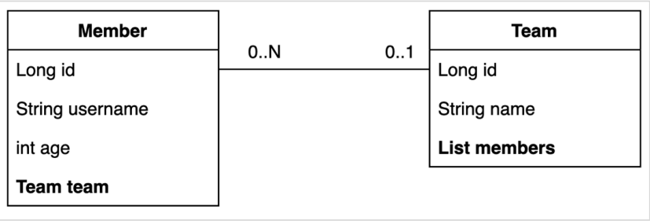

## @EntityGraph

연관된 엔티티들을 SQL 한번에 조회하는 방법



위와 같이 Member - Team 엔티티가 있을 때 member team은 지연로딩 관계이다. 따라서 다음과 같이 team의 데이터를 조회할 때 마다 쿼리가 실행된다. (N+1 문제 발생)

```
@Test
public void findMemberLazy() throws Exception {
    //given
    //member1 -> teamA
    //member2 -> teamB
    Team teamA = new Team("teamA");
    Team teamB = new Team("teamB");
    teamRepository.save(teamA);
    teamRepository.save(teamB);
    memberRepository.save(new Member("member1", 10, teamA));
    memberRepository.save(new Member("member2", 20, teamB));
    em.flush();
    em.clear();
    //when
    List<Member> members = memberRepository.findAll();
    //then
    for (Member member : members) {
      member.getTeam().getName();
    }
}
```

연관된 엔티티를 한번에 조회하려면 페치 조인이 필요하다.

JPQL 페치 조인

```
@Query("select m from Member m left join fetch m.team")
List<Member> findMemberFetchJoin();
```

스프링 데이터 JPA는 JPA가 제공하는 엔티티 그래프 기능을 편리하게 사용하게 도와준다. 이 기능을 사용하면 JPQL 없이 페치 조인을 사용할 수 있다. (JPQL + 엔티티 그래프도 가능)

EntityGraph

```
//공통 메서드 오버라이드
@Override
@EntityGraph(attributePaths = {"team"})
List<Member> findAll();
//JPQL + 엔티티 그래프
@EntityGraph(attributePaths = {"team"})
@Query("select m from Member m")
List<Member> findMemberEntityGraph();
//메서드 이름으로 쿼리에서 특히 편리하다.
@EntityGraph(attributePaths = {"team"})
List<Member> findByUsername(String username)
```

EntityGraph 정리

-   사실상 페치 조인(FETCH JOIN)의 간편 버전
-   LEFT OUTER JOIN 사용

<script src="https://utteranc.es/client.js"
        repo="chojs23/comments"
        issue-term="pathname"
        theme="github-light"
        crossorigin="anonymous"
        async>
</script>
