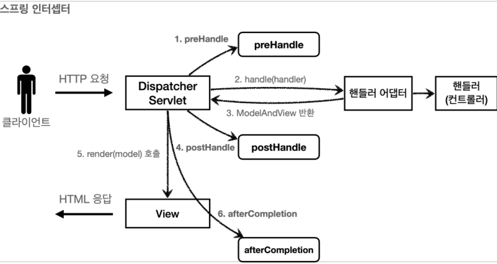
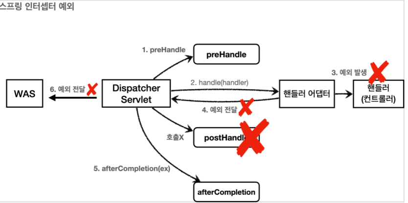

## 스프링 인터셉터

HTTP 요청 -> WAS -> 필터 -> 서블릿 -> 스프링 인터셉터 -> 컨트롤러

스프링 인터셉터는 디스패처 서블릿과 컨트롤러 사이에서 컨트롤러 호출 직전에 호출 된다.
스프링 인터셉터는 스프링 MVC가 제공하는 기능이기 때문에 결국 디스패처 서블릿 이후에 등장하게 된다.
스프링 MVC의 시작점이 디스패처 서블릿이라고 생각해보면 이해가 될 것이다.
스프링 인터셉터에도 URL 패턴을 적용할 수 있는데, 서블릿 URL 패턴과는 다르고, 매우 정밀하게 설정할
수 있다.

HTTP 요청 -> WAS -> 필터 -> 서블릿 -> 스프링 인터셉터 -> 컨트롤러 //로그인 사용자

HTTP 요청 -> WAS -> 필터 -> 서블릿 -> 스프링 인터셉터(적절하지 않은 요청이라 판단, 컨트롤러 호출
X) // 비 로그인 사용자

스프링 인터셉터 체인

HTTP 요청 -> WAS -> 필터 -> 서블릿 -> 인터셉터1 -> 인터셉터2 -> 컨트롤러

스프링 인터셉터는 체인으로 구성되는데, 중간에 인터셉터를 자유롭게 추가할 수 있다. 예를 들어서 로그를
남기는 인터셉터를 먼저 적용하고, 그 다음에 로그인 여부를 체크하는 인터셉터를 만들 수 있다.

### 스프링 인터셉터 인터페이스

스프링의 인터셉터를 사용하려면 HandlerInterceptor 인터페이스를 구현하면 된다.

```
public interface HandlerInterceptor {
  default boolean preHandle(HttpServletRequest request, HttpServletResponse
  response, Object handler) throws Exception {

  }
  default void postHandle(HttpServletRequest request, HttpServletResponse
  response,Object handler, @Nullable ModelAndView modelAndView) throws Exception {

  }
  default void afterCompletion(HttpServletRequest request, HttpServletResponse
  response,Object handler, @Nullable Exception ex) throws Exception {

  }
}
```

스프링 인터셉터의 호출 흐름



정상 흐름

- preHandle : 컨트롤러 호출 전에 호출된다. (더 정확히는 핸들러 어댑터 호출 전에 호출된다.)
  - preHandle 의 응답값이 true 이면 다음으로 진행하고, false 이면 더는 진행하지 않는다. false
    인 경우 나머지 인터셉터는 물론이고, 핸들러 어댑터도 호출되지 않는다. 그림에서 1번에서 끝이
    나버린다.
- postHandle : 컨트롤러 호출 후에 호출된다. (더 정확히는 핸들러 어댑터 호출 후에 호출된다.)
- afterCompletion : 뷰가 렌더링 된 이후에 호출된다.

스프링 인터셉터 예외 상황


afterCompletion은 예외가 발생해도 호출된다.
예외가 발생하면 postHandle() 는 호출되지 않으므로 예외와 무관하게 공통 처리를 하려면
afterCompletion() 을 사용해야 한다.
예외가 발생하면 afterCompletion() 에 예외 정보( ex )를 포함해서 호출된다.

요청 로그 인터셉터

```
@Slf4j
public class LogInterceptor implements HandlerInterceptor {
 public static final String LOG_ID = "logId";
 @Override
 public boolean preHandle(HttpServletRequest request, HttpServletResponse
response, Object handler) throws Exception {
 String requestURI = request.getRequestURI();
 String uuid = UUID.randomUUID().toString();
 request.setAttribute(LOG_ID, uuid);
 //@RequestMapping: HandlerMethod
 //정적 리소스: ResourceHttpRequestHandler
 if (handler instanceof HandlerMethod) {
 HandlerMethod hm = (HandlerMethod) handler; //호출할 컨트롤러 메서드의
모든 정보가 포함되어 있다.
 }
 log.info("REQUEST [{}][{}][{}]", uuid, requestURI, handler);
 return true; //false 진행X
 }
 @Override
 public void postHandle(HttpServletRequest request, HttpServletResponse
response, Object handler, ModelAndView modelAndView) throws Exception {
 log.info("postHandle [{}]", modelAndView);
 }
 @Override
 public void afterCompletion(HttpServletRequest request, HttpServletResponse
response, Object handler, Exception ex) throws Exception {
 String requestURI = request.getRequestURI();
 String logId = (String)request.getAttribute(LOG_ID);
 log.info("RESPONSE [{}][{}]", logId, requestURI);
 if (ex != null) {
 log.error("afterCompletion error!!", ex);
 }
 }
}
```

WebConfig - 인터셉터 등록

```
@Configuration
public class WebConfig implements WebMvcConfigurer {
 @Override
 public void addInterceptors(InterceptorRegistry registry) {
 registry.addInterceptor(new LogInterceptor())
 .order(1)
 .addPathPatterns("/**")
 .excludePathPatterns("/css/**", "/*.ico", "/error");
 }
 //...
}
```

registry.addInterceptor(new LogInterceptor()) : 인터셉터를 등록한다.
order(1) : 인터셉터의 호출 순서를 지정한다. 낮을 수록 먼저 호출된다.
addPathPatterns("/\*\*") : 인터셉터를 적용할 URL 패턴을 지정한다.
excludePathPatterns("/css/\*\*", "/\*.ico", "/error") : 인터셉터에서 제외할 패턴을 지정한다.

인터셉터를 이용해 로그인 체크 기능을 개발해보자.

LoginCheckInterceptor

```
@Slf4j
public class LoginCheckInterceptor implements HandlerInterceptor {
  @Override
  public boolean preHandle(HttpServletRequest request, HttpServletResponse response, Object handler) throws Exception {
      String requestURI = request.getRequestURI();
      log.info("인증 체크 인터셉터 실행 {}", requestURI);
      HttpSession session = request.getSession(false);
      if (session == null || session.getAttribute(SessionConst.LOGIN_MEMBER)== null) {
          log.info("미인증 사용자 요청");
          //로그인으로 redirect
          response.sendRedirect("/login?redirectURL=" + requestURI);
          return false;
      }
      return true;
  }
}
```

```
@Configuration
public class WebConfig implements WebMvcConfigurer {
    @Override
    public void addInterceptors(InterceptorRegistry registry) {
        registry.addInterceptor(new LogInterceptor())
        .order(1)
        .addPathPatterns("/**")
        .excludePathPatterns("/css/**", "/*.ico", "/error");
        registry.addInterceptor(new LoginCheckInterceptor())
        .order(2)
        .addPathPatterns("/**")
        .excludePathPatterns(
        "/", "/members/add", "/login", "/logout",
        "/css/**", "/*.ico", "/error"
        );
    }
    //...
}
```
