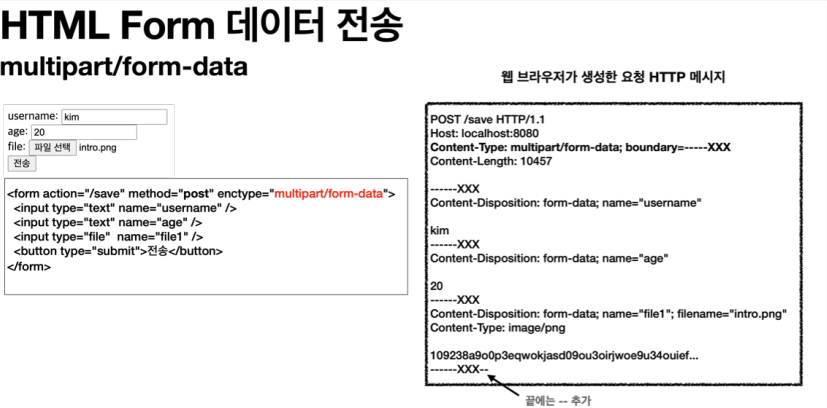

## 파일 업로드

먼저 HTML 폼을 전송하는 다음 두 가지 방식의 차이를 알아보자.

HTML 폼 전송 방식

-   application/x-www-form-urlencoded
-   multipart/form-data

application/x-www-form-urlencoded 방식은 HTML 폼 데이터를 서버로 전송하는 가장 기본적인 방법이다. Form 태그에 별도의 enctype 옵션이 없으면 웹 브라우저는 요청 HTTP 메시지의 헤더에 다음 내용을 추가한다.

Content-Type: application/x-www-form-urlencoded

그리고 폼에 입력한 전송할 항목을 HTTP Body에 문자로 username=kim&age=20 와 같이 & 로 구분해서 전송한다

파일을 업로드 하려면 파일은 문자가 아니라 바이너리 데이터를 전송해야 한다. 문자를 전송하는 이 방식으로 파일을 전송하기는 어렵다. 그리고 또 한가지 문제가 더 있는데, 보통 폼을 전송할 때 파일만 전송하는 것이 아니라는 점이다.

예를들어, 첨부파일과 첨부파일을 올린 사용자의 이름을 같이 전송한다고 하면 이름은 문자로 전송하고 첨부파일은 바이너리 데이터로 전송해야 한다. **문자**와 **바이너리**를 동시에 전송해야 하는 문제가 있다.

이 문제를 해결하기 위해 HTTP는 multipart/form-data 라는 전송 방식을 제공한다.



multipart/form-data 방식은 다른 종류의 여러 파일과 폼의 내용 함께 전송할 수 있다.

폼의 입력 결과로 생성된 HTTP 메시지를 보면 각각의 전송 항목이 구분이 되어있다(boundary=-----XXX).
ContentDisposition 이라는 항목별 헤더가 추가되어 있고 여기에 부가 정보가 있다. 예제에서는 username , age , file1 이 각각 분리되어 있고, 폼의 일반 데이터는 각 항목별로 문자가 전송되고, 파일의 경우 파일 이름과 Content-Type이 추가되고 바이너리 데이터가 전송된다.

spring.servlet.multipart.enabled=true (기본 true)

이 옵션을 켜면 스프링 부트는 서블릿 컨테이너에게 멀티파트 데이터를 처리하라고 설정한다. 참고로 기본 값은 true 이다.

<br>

<hr>

multipart를 이용하여 실제 파일을 서버에 올려보자.

application.properties

file.dir=/Users/neo/study/file/

Controller

```
@Slf4j
@Controller
@RequestMapping("/servlet/v2")
public class ServletUploadControllerV2 {
  @Value("${file.dir}") //application.properties 에서 설정한 file.dir 의 값을 주입한다.
  private String fileDir;

  @GetMapping("/upload")
  public String newFile() {
    return "upload-form";
  }

  @PostMapping("/upload")
  public String saveFileV1(HttpServletRequest request) throws ServletException, IOException {
    log.info("request={}", request);
    String itemName = request.getParameter("itemName");
    log.info("itemName={}", itemName);
    Collection<Part> parts = request.getParts();
    log.info("parts={}", parts);

    for (Part part : parts) {
      log.info("==== PART ====");
      log.info("name={}", part.getName());
      Collection<String> headerNames = part.getHeaderNames();
      for (String headerName : headerNames) {
        log.info("header {}: {}", headerName, part.getHeader(headerName));
      }

      //편의 메서드
      //content-disposition: filename
      log.info("submittedFileName={}", part.getSubmittedFileName());
      log.info("size={}", part.getSize()); //part body size

      //데이터 읽기
      InputStream inputStream = part.getInputStream();
      String body = StreamUtils.copyToString(inputStream, StandardCharsets.UTF_8);
      log.info("body={}", body);

      //파일에 저장하기
      if (StringUtils.hasText(part.getSubmittedFileName())) {
        String fullPath = fileDir + part.getSubmittedFileName();
        log.info("파일 저장 fullPath={}", fullPath);
        part.write(fullPath);
      }
    }
    return "upload-form";
  }
}
```

멀티파트 형식은 전송 데이터를 하나하나 각각 부분( Part )으로 나누어 전송한다. parts 에는 이렇게 나누어진 데이터가 각각 담긴다.
서블릿이 제공하는 Part 는 멀티파트 형식을 편리하게 읽을 수 있는 다양한 메서드를 제공한다.

Part 주요 메서드

-   part.getSubmittedFileName() : 클라이언트가 전달한 파일명
-   part.getInputStream(): Part의 전송 데이터를 읽을 수 있다.
-   part.write(...): Part를 통해 전송된 데이터를 저장할 수 있다.

<hr>
다음 내용을 전송해보자.

itemName : 상품A
file : 스크릿샷.png

결과 로그

```
==== PART ====
name=itemName
header content-disposition: form-data; name="itemName"
submittedFileName=null
size=7
body=상품A
==== PART ====
name=file
header content-disposition: form-data; name="file"; filename="스크린샷.png"
header content-type: image/png
submittedFileName=스크린샷.png
size=112384
body=qwlkjek2ljlese...
파일 저장 fullPath=/Users/neo/study/file/스크린샷.png
```

서블릿이 제공하는 Part 는 편하기는 하지만, HttpServletRequest 를 사용해야 하고, 추가로 파일
부분만 구분하려면 여러가지 코드를 넣어야 한다.
이번에는 스프링이 이 부분을 얼마나 편리하게 제공하는지 확인해보자.

<br>
<hr>

### 스프링 파일 업로드

스프링은 MultipartFile 이라는 인터페이스로 멀티파트 파일을 매우 편리하게 지원한다.

```
@Slf4j
@Controller
@RequestMapping("/spring")
public class SpringUploadController {
  @Value("${file.dir}")
  private String fileDir;


  @GetMapping("/upload")
  public String newFile() {
    return "upload-form";
  }


  @PostMapping("/upload")
  public String saveFile(@RequestParam String itemName,@RequestParam MultipartFile file,
   HttpServletRequest request) throws IOException {
    log.info("request={}", request);
    log.info("itemName={}", itemName);
    log.info("multipartFile={}", file);
    if (!file.isEmpty()) {
    String fullPath = fileDir + file.getOriginalFilename();
    log.info("파일 저장 fullPath={}", fullPath);
    file.transferTo(new File(fullPath));
  }
    return "upload-form";
  }
}
```

@RequestParam MultipartFile file
업로드하는 HTML Form의 name에 맞추어 @RequestParam 을 적용하면 된다.
추가로@ModelAttribute 에서도 MultipartFile 을 동일하게 사용할 수 있다.

실행 로그

```
request=org.springframework.web.multipart.support.StandardMultipartHttpServletRequest@5c022dc6
itemName=상품A
multipartFile=org.springframework.web.multipart.support.StandardMultipartHttpServletRequest$StandardMultipartFile@274ba730
파일 저장 fullPath=/Users/neo/study/file/스크린샷.png
```

<br>
<hr>
#### 업로드,다운로드 예제

요구사항

-   상품을 관리
    -   상품 이름
    -   첨부파일 하나
    -   이미지 파일 여러개
-   첨부파일을 업로드 다운로드 할 수 있다.
-   업로드한 이미지를 웹 브라우저에서 확인할 수 있다.

Item - 상품 도메인

```
@Data
public class Item {
 private Long id;
 private String itemName;
 private UploadFile attachFile;
 private List<UploadFile> imageFiles;
}
```

ItemForm

```
@Data
public class ItemForm {
 private Long itemId;
 private String itemName;
 private List<MultipartFile> imageFiles;
 private MultipartFile attachFile;
}
```

List\<MultipartFile> imageFiles : 이미지를 다중 업로드 하기 위해 MultipartFile 를 사용했다.
MultipartFile attachFile : 멀티파트는 @ModelAttribute 에서 사용할 수 있다.

ItemRepository

```
@Repository
public class ItemRepository {
  private final Map<Long, Item> store = new HashMap<>();
  private long sequence = 0L;

  public Item save(Item item) {
    item.setId(++sequence);
    store.put(item.getId(), item);
    return item;
  }

  public Item findById(Long id) {
    return store.get(id);
  }
}
```

UploadFile - 업로드 파일 정보 보관

```
@Data
public class UploadFile {
  private String uploadFileName;
  private String storeFileName;
  public UploadFile(String uploadFileName, String storeFileName) {
    this.uploadFileName = uploadFileName;
    this.storeFileName = storeFileName;
  }
}
```

uploadFileName : 고객이 업로드한 파일명
storeFileName : 서버 내부에서 관리하는 파일명

고객이 업로드한 파일명으로 서버 내부에 파일을 저장하면 안된다. 왜냐하면 서로 다른 고객이 같은 파일이름을 업로드 하는 경우 기존 파일 이름과 충돌이 날 수 있다.
서버에서는 저장할 파일명이 겹치지 않도록 내부에서 관리하는 별도의 파일명이 필요하다.

```
@Component
public class FileStore {
    @Value("${file.dir}")
    private String fileDir;

    public String getFullPath(String filename) {
    return fileDir + filename;
  }


  public List<UploadFile> storeFiles(List<MultipartFile> multipartFiles)
  throws IOException {
    List<UploadFile> storeFileResult = new ArrayList<>();
    for (MultipartFile multipartFile : multipartFiles) {
      if (!multipartFile.isEmpty()) {
        storeFileResult.add(storeFile(multipartFile));
      }
    }
    return storeFileResult;
  }


  public UploadFile storeFile(MultipartFile multipartFile) throws IOException
  {
    if (multipartFile.isEmpty()) {
      return null;
    }
    String originalFilename = multipartFile.getOriginalFilename();
    String storeFileName = createStoreFileName(originalFilename);
    multipartFile.transferTo(new File(getFullPath(storeFileName)));
    return new UploadFile(originalFilename, storeFileName);
  }

  private String createStoreFileName(String originalFilename) {
    String ext = extractExt(originalFilename);
    String uuid = UUID.randomUUID().toString();
    return uuid + "." + ext;
  }

  //파일 확장자 꺼내기
  private String extractExt(String originalFilename) {
    int pos = originalFilename.lastIndexOf(".");
    return originalFilename.substring(pos + 1);
  }
}
```

createStoreFileName() : 서버 내부에서 관리하는 파일명은 유일한 이름을 생성하는 UUID 를 사용해서 충돌하지 않도록 한다.
extractExt() : 확장자를 별도로 추출해서 서버 내부에서 관리하는 파일명에도 붙여준다. 예를 들어서 고객이 a.png 라는 이름으로 업로드 하면 51041c62-86e4-4274-801d-614a7d994edb.png 와 같이 저장한다.

Controller

```
@Slf4j
@Controller
@RequiredArgsConstructor
public class ItemController {
  private final ItemRepository itemRepository;
  private final FileStore fileStore;

  @GetMapping("/items/new")
  public String newItem(@ModelAttribute ItemForm form) {
    return "item-form";
  }

  @PostMapping("/items/new")
  public String saveItem(@ModelAttribute ItemForm form, RedirectAttributes redirectAttributes) throws IOException {
    UploadFile attachFile = fileStore.storeFile(form.getAttachFile());
    List<UploadFile> storeImageFiles =
    fileStore.storeFiles(form.getImageFiles());
    //데이터베이스에 저장
    Item item = new Item();
    item.setItemName(form.getItemName());
    item.setAttachFile(attachFile);
    item.setImageFiles(storeImageFiles);
    itemRepository.save(item);
    redirectAttributes.addAttribute("itemId", item.getId());
    return "redirect:/items/{itemId}";
  }

  @GetMapping("/items/{id}")
  public String items(@PathVariable Long id, Model model) {
    Item item = itemRepository.findById(id);
    model.addAttribute("item", item);
    return "item-view";
  }

  @ResponseBody
  @GetMapping("/images/{filename}")
  public Resource downloadImage(@PathVariable String filename) throws MalformedURLException {
    return new UrlResource("file:" + fileStore.getFullPath(filename));
  }

  //@ResponseBody 써도됨
  @GetMapping("/attach/{itemId}")
  public ResponseEntity<Resource> downloadAttach(@PathVariable Long itemId) throws MalformedURLException {
    Item item = itemRepository.findById(itemId);
    String storeFileName = item.getAttachFile().getStoreFileName();
    String uploadFileName = item.getAttachFile().getUploadFileName();

    UrlResource resource = new UrlResource("file:" + fileStore.getFullPath(storeFileName));
    log.info("uploadFileName={}", uploadFileName);
    String encodedUploadFileName = UriUtils.encode(uploadFileName, StandardCharsets.UTF_8);
    String contentDisposition = "attachment; filename=\"" + encodedUploadFileName + "\"";

    return ResponseEntity.ok()
    .header(HttpHeaders.CONTENT_DISPOSITION, contentDisposition)
    .body(resource);
  }
}
```

@GetMapping("/images/{filename}") : \ 태그로 이미지를 조회할 때 사용한다. UrlResource 로 이미지 파일을 읽어서 @ResponseBody 로 이미지 바이너리를 반환한다.

@GetMapping("/attach/{itemId}") : 파일을 다운로드 할 때 실행한다. 예제를 더 단순화 할 수 있지만,
파일 다운로드 시 권한 체크같은 복잡한 상황까지 가정한다 생각하고 이미지 id 를 요청하도록 했다.

파일을 다운로드 하기 위해서는 헤더에 Content-Disposition을 넣어줘야한다.
파일 다운로드시에는 고객이 업로드한 파일 이름으로 다운로드 하는게 좋다.
이때는 Content-Disposition해더에 attachment; filename="업로드 파일명" 값을 주면 된다.

등록 폼 뷰

resources/templates/item-form.html

```
<!DOCTYPE HTML>
<html xmlns:th="http://www.thymeleaf.org">
<head>
 <meta charset="utf-8">
</head>
<body>
<div class="container">
 <div class="py-5 text-center">
  <h2>상품 등록</h2>
 </div>
 <form th:action method="post" enctype="multipart/form-data">
  <ul>
    <li>상품명 <input type="text" name="itemName"></li>
    <li>첨부파일<input type="file" name="attachFile" ></li>
    <li>이미지 파일들<input type="file" multiple="multiple"
    name="imageFiles" ></li>
  </ul>
  <input type="submit"/>
 </form>
</div> <!-- /container -->
</body>
</html>
```

다중 파일 업로드를 하려면 multiple="multiple" 옵션을 주면 된다.
ItemForm 의 다음 코드에서 여러 이미지 파일을 받을 수 있다.
private List\<MultipartFile> imageFiles;

조회 뷰

resources/templates/item-view.html

```
<!DOCTYPE HTML>
<html xmlns:th="http://www.thymeleaf.org">
<head>
 <meta charset="utf-8">
</head>
<body>
<div class="container">
 <div class="py-5 text-center">
  <h2>상품 조회</h2>
 </div>
 상품명: <span th:text="${item.itemName}">상품명</span><br/>
 첨부파일: <a th:if="${item.attachFile}" th:href="|/attach/${item.id}|"
              th:text="${item.getAttachFile().getUploadFileName()}" /><br/>
 

</div> <!-- /container -->
</body>
</html>
```

<script src="https://utteranc.es/client.js"
        repo="chojs23/comments"
        issue-term="pathname"
        theme="github-light"
        crossorigin="anonymous"
        async>
</script>
