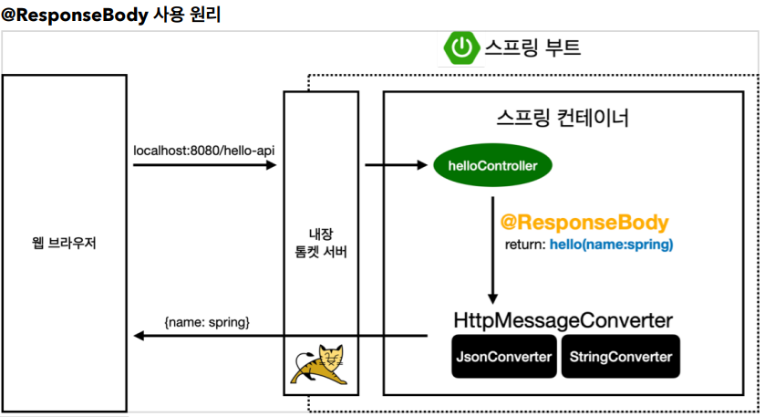
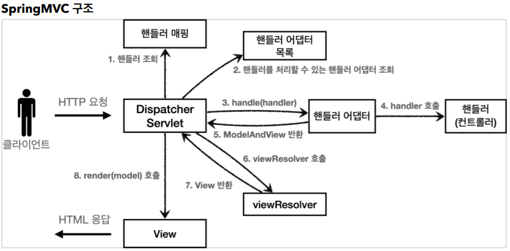
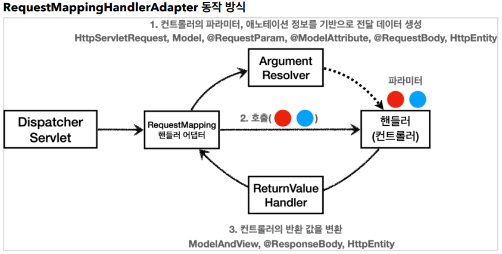
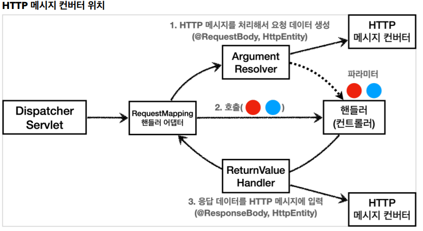

## HTTP 메시지 컨버터

뷰 템플릿으로 HTML을 생성해서 응답하는 것이 아니라, HTTP API처럼 JSON 데이터를 HTTP 메시지 바디에서 직접 읽거나 쓰는 경우 HTTP 메시지 컨버터를 사용하면 편리하다.



- @ResponseBody 를 사용
  - HTTP의 BODY에 문자 내용을 직접 반환
  - viewResolver 대신에 **HttpMessageConverter** 가 동작
  - 기본 문자처리: StringHttpMessageConverter
  - 기본 객체처리: MappingJackson2HttpMessageConverter
  - byte 처리 등등 기타 여러 HttpMessageConverter가 기본으로 등록되어 있음

<br>

스프링 MVC는 다음의 경우에 HTTP 메시지 컨버터를 적용한다.

HTTP 요청: @RequestBody , HttpEntity(RequestEntity)
HTTP 응답: @ResponseBody , HttpEntity(ResponseEntity)

HTTP 메시지 컨버터 인터페이스

```
org.springframework.http.converter.HttpMessageConverter
package org.springframework.http.converter;
public interface HttpMessageConverter<T> {
    boolean canRead(Class<?> clazz, @Nullable MediaType mediaType);
    boolean canWrite(Class<?> clazz, @Nullable MediaType mediaType);
    List<MediaType> getSupportedMediaTypes();
    T read(Class<? extends T> clazz, HttpInputMessage inputMessage) throws IOException, HttpMessageNotReadableException;

    void write(T t, @Nullable MediaType contentType, HttpOutputMessage
    outputMessage) throws IOException, HttpMessageNotWritableException;
}
```

canRead() , canWrite() : 메시지 컨버터가 해당 클래스, 미디어타입을 지원하는지 체크

read() , write() : 메시지 컨버터를 통해서 메시지를 읽고 쓰는 기능

<br>
<hr>

### 스프링 부트 기본 메시지 컨버터

- 0 = ByteArrayHttpMessageConverter -> byte[] 데이터 처리
  - 클래스 타입: byte[] , 미디어타입: \*/\*
- 1 = StringHttpMessageConverter -> String 문자로 데이터를 처리
  - 클래스 타입: String , 미디어타입: \*/\*
- 2 = MappingJackson2HttpMessageConverter -> application/json
  - 클래스 타입: 객체 또는 HashMap , 미디어타입 application/json 관련

스프링 부트는 다양한 메시지 컨버터를 제공하는데, 대상 클래스 타입과 미디어 타입 둘을 체크해서 사용여부를 결정한다. 만약 만족하지 않으면 다음 메시지 컨버터로 우선순위가 넘어간다.

HTTP 요청 데이터 읽기

- HTTP 요청이 오고, 컨트롤러에서 @RequestBody , HttpEntity 파라미터를 사용한다.
- 메시지 컨버터가 메시지를 읽을 수 있는지 확인하기 위해 canRead() 를 호출한다.
  - 대상 클래스 타입을 지원하는가.
    - 예) @RequestBody 의 대상 클래스 ( byte[] , String , HelloData )
  - HTTP 요청의 Content-Type 미디어 타입을 지원하는가.
    - 예) text/plain , application/json , \*/\*
- canRead() 조건을 만족하면 read() 를 호출해서 객체 생성하고, 반환한다.

<br>
HTTP 응답 데이터 생성

- 컨트롤러에서 @ResponseBody , HttpEntity 로 값이 반환된다.
- 메시지 컨버터가 메시지를 쓸 수 있는지 확인하기 위해 canWrite() 를 호출한다.
  - 대상 클래스 타입을 지원하는가.
    - 예) return의 대상 클래스 ( byte[] , String , HelloData )
  - HTTP 요청의 Accept 미디어 타입을 지원하는가.(더 정확히는 @RequestMapping 의 produces)
    - 예) text/plain , application/json , \*/\*
- canWrite() 조건을 만족하면 write() 를 호출해서 HTTP 응답 메시지 바디에 데이터를 생성한다.

<br>
<hr>

### 요청 매핑 헨들러 어뎁터 구조

HTTP 메시지 컨버터는 스프링 MVC 어디쯤에서 사용되는 것일까?




<br>

**ArgumentResolver**

생각해보면, 애노테이션 기반의 컨트롤러는 매우 다양한 파라미터를 사용할 수 있었다.
HttpServletRequest , Model 은 물론이고, @RequestParam , @ModelAttribute 같은 애노테이션
그리고 @RequestBody , HttpEntity 같은 HTTP 메시지를 처리하는 부분까지 매우 큰 유연함을
보여주었다.
이렇게 파라미터를 유연하게 처리할 수 있는 이유가 바로 ArgumentResolver 덕분이다.

애노테이션 기반 컨트롤러를 처리하는 RequestMappingHandlerAdaptor 는 ArgumentResolver 를 호출해서 컨트롤러(핸들러)가 필요로 하는 다양한 파라미터의 값(객체)을 생성한다.

그리고 이렇게 파리미터의 값이 모두 준비되면 컨트롤러를 호출하면서 값을 넘겨준다.

**ReturnValueHandler**

HandlerMethodReturnValueHandler 를 줄여서 ReturnValueHandle 라 부른다.
ArgumentResolver 와 비슷한데, 이것은 응답 값을 변환하고 처리한다.
컨트롤러에서 String으로 뷰 이름을 반환해도, 동작하는 이유가 바로 ReturnValueHandler 덕분이다.

<br>
<hr>



요청의 경우 @RequestBody 를 처리하는 ArgumentResolver 가 있고, HttpEntity 를 처리하는
ArgumentResolver 가 있다. 이 ArgumentResolver 들이 HTTP 메시지 컨버터를 사용해서 필요한
객체를 생성하는 것이다.

응답의 경우 @ResponseBody 와 HttpEntity 를 처리하는 ReturnValueHandler 가 있다. 그리고
여기에서 HTTP 메시지 컨버터를 호출해서 응답 결과를 만든다.

<script src="https://utteranc.es/client.js"
        repo="chojs23/comments"
        issue-term="pathname"
        theme="github-dark"
        crossorigin="anonymous"
        async>
</script>
