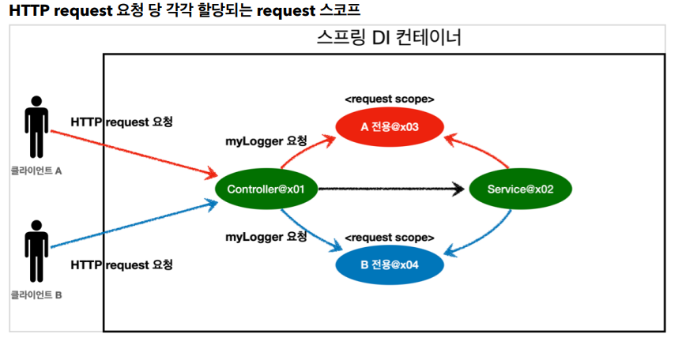
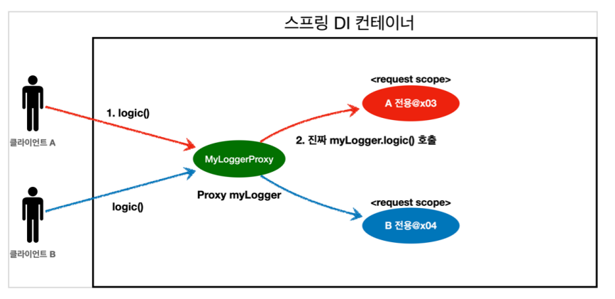

## 빈 스코프

지금까지 우리는 스프링 빈이 스프링 컨테이너의 시작과 함께 생성되어서 스프링 컨테이너가 종료될 때 까지 유지된다고 학습했다. 이것은 스프링 빈이 기본적으로 싱글톤 스코프로 생성되기 때문이다. 스코프는 빈이 존재할 수 있는 범위를 뜻한다.

스프링은 다음과 같은 다양한 스코프를 지원한다.

- 싱글톤: 기본 스코프, 스프링 컨테이너의 시작과 종료까지 유지되는 가장 넓은 범위의 스코프이다.
- 프로토타입: 스프링 컨테이너는 프로토타입 빈의 생성과 의존관계 주입까지만 관여하고 더는 관리하지 않는 매우 짧은 범위의 스코프이다.
- 웹 관련 스코프
  request: 웹 요청이 들어오고 나갈때 까지 유지되는 스코프이다.
  session: 웹 세션이 생성되고 종료될 때 까지 유지되는 스코프이다.
  application: 웹의 서블릿 컨텍스트와 같은 범위로 유지되는 스코프이다.

컴포넌트 스캔 자동 등록

```
@Scope("prototype")
@Component
public class HelloBean {}
```

수동 등록

```
@Scope("prototype")
@Bean
PrototypeBean HelloBean() {
 return new HelloBean();
}
```

### 프로토타입 스코프

싱글톤 스코프의 빈을 조회하면 스프링 컨테이너는 **항상 같은 인스턴스**의 스프링 빈을 반환한다. 반면에 프로토타입 스코프를 스프링 컨테이너에 조회하면 스프링 컨테이너는 **항상 새로운 인스턴스**를 생성해서 반환한다.

또한 프로토타입 스코프의 빈은 **스프링 컨테이너가 프로토타입 빈을 생성하고, 의존관계 주입, 초기화까지만 처리**한다는 것이다. 클라이언트에 빈을 반환하고, 이후 스프링 컨테이너는 생성된 프로토타입 빈을 관리하지 않는다.
프로토타입 빈을 관리할 책임은 프로토타입 빈을 받은 클라이언트에 있다. 그래서 @PreDestroy 같은 종료 메서드가 호출되지 않는다.

싱글톤 빈은 스프링 컨테이너 생성 시점에 초기화 메서드가 실행 되지만, 프로토타입 스코프의 빈은 스프링 컨테이너에서 빈을 조회할 때 생성되고, 초기화 메서드도 실행된다.

프로토타입 빈의 특징 정리

- 스프링 컨테이너에 요청할 때 마다 새로 생성된다.
- 스프링 컨테이너는 프로토타입 빈의 생성과 의존관계 주입 그리고 초기화까지만 관여한다.
- 종료 메서드가 호출되지 않는다.
- 그래서 프로토타입 빈은 프로토타입 빈을 조회한 클라이언트가 관리해야 한다. 종료 메서드에 대한 호출도 클라이언트가 직접 해야한다.

<br>
<hr>

### Provider

싱글톤 빈과 프로토타입 빈을 함께 사용할 때, Provider을 쓰면 사용할 때 마다 항상 새로운 프로토타입 빈을 생성할 수 있다.

#### ObjectProvider

```
@Autowired
private ObjectProvider<PrototypeBean> prototypeBeanProvider;

public int logic() {
PrototypeBean prototypeBean = prototypeBeanProvider.getObject();
prototypeBean.addCount();
int count = prototypeBean.getCount();
return count;
}
```

prototypeBeanProvider.getObject() 을 통해서 항상 새로운 프로토타입 빈이 생성

ObjectProvider 의 getObject() 를 호출하면 내부에서는 스프링 컨테이너를 통해 해당 빈을 찾아서 반환한다. (**DL**) (의존관계를 외부에서 주입(DI) 받는게 아니라 직접 필요한 의존관계를 찾는 것을 Dependency Lookup (DL) 의존관계 조회라 한다)

#### JSR-330 Provider

javax.inject.Provider 라는 JSR-330 자바 표준을 사용
이 방법을 사용하려면 javax.inject:javax.inject:1 라이브러리를 gradle에 추가해야 한다.

```
package javax.inject;
public interface Provider<T> {
 T get();
}
```

```
@Autowired
private Provider<PrototypeBean> provider;
public int logic() {
  PrototypeBean prototypeBean = provider.get();
  prototypeBean.addCount();
  int count = prototypeBean.getCount();
  return count;
}
```

provider 의 get() 을 호출하면 내부에서는 스프링 컨테이너를 통해 해당 빈을 찾아서 반환한다. (DL)
<br>

<hr>

### 웹 스코프

웹 스코프는 웹 환경에서만 동작한다.
웹 스코프는 프로토타입과 다르게 스프링이 해당 스코프의 종료시점까지 관리한다. 따라서 종료 메서드가 호출된다.

스코프 종류

- request: HTTP 요청 하나가 들어오고 나갈 때 까지 유지되는 스코프, 각각의 HTTP 요청마다 별도의 빈 인스턴스가 생성되고, 관리된다.
- session: HTTP Session과 동일한 생명주기를 가지는 스코프
- application: 서블릿 컨텍스트( ServletContext )와 동일한 생명주기를 가지는 스코프
- websocket: 웹 소켓과 동일한 생명주기를 가지는 스코프



MyLogger

```
@Component
@Scope(value = "request")
public class MyLogger {
  private String uuid;
  private String requestURL;

  public void setRequestURL(String requestURL) {
    this.requestURL = requestURL;
  }

  public void log(String message) {
    System.out.println("[" + uuid + "]" + "[" + requestURL + "] " + message);
  }

  @PostConstruct
  public void init() {
    uuid = UUID.randomUUID().toString();
    System.out.println("[" + uuid + "] request scope bean create:" + this);
  }
  @PreDestroy
  public void close() {
    System.out.println("[" + uuid + "] request scope bean close:" + this);
  }
}
```

@Scope(value = "request") 를 사용해서 request 스코프로 지정했다. 이제 이 빈은 HTTP 요청 당 하나씩 생성되고, HTTP 요청이 끝나는 시점에 소멸된다.

Controller

```
@Controller
@RequiredArgsConstructor
public class LogDemoController {
  private final LogDemoService logDemoService;
  private final MyLogger myLogger;

  @RequestMapping("log-demo")
  @ResponseBody
  public String logDemo(HttpServletRequest request) {
    String requestURL = request.getRequestURL().toString();
    myLogger.setRequestURL(requestURL);
    myLogger.log("controller test");
    logDemoService.logic("testId");
    return "OK";
  }
}
```

Service

```
@Service
@RequiredArgsConstructor
public class LogDemoService {
  private final MyLogger myLogger;
  public void logic(String id) {
    myLogger.log("service id = " + id);
  }
}
```

기대하는 출력

```
[d06b992f...] request scope bean create
[d06b992f...][http://localhost:8080/log-demo] controller test
[d06b992f...][http://localhost:8080/log-demo] service id = testId
[d06b992f...] request scope bean close
```

실제는 기대와 다르게 애플리케이션 실행 시점에 오류 발생

```
Error creating bean with name 'myLogger': Scope 'request' is not active for the
current thread; consider defining a scoped proxy for this bean if you intend to refer to it from a singleton;
```

스프링 애플리케이션을 실행하는 시점에 싱글톤 빈은 생성해서 주입이 가능하지만, request 스코프 빈은 아직 생성되지 않는다. 이 빈은 실제 고객의 요청이 와야 생성할 수 있다.

이와 같은 문제를 해결 하기 위해 **Provider, Proxy** 를 쓸 수 있다.

### 스코프와 Provider

Controller

```
@Controller
@RequiredArgsConstructor
public class LogDemoController {
  private final LogDemoService logDemoService;

  private final ObjectProvider<MyLogger> myLoggerProvider;

  @RequestMapping("log-demo")
  @ResponseBody
  public String logDemo(HttpServletRequest request) {
    String requestURL = request.getRequestURL().toString();
    myLogger.setRequestURL(requestURL);
    myLogger.log("controller test");
    logDemoService.logic("testId");
    return "OK";
  }
}
```

Service

```
@Service
@RequiredArgsConstructor
public class LogDemoService {
  private final ObjectProvider<MyLogger> myLoggerProvider;
  public void logic(String id) {
    myLogger.log("service id = " + id);
  }
}
```

main() 메서드로 스프링을 실행하고, 웹 브라우저에 http://localhost:8080/log-demo 를 입력하자.

```
[d06b992f...] request scope bean create
[d06b992f...][http://localhost:8080/log-demo] controller test
[d06b992f...][http://localhost:8080/log-demo] service id = testId
[d06b992f...] request scope bean close
```

ObjectProvider 덕분에 ObjectProvider.getObject() 를 호출하는 시점까지 request scope 빈의 생성을 지연할 수 있다.

ObjectProvider.getObject() 를 LogDemoController , LogDemoService 에서 각각 한번씩 따로 호출해도 같은 HTTP 요청이면 같은 스프링 빈이 반환된다!

<br>
<hr>

### 스코프와 프록시

```
@Component
@Scope(value = "request", proxyMode = ScopedProxyMode.TARGET_CLASS)
public class MyLogger {
}
```

proxyMode = ScopedProxyMode.TARGET_CLASS 를 추가

이렇게 하면 MyLogger의 가짜 프록시 클래스를 만들어두고 HTTP request와 상관 없이 가짜 프록시 클래스를 다른 빈에 미리 주입해 둘 수 있다.

실행해보면 Provider를 쓸 때와 결과가 같다.

프록시모드는 CGLIB라는 라이브러리로 내 클래스를 상속 받은 가짜 프록시 객체를 만들어서 주입한다.

결과를 확인해보면 우리가 등록한 순수한 MyLogger 클래스가 아니라 MyLogger$
$EnhancerBySpringCGLIB 이라는 클래스로 만들어진 객체가 대신 등록된 것을 확인할 수 있다.

그리고 스프링 컨테이너에 "myLogger"라는 이름으로 진짜 대신에 이 가짜 프록시 객체를 등록한다.

그래서 의존관계 주입도 이 가짜 프록시 객체가 주입된다



가짜 프록시 객체는 요청이 오면 그때 내부에서 진짜 빈을 요청하는 위임 로직이 들어있다.

가짜 프록시 객체는 실제 request scope와는 관계가 없다. 그냥 가짜이고, 내부에 단순한 위임 로직만 있고, 싱글톤 처럼 동작한다.

특징 정리

- 프록시 객체 덕분에 클라이언트는 마치 싱글톤 빈을 사용하듯이 편리하게 request scope를 사용할 수 있다.
- 사실 Provider를 사용하든, 프록시를 사용하든 핵심 아이디어는 진짜 객체 조회를 꼭 필요한 시점까지 지연처리 한다는 점이다.
- 단지 애노테이션 설정 변경만으로 원본 객체를 프록시 객체로 대체할 수 있다. 이것이 바로 다형성과 DI 컨테이너가 가진 큰 강점이다.

<script src="https://utteranc.es/client.js"
        repo="chojs23/comments"
        issue-term="pathname"
        theme="github-dark"
        crossorigin="anonymous"
        async>
</script>
