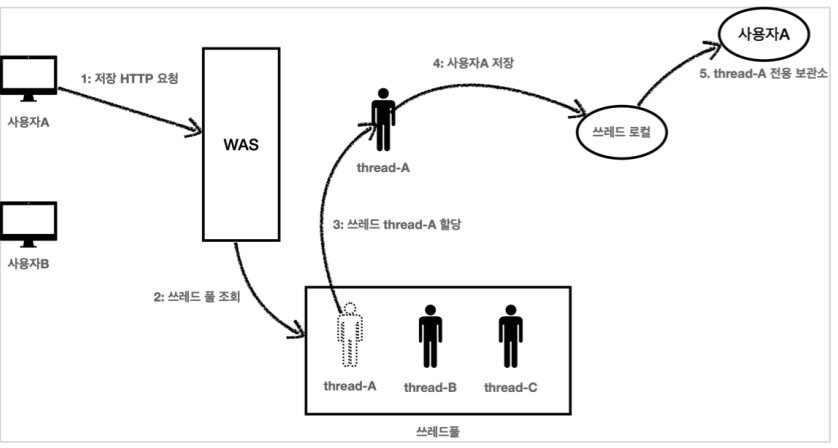
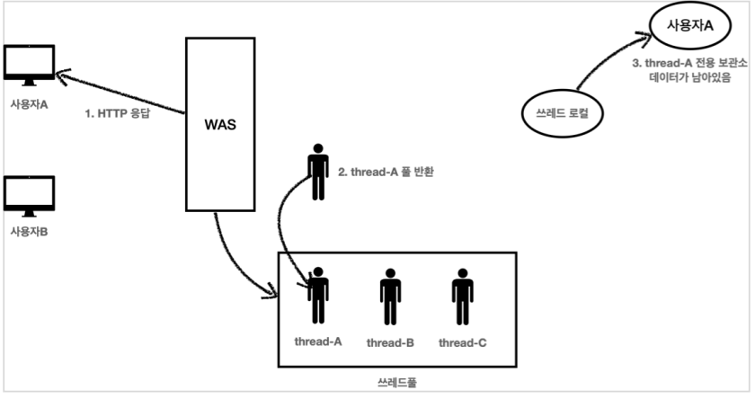
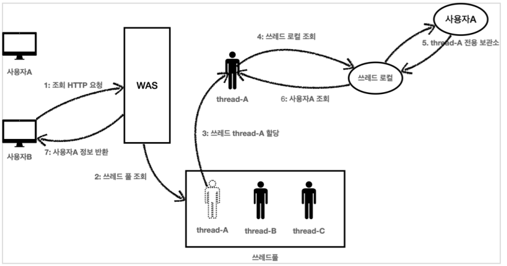

## ThreadLocal

쓰레드 로컬이란 해당하는 쓰레드만 접근할 수 있는 특별한 저장소를 뜻한다. 싱글톤 객체에서 여러 쓰레드가 동시에 값을 변경하면 원하는 결과가 제대로 나오지 않을 수 있다. 지역변수는 쓰레드마다 새로 할당되어 문제가 되지 않지만 멤버변수(필드)의 경우에는 싱글톤 객체에서 여러 쓰레드가 값을 공유해서 사용한다.

쓰레드 로컬은 각 쓰레드마다 별도의 내부 저장소를 제공한다. 따라서 같은 인스턴스의 쓰레드 로컬 필드에 접근해도 문제가 되지 않는다.

다음 예제를 통해 쓰레드 로컬이 어떻게 동작하는지 확인해보자.

```
@Slf4j
public class ThreadLocalService {
    private ThreadLocal<String> nameStore = new ThreadLocal<>();

    public String logic(String name) {
        log.info("저장 name={} -> nameStore={}", name, nameStore.get());
        nameStore.set(name);
        sleep(1000);
        log.info("조회 nameStore={}",nameStore.get());
        return nameStore.get();
    }

    private void sleep(int millis) {
        try {
            Thread.sleep(millis);
        } catch (InterruptedException e) {
            e.printStackTrace();
        }
    }
}
```

```
private ThreadLocal<String> nameStore = new ThreadLocal<>();
```

ThreadLocal 사용법
값 저장: ThreadLocal.set(xxx)
값 조회: ThreadLocal.get()
값 제거: ThreadLocal.remove() -> 해당 쓰레드의 내부 저장소에 저장된 값을 모두 지워준다.다른 쓰레드가 저장한 값은 지우지 않는다.

**주의**

> 해당 쓰레드가 쓰레드 로컬을 모두 사용하고 나면 ThreadLocal.remove() 를 호출해서 쓰레드 로컬에 저장된 값을 제거해주어야 한다.

```
@Slf4j
public class ThreadLocalServiceTest {
    private ThreadLocalService service = new ThreadLocalService();

    @Test
    void threadLocal() {
        log.info("main start");
        Runnable userA = () -> {
            service.logic("userA");
        };

        Runnable userB = () -> {
            service.logic("userB");
        };

        Thread threadA = new Thread(userA);
        threadA.setName("thread-A");

        Thread threadB = new Thread(userB);
        threadB.setName("thread-B");

        threadA.start();
        sleep(100);

        threadB.start();
        sleep(2000);

        log.info("main exit");
    }

    private void sleep(int millis) {
        try {
            Thread.sleep(millis);
        } catch (InterruptedException e) {
            e.printStackTrace();
        }
    }
}
```

실행 결과

```
[Test worker] main start
[Thread-A] 저장 name=userA -> nameStore=null
[Thread-B] 저장 name=userB -> nameStore=null
[Thread-A] 조회 nameStore=userA
[Thread-B] 조회 nameStore=userB
[Test worker] main exit
```

각 쓰레드마다 쓰레드 로컬이 별도의 nameStore 저장소를 제공해줘서 싱글톤 객체로 생성된 ThreadLocalService의 멤버 변수 nameStore에서 동시성 문제가 발생하지 않는다.

<br>
<hr>

### 쓰레드로컬 사용시 주의사항

쓰레드 로컬의 값을 사용 후 제거하지 않고 그냥 두면 WAS(톰캣)처럼 쓰레드 풀을 사용하는 경우에 심각한 문제가 발생할 수 있다.



1. 사용자A가 저장 HTTP를 요청했다.
2. WAS는 쓰레드 풀에서 쓰레드를 하나 조회한다.
3. 쓰레드 thread-A 가 할당되었다.
4. thread-A 는 사용자A 의 데이터를 쓰레드 로컬에 저장한다.
5. 쓰레드 로컬의 thread-A 전용 보관소에 사용자A 데이터를 보관한다.



1. 사용자A의 HTTP 응답이 끝난다.
2. WAS는 사용이 끝난 thread-A 를 쓰레드 풀에 반환한다. 쓰레드를 생성하는 비용은 비싸기 때문에 쓰레드를 제거하지 않고, 보통 쓰레드 풀을 통해서 쓰레드를 재사용한다.
3. thread-A 는 쓰레드풀에 아직 살아있다. 따라서 쓰레드 로컬의 thread-A 전용 보관소에 사용자A 데이터도 함께 살아있게 된다.



1. 사용자B가 조회를 위한 새로운 HTTP 요청을 한다.
2. WAS는 쓰레드 풀에서 쓰레드를 하나 조회한다.
3. 쓰레드 thread-A 가 할당되었다. (물론 다른 쓰레드가 할당될 수 도 있다.)
4. 이번에는 조회하는 요청이다. thread-A 는 쓰레드 로컬에서 데이터를 조회한다.
5. 쓰레드 로컬은 thread-A 전용 보관소에 있는 사용자A 값을 반환한다.
6. 결과적으로 사용자A 값이 반환된다.
7. 사용자B는 사용자A의 정보를 조회하게 된다.

이런 문제를 예방하려면 사용자A의 요청이 끝날 때 쓰레드 로컬의 값을 ThreadLocal.remove() 를 통해서 꼭 제거해야 한다.

<script src="https://utteranc.es/client.js"
        repo="chojs23/comments"
        issue-term="pathname"
        theme="github-dark"
        crossorigin="anonymous"
        async>
</script>
