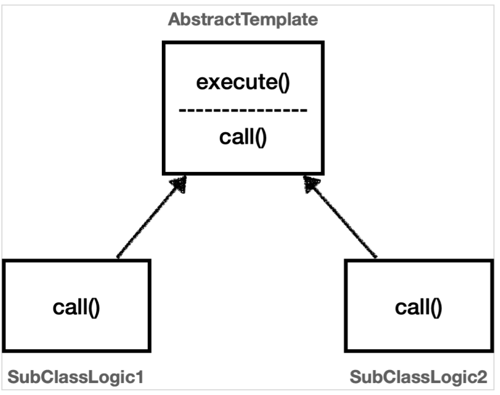
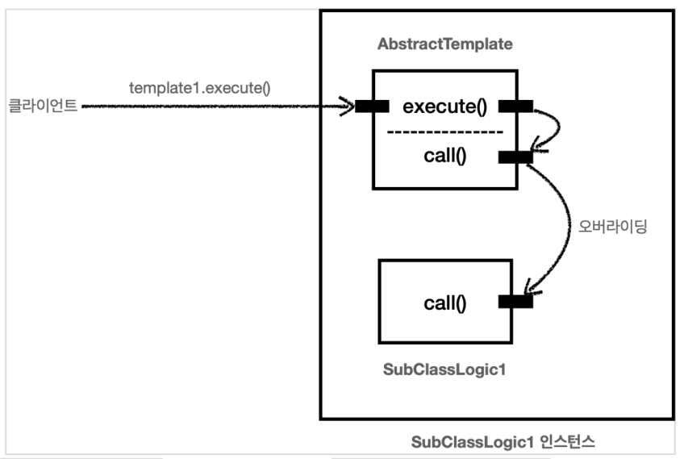
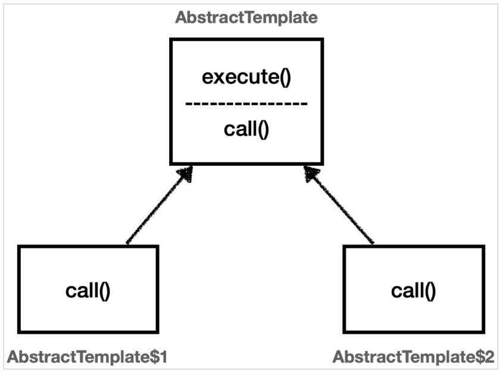

## 템플릿 메서드 패턴

템플릿 메서드 패턴이란 **핵심 기능** 과 **부가 기능** 을 분리해서 모듈화 하기위한 디자인 패턴이다.

예를 들어, 핵심 기능이란 orderService 의 핵심 기능은 주문로직같이 해당 객체가 제공하는 고유의 기능이다. 부가 기능이란 핵심 기능을 보조하기 위해 제공되는 기능이다. 로그 추적기나 트랜잭션 기능 등 핵심 기능과 함께 사용되며 보조적인 역할을 하는 기능이다.

우리가 서비스에 로그 추적 로직을 추가한다고 생각해보자. 그 예시 코드는 다음과 같다.

```
TraceStatus status = null;

try {
    status = trace.begin("message");

    //핵심 기능 호출

    trace.end(status);
} catch (Exception e) {
    trace.exception(status, e);
    throw e;
}
```

좋은 설계는 변하는 것과 변하지 않는 것을 분리하는 것이다.
여기서 핵심 기능 부분은 변하고, 로그 추적기를 사용하는 부분은 변하지 않는 부분이다.

이런 식으로 여러 객체에서 코드를 작성하면 중복되는 코드가 존재하고, 부가 기능을 하는 중복되는 코드를 메서드로 뽑자니 try catch 문과 핵심 기능이 중간에 껴 있어 단순히 메서드로 추출하기에는 어렵다. 템플릿 메서드 패턴은 이런 문제를 해결하기 위한 디자인 패턴이다.

<br>
<hr>
템플릿 메서드 패턴의 간단한 예시

```
@Slf4j
public class TemplateMethodTest {
    @Test
    void templateMethodV0() {
        logic1();
        logic2();
    }

    private void logic1() {
        long startTime = System.currentTimeMillis();
        //비즈니스 로직 실행
        log.info("비즈니스 로직1 실행");
        //비즈니스 로직 종료
        long endTime = System.currentTimeMillis();
        long resultTime = endTime - startTime;
        log.info("resultTime={}", resultTime);
    }

    private void logic2() {
        long startTime = System.currentTimeMillis();
        //비즈니스 로직 실행
        log.info("비즈니스 로직2 실행");
        //비즈니스 로직 종료
        long endTime = System.currentTimeMillis();
        long resultTime = endTime - startTime;
        log.info("resultTime={}", resultTime);
    }
}
```

logic1() 과 logic2() 는 시간을 측정하는 부분과 비즈니스 로직을 실행하는 부분이 함께 존재한다.

변하는 부분: 비즈니스 로직
변하지 않는 부분: 시간 측정

이제 템플릿 메서드 패턴을 사용해서 변하는 부분과 변하지 않는 부분을 분리하자.

<br>
<hr>

템플릿 메서드 패턴 구조


AbstractTemplate

```
@Slf4j
public abstract class AbstractTemplate {

    public void execute() {
        long startTime = System.currentTimeMillis();
        //비즈니스 로직 실행
        call(); //상속
        //비즈니스 로직 종료
        long endTime = System.currentTimeMillis();
        long resultTime = endTime - startTime;
        log.info("resultTime={}", resultTime);
    }

    protected abstract void call();
}
```

템플릿이라는 틀에 변하지 않는 부분을 몰아둔다. 그리고 일부 변하는 부분을 별도로 호출해서 해결한다.

변하지 않는 부분인 시간 측정 로직을 몰아둔 것을 확인할 수 있다. 이제 이것이 하나의 템플릿이 된다. 그리고 템플릿 안에서 변하는 부분은 call() 메서드를 호출해서 처리한다.
템플릿 메서드 패턴은 부모 클래스에 변하지 않는 템플릿 코드를 둔다. 그리고 변하는 부분은 자식 클래스에 두고 상속과 오버라이딩을 사용해서 처리한다.

SubClassLogic1

```
@Slf4j
public class SubClassLogic1 extends AbstractTemplate {
    @Override
    protected void call() {
        log.info("비즈니스 로직1 실행");
    }
}
```

SubClassLogic2

```
@Slf4j
public class SubClassLogic2 extends AbstractTemplate {
    @Override
    protected void call() {
        log.info("비즈니스 로직2 실행");
    }
}
```

변하는 부분인 비즈니스 로직1,2을 처리하는 자식 클래스이다. 템플릿이 호출하는 대상인 call() 메서드를 오버라이딩 한다.

테스트 코드

```
@Test
void templateMethodV1() {
    AbstractTemplate template1 = new SubClassLogic1();
    template1.execute();
    AbstractTemplate template2 = new SubClassLogic2();
    template2.execute();
}
```

실행결과

```
비즈니스 로직1 실행
resultTime=0
비즈니스 로직2 실행
resultTime=1
```

템플릿 메서드 패턴 인스턴스 호출


template1.execute() 를 호출하면 템플릿 로직인 AbstractTemplate.execute() 를 실행한다. 여기서 중간에 call() 메서드를 호출하는데, 이 부분이 오버라이딩 되어있다. 따라서 현재 인스턴스인 SubClassLogic1 인스턴스의 SubClassLogic1.call() 메서드가 호출된다.

템플릿 메서드 패턴은 이렇게 **다형성**을 사용해서 변하는 부분과 변하지 않는 부분을 분리하는 방법이다.

<br>
<hr>

### 익명 내부 클래스 이용

템플릿 메서드 패턴은 SubClassLogic1 , SubClassLogic2 처럼 클래스를 계속 만들어야 하는 단점이 있다. 익명 내부 클래스를 사용하면 이런 단점을 보완할 수 있다.
익명 내부 클래스를 사용하면 객체 인스턴스를 생성하면서 동시에 생성할 클래스를 상속 받은 자식 클래스를 정의할 수 있다. 이 클래스는 SubClassLogic1 처럼 직접 지정하는 이름이 없고 클래스 내부에 선언되는 클래스여서 익명 내부 클래스라 한다.

```
@Test
void templateMethodV2() {
    AbstractTemplate template1 = new AbstractTemplate() {
        @Override
        protected void call() {
            log.info("비즈니스 로직1 실행");
        }
    };

    log.info("클래스 이름1={}", template1.getClass());
    template1.execute();

    AbstractTemplate template2 = new AbstractTemplate() {
        @Override
        protected void call() {
            log.info("비즈니스 로직1 실행");
        }
    };
    log.info("클래스 이름2={}", template2.getClass());
    template2.execute();
}
```

실행결과

```
클래스 이름1 class hello.advanced.trace.template.TemplateMethodTest$1
비즈니스 로직1 실행
resultTime=3
클래스 이름2 class hello.advanced.trace.template.TemplateMethodTest$2
비즈니스 로직2 실행
resultTime=0
```



단일 책임 원칙(SRP)
단순히 템플릿 메서드 패턴을 적용해서 소스코드 몇줄을 줄인 것이 전부가 아니다.
로그를 남기는 부분에 단일 책임 원칙(SRP)을 지킨 것이다. 변경 지점을 하나로 모아서 변경에 쉽게 대처할 수 있는 구조를 만든 것이다.
