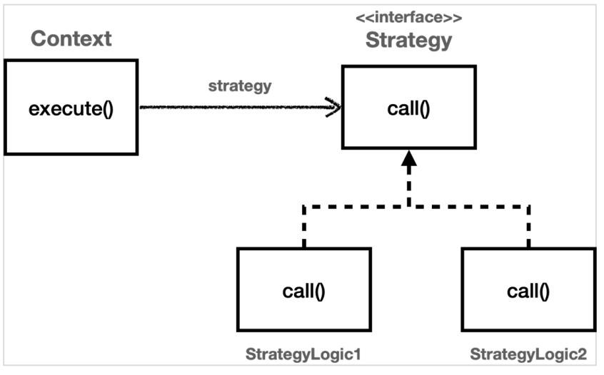
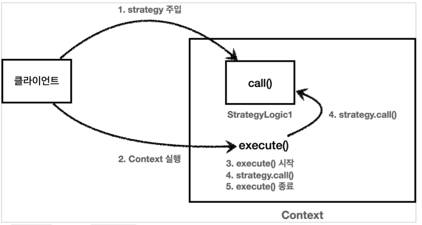

## 전략 패턴

### 템플릿 메서드 패턴의 한계

템플릿 메서드 패턴으로 부모 클래스에 알고리즘의 골격인 템플릿을 정의하고, 일부 변경되는 로직은 자식 클래스에 정의하여 자식 클래스가 알고리즘의 전체 구조를 변경하지 않고, 특정 부분만 재정의할 수 있다.
상속과 오버라이딩을 통한 다형성으로 문제를 해결하는 것이다.

하지만, 템플릿 메서드 패턴은 상속을 이용한다. 따라서 상속에서 오는 단점들이 따라온다. 자식 클래스가 부모 클래스에 컴파일 시점에 강한 결합이 되는 문제가 있고 자식 클래스는 부모 클래스의 기능을 전혀 사용하지 않는다. 따라서 자식 클래스가 부모 클래스를 의존하게 되고 부모 클래스를 수정하면 자식 클래스에도 영향을 줄 수 있다.

템플릿 메서드 패턴과 비슷한 역할을 하면서 상속의 단점을 제거할 수 있는 디자인 패턴이 전략 패턴(Strategy Pattern)이다.

<br>
<hr>

### 전략 패턴 예제

탬플릿 메서드 패턴은 부모 클래스에 변하지 않는 템플릿을 두고, 변하는 부분을 자식 클래스에 두어서 상속을 사용해서 문제를 해결했다.

전략 패턴은 변하지 않는 부분을 **Context** 라는 곳에 두고, 변하는 부분을 **Strategy** 라는 인터페이스를 만들고 해당 인터페이스를 구현하도록 해서 문제를 해결한다. 상속이 아니라 위임으로 문제를 해결하는 것이다.
전략 패턴에서 **Context** 는 변하지 않는 템플릿 역할을 하고, **Strategy** 는 변하는 알고리즘 역할을 한다



Strategy

```
public interface Strategy {
    void call();
}
```

StrategyLogic1

```
@Slf4j
public class StrategyLogic1 implements Strategy {
    @Override
    public void call() {
        log.info("비즈니스 로직1 실행");
    }
}
```

StrategyLogic2

```
@Slf4j
public class StrategyLogic2 implements Strategy {
    @Override
    public void call() {
        log.info("비즈니스 로직2 실행");
    }
}
```

Context

```
@Slf4j
public class Context {
    private Strategy strategy;

    public ContextV1(Strategy strategy) {
        this.strategy = strategy;
    }

    public void execute() {
        long startTime = System.currentTimeMillis();
        //비즈니스 로직 실행
        strategy.call(); //위임
        //비즈니스 로직 종료
        long endTime = System.currentTimeMillis();
        long resultTime = endTime - startTime;
        log.info("resultTime={}", resultTime);
    }
}
```

위와 같이 스프링에서 의존관계를 주입받는 것 처럼 Context 는 내부에 Strategy strategy 필드를 가지고 있고 이 필드에 변하는 부분인 Strategy 의 구현체를 주입한다.
전략 패턴의 핵심은 Context 는 Strategy 인터페이스에만 의존한다는 점이다. 덕분에 Strategy 의 구현체를 변경하거나 새로 만들어도 Context 코드에는 영향을 주지 않는다.
스프링에서 의존관계 주입에서 사용하는 방식이 바로 전략 패턴이다.

TestCode

```
@Test
void strategy() {
 Strategy strategyLogic1 = new StrategyLogic1();
 Context context1 = new Context(strategyLogic1);
 context1.execute();

 Strategy strategyLogic2 = new StrategyLogic2();
 Context context2 = new Context(strategyLogic2);
 context2.execute();
}
```



### 익명 내부 클래스 이용

전략 패턴도 익명 내부 클래스를 사용할 수 있다.

```
@Test
void strategy() {
    Strategy strategyLogic1 = new Strategy() {
        @Override
        public void call() {
        log.info("비즈니스 로직1 실행");
        }
    };

    log.info("strategyLogic1={}", strategyLogic1.getClass());
    Context context1 = new Context(strategyLogic1);
    context1.execute();

    Strategy strategyLogic2 = new Strategy() {
        @Override
        public void call() {
        log.info("비즈니스 로직2 실행");
        }
    };

    log.info("strategyLogic2={}", strategyLogic2.getClass());
    Context context2 = new Context(strategyLogic2);
    context2.execute();
}
```

```
ContextTest - strategyLogic1=class
hello.advanced.trace.strategy.ContextTest$1
ContextTest - 비즈니스 로직1 실행
Context - resultTime=0
ContextTest - strategyLogic2=class
hello.advanced.trace.strategy.ContextTest$2
ContextTest - 비즈니스 로직2 실행
Context - resultTime=0
```

실행 결과를 보면 ContextTest\$1, ContextTest\$2 와 같이 익명 내부 클래스가 생성된 것을 확인할 수 있다.

```
Context context1 = new Context(new Strategy() {
    @Override
    public void call() {
        log.info("비즈니스 로직1 실행");
    }
});

context1.execute();
```

익명 내부 클래스를 변수에 담아두지 말고, 생성하면서 바로 ContextV1 에 전달해도 된다.

```
ContextV1 context1 = new ContextV1(() -> log.info("비즈니스 로직1 실행"));
context1.execute();
```

익명 내부 클래스를 자바8부터 제공하는 람다로 변경할 수 있다. 람다로 변경하려면 인터페이스에 메서드가 1개만 있으면 되는데, 여기에서 제공하는 Strategy 인터페이스는 메서드가 1개만 있으므로 람다로 사용할 수 있다.

#### 선 조립, 후 실행

전략 패턴 방식은 Context 와 Strategy 를 실행 전에 원하는 모양으로 조립해두고, 그 다음에 Context 를 실행하는 선 조립, 후 실행 방식에서 매우 유용하다.

스프링으로 애플리케이션을 개발할 때 애플리케이션 로딩 시점에 의존관계 주입을 통해 필요한 의존관계를 모두 맺어두고 난 다음에 실제 요청을 처리하는 것 과 같은 원리이다.

<br>
<hr>

이렇게 먼저 조립하고 사용하는 방식보다 더 유연하게 전략 패턴을 사용하는 방법을 보자.

전략을 실행할 때 직접 파라미터로 전달해서 사용해보자.

```
@Slf4j
public class ContextV2 {
    public void execute(Strategy strategy) {
        long startTime = System.currentTimeMillis();
        //비즈니스 로직 실행
        strategy.call(); //위임
        //비즈니스 로직 종료
        long endTime = System.currentTimeMillis();
        long resultTime = endTime - startTime;
        log.info("resultTime={}", resultTime);
    }
}
```
