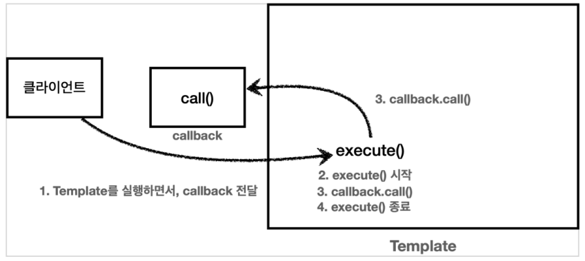

## 템플릿 콜백 패턴

앞서 전략패턴에서의 Context와 Strategy를 보면 Context는 변하지 않는 템플릿, Strategy는 변하는 부분이고 파라미터로 Context에게 넘겨서 실행하였다.

```
@Slf4j
public class ContextV2 {
    public void execute(Strategy strategy) {
        long startTime = System.currentTimeMillis();
        //비즈니스 로직 실행
        strategy.call(); //위임
        //비즈니스 로직 종료
        long endTime = System.currentTimeMillis();
        long resultTime = endTime - startTime;
        log.info("resultTime={}", resultTime);
    }
}
```

이렇게 다른 코드의 인수로서 넘겨주는 실행 가능한 코드를 콜백(callback)이라 한다.

> 프로그래밍에서 콜백(callback) 또는 콜애프터 함수(call-after function)는 다른 코드의 인수로서 넘겨주는 실행 가능한 코드를 말한다. 콜백을 넘겨받는 코드는 이 콜백을 필요에 따라 즉시 실행할 수도 있고, 아니면 나중에 실행할 수도 있다. (위키백과)

클라이언트에서 직접 Strategy 를 실행하는 것이 아니라, 클라이언트가 ContextV2.execute(..) 를 실행할 때 Strategy 를 넘겨주고, ContextV2 뒤에서 Strategy 가 실행된다.

스프링에서는 ContextV2 와 같은 방식의 전략 패턴을 템플릿 콜백 패턴이라 한다. 전략 패턴에서 Context 가 템플릿 역할을 하고, Strategy 부분이 콜백으로 넘어온다 생각하면 된다.

스프링에서는 JdbcTemplate , RestTemplate , TransactionTemplate , RedisTemplate 처럼 다양한 템플릿 콜백 패턴이 사용된다. 스프링에서 이름에 XxxTemplate 가 있다면 템플릿 콜백 패턴으로 만들어져 있다 생각하면 된다.



템플릿 콜백 패턴을 간단한 코드 예시로 확인해보자

Callback - 인터페이스

```
public interface Callback {
    void call();
}
```

TimeLogTemplate

```
@Slf4j
public class TimeLogTemplate {
    public void execute(Callback callback) {
        long startTime = System.currentTimeMillis();
        //비즈니스 로직 실행
        callback.call(); //위임
        //비즈니스 로직 종료
        long endTime = System.currentTimeMillis();
        long resultTime = endTime - startTime;
        log.info("resultTime={}", resultTime);
    }
}
```

Test 코드

```
@Slf4j
public class TemplateCallbackTest {
    /**
    * 템플릿 콜백 패턴 - 익명 내부 클래스
    */
    @Test
    void callbackV1() {
        TimeLogTemplate template = new TimeLogTemplate();
        template.execute(new Callback() {
            @Override
            public void call() {
            log.info("비즈니스 로직1 실행");
            }
        });

        template.execute(new Callback() {
            @Override
            public void call() {
            log.info("비즈니스 로직2 실행");
            }
        });
    }

    /**
    * 템플릿 콜백 패턴 - 람다
    */
    @Test
    void callbackV2() {
        TimeLogTemplate template = new TimeLogTemplate();
        template.execute(() -> log.info("비즈니스 로직1 실행"));
        template.execute(() -> log.info("비즈니스 로직2 실행"));
    }
}
```

<script src="https://utteranc.es/client.js"
        repo="chojs23/comments"
        issue-term="pathname"
        theme="github-light"
        crossorigin="anonymous"
        async>
</script>
