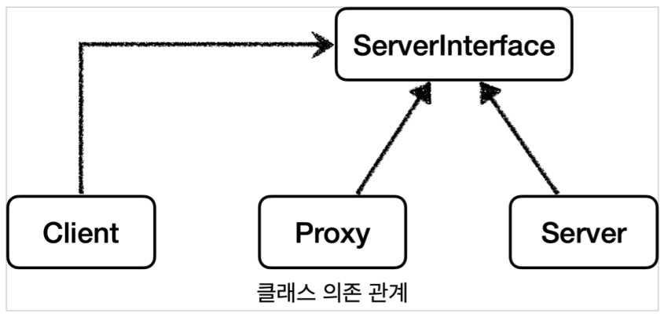

## 프록시 패턴

프록시는 굉장히 넓은 곳에서 사용된다. 네트워크에서 클라이언트가 서버에게 요청을 할 때 클라이언트와 서버 사이에 프록시 서버를 두게 되면 프록시 서버를 통해 캐시나 추가 기능 등을 이용할 수 있다.

객체의 관점에서도 이 프록시를 이용할 수 있는데, 요청하는 객체와 요청을 처리하는 객체 사이에 프록시 객체를 만들어 추가적인 이점을 얻을 수 있다.

객체에서 프록시가 되려면, 클라이언트는 서버에게 요청을 한 것인지, 프록시에게 요청을 한 것인지 조차 몰라야 한다.
쉽게 이야기해서 서버와 프록시는 같은 인터페이스를 사용해야 한다. 그리고 클라이언트가 사용하는 서버 객체를 프록시 객체로 변경해도 클라이언트 코드를 변경하지 않고 동작할 수 있어야 한다.

클래스 의존 관계도를 보면 클라이언트는 서버 인터페이스에만 의존하고 실제 서버와 프록시는 같은 서버 인터페이스를 사용한다. 따라서 DI을 통해 대체 가능하게 된다.
DI를 사용하게 되면 클라이언트의 코드 변경 없이도 유연하게 클라이언트 -> 서버 의존관계를 클라이언트 -> 프록시 의존관계로 변경할 수 있다.

프록시의 주요 기능

프록시를 통해서 할 수 있는 일은 크게 2가지로 구분할 수 있다.

- 접근 제어
  - 권한에 따른 접근 차단
  - 캐싱
  - 지연 로딩
- 부가 기능 추가
  - 원래 서버가 제공하는 기능에 더해서 부가 기능을 수행한다.
  - 예) 요청 값이나, 응답 값을 중간에 변형한다.
  - 예) 실행 시간을 측정해서 추가 로그를 남긴다.
  - 프록시 객체가 중간에 있으면 크게 접근 제어와 부가 기능 추가를 수행할 수 있다.

> GOF 디자인 패턴
> 둘다 프록시를 사용하는 방법이지만 GOF 디자인 패턴에서는 이 둘을 의도(intent)에 따라서 프록시 패턴과 데코레이터 패턴으로 구분한다.
> 프록시 패턴: 접근 제어가 목적
> 데코레이터 패턴: 새로운 기능 추가가 목적

프록시 패턴의 의도: 다른 개체에 대한 접근을 제어하기 위해 대리자를 제공
데코레이터 패턴의 의도: 객체에 추가 책임(기능)을 동적으로 추가하고, 기능 확장을 위한 유연한 대안 제공

