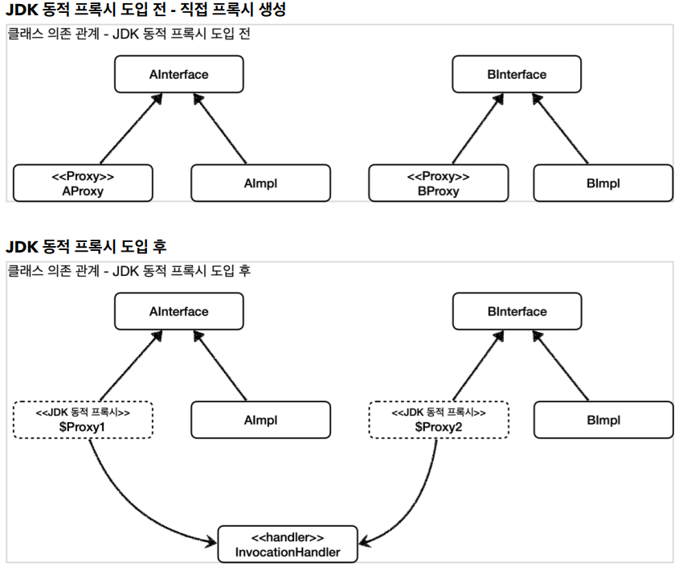

## 동적 프록시

프록시 패턴을 사용해서 기존 코드를 변경하지 않고, 부가 기능을 적용할 수 있었다. 그런데 프록시 패턴을 통해 부가기능을 추가하려면 대상 클래스 수 만큼 프록시 클래스를 만들어야 하는 문제가 있었다. 여러 클래스에서 공통으로 부가기능을 추가하기 위한 프록시 클래스들의 소스코드는 거의 같은 모양을 하고 있다.

자바가 기본으로 제공하는 JDK 동적 프록시 기술이나 CGLIB 같은 프록시 생성 오픈소스 기술을 활용하면 프록시 객체를 동적으로 만들어낼 수 있다. 이를 이용하면 프록시 클래스를 계속 만들지 않아도 된다. 프록시를 적용할 코드를 하나만 만들어두고 동적 프록시 기술을 사용해서 프록시 객체를 만들어내면 된다.

JDK 동적 프록시를 이해하기 위해서는 먼저 자바의 리플렉션 기술을 이해해야 한다.
리플렉션 기술을 사용하면 클래스나 메서드의 메타정보를 동적으로 획득하고, 코드도 동적으로 호출할 수 있다.

### 리플렉션

```
@Slf4j
public class ReflectionTest {
  @Test
  void reflection0() {
    Hello target = new Hello();

    //공통 로직1 시작
    log.info("start");
    String result1 = target.callA(); //호출하는 메서드가 다름
    log.info("result={}", result1);
    //공통 로직1 종료

    //공통 로직2 시작
    log.info("start");
    String result2 = target.callB(); //호출하는 메서드가 다름
    log.info("result={}", result2);
    //공통 로직2 종료
  }

  @Slf4j
  static class Hello {
    public String callA() {
      log.info("callA");
      return "A";
    }
    public String callB() {
      log.info("callB");
      return "B";
    }
  }
}
```

공통 로직1과 공통 로직2는 호출하는 메서드만 다르고 전체 코드 흐름이 완전히 같다.

-   먼저 start 로그를 출력한다.
-   어떤 메서드를 호출한다.
-   메서드의 호출 결과를 로그로 출력한다.

여기서 공통 로직1과 공통 로직 2를 하나의 메서드로 뽑아서 합칠 수 있을까?
만 메서드로 뽑아서 공통화하는 것이 생각보다 어렵다. 왜냐하면 중간에 호출하는 메서드가 다르기 때문이다.

호출하는 메서드인 target.callA() , target.callB() 이 부분만 동적으로 처리할 수 있다면 문제를 해결할 수 있다.

```
log.info("start");
String result = xxx(); //호출 대상이 다름, 동적 처리 필요
log.info("result={}", result);
```

이럴 때 사용하는 기술이 바로 리플렉션이다. 리플렉션은 클래스나 메서드의 메타정보를 사용해서 동적으로 호출하는 메서드를 변경할 수 있다.

```
@Test
void reflection1() throws Exception {
  //클래스 정보
  Class classHello =
  Class.forName("hello.proxy.jdkdynamic.ReflectionTest$Hello");
  Hello target = new Hello();

  //callA 메서드 정보
  Method methodCallA = classHello.getMethod("callA");
  Object result1 = methodCallA.invoke(target);
  log.info("result1={}", result1);

  //callB 메서드 정보
  Method methodCallB = classHello.getMethod("callB");
  Object result2 = methodCallB.invoke(target);
  log.info("result2={}", result2);
}
```

-   Class.forName("hello.proxy.jdkdynamic.ReflectionTest$Hello") : 클래스 메타정보를 획득한다. 참고로 내부 클래스는 구분을 위해 \$ 를 사용한다.

-   classHello.getMethod("call") : 해당 클래스의 call 메서드 메타정보를 획득한다.
-   methodCallA.invoke(target) : 획득한 메서드 메타정보로 실제 인스턴스의 메서드를 호출한다. 여기서 methodCallA 는 Hello 클래스의 callA() 이라는 메서드 메타정보이다. methodCallA.invoke(인스턴스) 를 호출하면서 인스턴스를 넘겨주면 해당 인스턴스의 callA() 메서드를 찾아서 실행한다. 여기서는 target 의 callA() 메서드를 호출한다.

그런데 target.callA() 나 target.callB() 메서드를 직접 호출하면 되지 이렇게 메서드 정보를 획득해서 메서드를 호출하면 어떤 효과가 있을까? 여기서 중요한 핵심은 클래스나 메서드 정보를 동적으로 변경할 수 있다는 점이다.
기존의 callA() , callB() 메서드를 직접 호출하는 부분이 Method 로 대체되었다. 덕분에 이제 공통 로직을 만들 수 있게 되었다.

```
@Test
void reflection2() throws Exception {
  Class classHello =
  Class.forName("hello.proxy.jdkdynamic.ReflectionTest$Hello");
  Hello target = new Hello();
  Method methodCallA = classHello.getMethod("callA");
  dynamicCall(methodCallA, target);
  Method methodCallB = classHello.getMethod("callB");
  dynamicCall(methodCallB, target);
}

private void dynamicCall(Method method, Object target) throws Exception {
  log.info("start");
  Object result = method.invoke(target);
  log.info("result={}", result);
}
```

dynamicCall(Method method, Object target)
공통 로직1, 공통 로직2를 한번에 처리할 수 있는 통합된 공통 처리 로직이다.
Method method : 첫 번째 파라미터는 호출할 메서드 정보가 넘어온다. 이것이 핵심이다. 기존에는 메서드 이름을 직접 호출했지만, 이제는 Method 라는 메타정보를 통해서 호출할 메서드 정보가 동적으로 제공된다.

Object target : 실제 실행할 인스턴스 정보가 넘어온다. 타입이 Object 라는 것은 어떠한 인스턴스도 받을 수 있다는 뜻이다. 물론 method.invoke(target) 를 사용할 때 호출할 클래스와 메서드 정보가 서로 다르면 예외가 발생한다.

**주의**
리플렉션을 사용하면 클래스와 메서드의 메타정보를 사용해서 애플리케이션을 동적으로 유연하게 만들 수 있다. 하지만 리플렉션 기술은 런타임에 동작하기 때문에, 컴파일 시점에 오류를 잡을 수 없다.

### JDK 동적 프록시

동적 프록시 기술을 사용하면 개발자가 직접 프록시 클래스를 만들지 않아도 된다. 이름 그대로 프록시 객체를 동적으로 런타임에 개발자 대신 만들어준다. 그리고 동적 프록시에 원하는 실행 로직을 지정할 수 있다.

JDK 동적 프록시는 인터페이스를 기반으로 프록시를 동적으로 만들어준다. 따라서 인터페이스가 필수이다.

A Interface

```
public interface AInterface {
  String call();
}
```

```
@Slf4j
public class AImpl implements AInterface {
  @Override
  public String call() {
    log.info("A 호출");
    return "a";
  }
}
```

B Interface

```
public interface BInterface {
  String call();
}
```

```
@Slf4j
public class BImpl implements BInterface {
  @Override
  public String call() {
    log.info("B 호출");
    return "b";
  }
}
```

JDK 동적 프록시에 적용할 로직은 InvocationHandler 인터페이스를 구현해서 작성하면 된다.

```
public interface InvocationHandler {
  public Object invoke(Object proxy, Method method, Object[] args)
    throws Throwable;
}
```

Object proxy : 프록시 자신
Method method : 호출한 메서드
Object[] args : 메서드를 호출할 때 전달한 인수

```
@Slf4j
public class TimeInvocationHandler implements InvocationHandler {

  private final Object target;

  public TimeInvocationHandler(Object target) {
    this.target = target;
  }

  @Override
  public Object invoke(Object proxy, Method method, Object[] args) throws Throwable {
    log.info("TimeProxy 실행");
    long startTime = System.currentTimeMillis();
    Object result = method.invoke(target, args);
    long endTime = System.currentTimeMillis();
    long resultTime = endTime - startTime;
    log.info("TimeProxy 종료 resultTime={}", resultTime);
    return result;
  }
}
```

테스트 코드

```
@Slf4j
public class JdkDynamicProxyTest {

  @Test
  void dynamicA() {
    AInterface target = new AImpl();
    TimeInvocationHandler handler = new TimeInvocationHandler(target);
    AInterface proxy = (AInterface) Proxy.newProxyInstance(AInterface.class.getClassLoader(), new Class[]
    {AInterface.class}, handler);

    proxy.call();
    log.info("targetClass={}", target.getClass());
    log.info("proxyClass={}", proxy.getClass());
  }

  @Test
  void dynamicB() {
    BInterface target = new BImpl();
    TimeInvocationHandler handler = new TimeInvocationHandler(target);
    BInterface proxy = (BInterface) Proxy.newProxyInstance(BInterface.class.getClassLoader(), new Class[]
    {BInterface.class}, handler);

    proxy.call();
    log.info("targetClass={}", target.getClass());
    log.info("proxyClass={}", proxy.getClass());
  }
}
```

dynamicA 결과

```
TimeInvocationHandler - TimeProxy 실행
AImpl - A 호출
TimeInvocationHandler - TimeProxy 종료 resultTime=0
JdkDynamicProxyTest - targetClass=class hello.proxy.jdkdynamic.code.AImpl
JdkDynamicProxyTest - proxyClass=class com.sun.proxy.$Proxy1
```

-   new TimeInvocationHandler(target) : 동적 프록시에 적용할 핸들러 로직이다.
-   Proxy.newProxyInstance(AInterface.class.getClassLoader(), new Class[] {AInterface.class}, handler)
    -   동적 프록시는 java.lang.reflect.Proxy 를 통해서 생성할 수 있다.
    -   클래스 로더 정보, 인터페이스, 그리고 핸들러 로직을 넣어주면 된다. 그러면 해당 인터페이스를 기반으로 동적 프록시를 생성하고 그 결과를 반환한다.

실행 순서

1. 클라이언트는 JDK 동적 프록시의 call() 을 실행한다.
2. JDK 동적 프록시는 InvocationHandler.invoke() 를 호출한다. TimeInvocationHandler 가 구현체로 있으로 TimeInvocationHandler.invoke() 가 호출된다.
3. TimeInvocationHandler 가 내부 로직을 수행하고, method.invoke(target, args) 를 호출해서 target 인 실제 객체( AImpl )를 호출한다.
4. AImpl 인스턴스의 call() 이 실행된다.
5. AImpl 인스턴스의 call() 의 실행이 끝나면 TimeInvocationHandler 로 응답이 돌아온다. 시간 로그를 출력하고 결과를 반환한다.


JDK 동적 프록시 기술 덕분에 적용 대상 만큼 프록시 객체를 만들지 않아도 된다. 그리고 같은 부가 기능 로직을 한번만 개발해서 공통으로 적용할 수 있다. 각각 필요한 InvocationHandler 만 만들어서 넣어주면 된다. 결과적으로 프록시 클래스를 수 없이 만들어야 하는 문제도 해결하고, 부가 기능 로직도 하나의 클래스에 모아서 단일 책임 원칙(SRP)도 지킬 수 있게 되었다.

  <script src="https://utteranc.es/client.js"
          repo="chojs23/comments"
          issue-term="pathname"
          theme="github-light"
          crossorigin="anonymous"
          async>
  </script>
