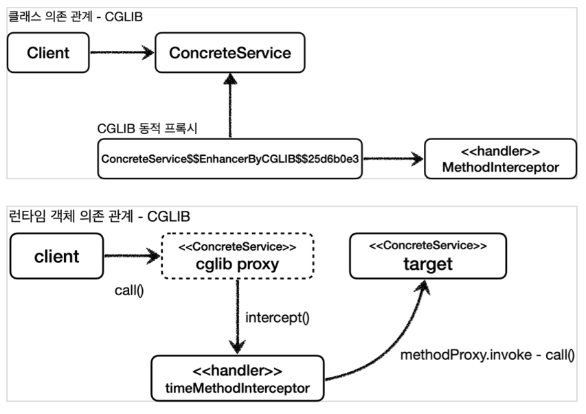

## CGLIB - Code Generator Library

CGLIB를 사용하면 인터페이스가 없어도 구체 클래스만 가지고 동적 프록시를 만들어낼 수 있다.
JDK 동적 프록시에서 실행 로직을 위해 InvocationHandler 를 제공했듯이, CGLIB는 MethodInterceptor 를 제공한다.

```
public interface MethodInterceptor extends Callback {
  Object intercept(Object obj, Method method, Object[] args, MethodProxy
  proxy) throws Throwable;
}
```

obj : CGLIB가 적용된 객체
method : 호출된 메서드
args : 메서드를 호출하면서 전달된 인수
proxy : 메서드 호출에 사용

```
@Slf4j
public class TimeMethodInterceptor implements MethodInterceptor {
  private final Object target;

  public TimeMethodInterceptor(Object target) {
    this.target = target;
  }

  @Override
  public Object intercept(Object obj, Method method, Object[] args,
  MethodProxy proxy) throws Throwable {
    log.info("TimeProxy 실행");
    long startTime = System.currentTimeMillis();
    Object result = proxy.invoke(target, args);
    long endTime = System.currentTimeMillis();
    long resultTime = endTime - startTime;
    log.info("TimeProxy 종료 resultTime={}", resultTime);
    return result;
  }
}
```

Object target : 프록시가 호출할 실제 대상
proxy.invoke(target, args) : 실제 대상을 동적으로 호출한다.

테스트코드

```
@Slf4j
public class CglibTest {
  @Test
  void cglib() {
    ConcreteService target = new ConcreteService();
    Enhancer enhancer = new Enhancer();
    enhancer.setSuperclass(ConcreteService.class);
    enhancer.setCallback(new TimeMethodInterceptor(target));
    ConcreteService proxy = (ConcreteService)enhancer.create();
    log.info("targetClass={}", target.getClass());
    log.info("proxyClass={}", proxy.getClass());
    proxy.call();
  }
}
```

ConcreteService 는 인터페이스가 없는 구체 클래스이다. 여기에 CGLIB를 사용해서 프록시를 생성해보자.
Enhancer : CGLIB는 Enhancer 를 사용해서 프록시를 생성한다.
enhancer.setSuperclass(ConcreteService.class) : CGLIB는 구체 클래스를 상속 받아서 프록시를 생성할 수 있다. 어떤 구체 클래스를 상속 받을지 지정한다.
enhancer.setCallback(new TimeMethodInterceptor(target)) : 프록시에 적용할 실행 로직을 할당한다.
enhancer.create() : 프록시를 생성한다. 앞서 설정한
enhancer.setSuperclass(ConcreteService.class) 에서 지정한 클래스를 상속 받아서 프록시가 만들어진다.



<script src="https://utteranc.es/client.js"
        repo="chojs23/comments"
        issue-term="pathname"
        theme="github-dark"
        crossorigin="anonymous"
        async>
</script>
