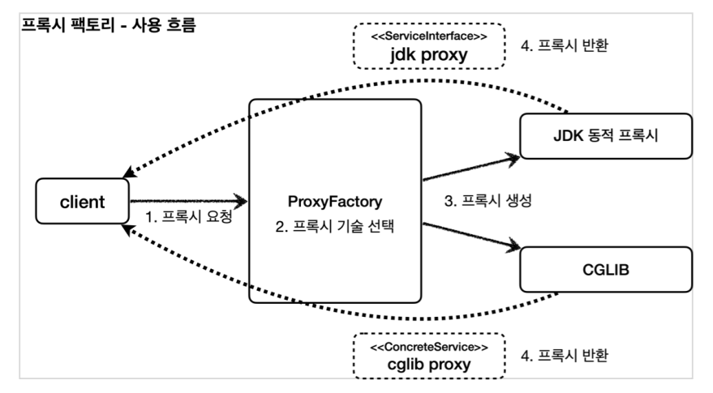
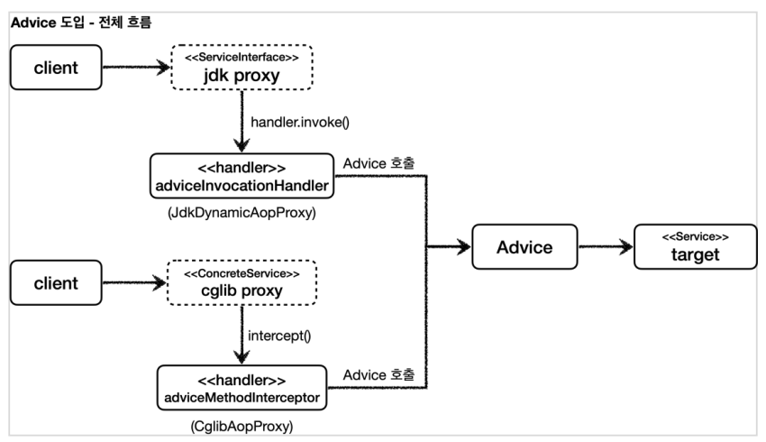

## 프록시 팩토리

우리가 동적 프록시를 이용할 때 인터페이스가 있는 경우에는 JDK 동적 프록시를 이용하고 구체 클래스인 경우에는 CGLIB을 따로 이용해야 했다. 두 기술을 함께 사용할 때 부가 기능을 제공하기 위해 JDK 동적 프록시가 제공하는 InvocationHandler 와 CGLIB가 제공하는 MethodInterceptor 를 각각 중복으로 만들어서 관리해야 할까?

스프링은 유사한 구체적인 기술들이 있을 때, 그것들을 통합해서 일관성 있게 접근할 수 있고, 더욱 편리하게 사용할 수 있는 추상화된 기술을 제공한다.
스프링은 동적 프록시를 통합해서 편리하게 만들어주는 프록시 팩토리( ProxyFactory )라는 기능을 제공한다.
이전에는 상황에 따라서 JDK 동적 프록시를 사용하거나 CGLIB를 사용해야 했다면, 이제는 이 프록시 팩토리 하나로 편리하게 동적 프록시를 생성할 수 있다.



JDK 동적 프록시와 CGLIB에서 제공하는 InvocationHandler와 MethodInterceptor를 따로 만들어야 할까? InvocationHandler 나 MethodInterceptor 를 신경쓰지 않고, Advice 만 만들면 된다. InvocationHandler 나 MethodInterceptor 는 Advice 를 호출하게 된다.
프록시 팩토리를 사용하면 Advice 를 호출하는 전용 InvocationHandler , MethodInterceptor 를 내부에서 사용한다.



### Advice

Advice 는 프록시에 적용하는 부가 기능 로직이다. 이것은 JDK 동적 프록시가 제공하는 InvocationHandler 와 CGLIB가 제공하는 MethodInterceptor 의 개념과 유사한다. 둘을 개념적으로 추상화 한 것이다. 프록시 팩토리를 사용하면 둘 대신에 Advice 를 사용하면 된다.
Advice 를 만드는 방법은 여러가지가 있지만, 기본적인 방법은 다음 인터페이스를 구현하면 된다.

```
public interface MethodInterceptor extends Interceptor {
  Object invoke(MethodInvocation invocation) throws Throwable;
}
```

- MethodInvocation invocation
  - 내부에는 다음 메서드를 호출하는 방법, 현재 프록시 객체 인스턴스, args , 메서드 정보 등이 포함되어 있다. 기존에 파라미터로 제공되는 부분들이 이 안으로 모두 들어갔다고 생각하면 된다.
- CGLIB의 MethodInterceptor 와 이름이 같으므로 패키지 이름에 주의하자
  - 참고로 여기서 사용하는 org.aopalliance.intercept 패키지는 스프링 AOP 모듈( spring-top ) 안에 들어있다.
- MethodInterceptor 는 Interceptor 를 상속하고 Interceptor 는 Advice 인터페이스를 상속한다.

이 인터페이스를 구현에 실제 Advice를 만들어보자

TimeAdvice

```
@Slf4j
public class TimeAdvice implements MethodInterceptor {
  @Override
  public Object invoke(MethodInvocation invocation) throws Throwable {
    log.info("TimeProxy 실행");
    long startTime = System.currentTimeMillis();
    Object result = invocation.proceed();
    long endTime = System.currentTimeMillis();
    long resultTime = endTime - startTime;
    log.info("TimeProxy 종료 resultTime={}ms", resultTime);
    return result;
  }
}
```

invocation.proceed() 를 호출하면 target 클래스를 호출하고 그 결과를 받는다.
그런데 기존에 보았던 코드들과 다르게 target 클래스의 정보가 보이지 않는다. target 클래스의 정보는 MethodInvocation invocation 안에 모두 포함되어 있다.
프록시 팩토리로 프록시를 생성하는 단계에서 이미 target 정보를 파라미터로 전달받는다.

JDK 동적 프록시 테스트코드

```
@Slf4j
public class ProxyFactoryTest {
  @Test
  @DisplayName("인터페이스가 있으면 JDK 동적 프록시 사용")
  void interfaceProxy() {
    ServiceInterface target = new ServiceImpl();

    ProxyFactory proxyFactory = new ProxyFactory(target);
    proxyFactory.addAdvice(new TimeAdvice());
    ServiceInterface proxy = (ServiceInterface) proxyFactory.getProxy();

    log.info("targetClass={}", target.getClass());
    log.info("proxyClass={}", proxy.getClass());

    proxy.save();

    assertThat(AopUtils.isAopProxy(proxy)).isTrue();
    assertThat(AopUtils.isJdkDynamicProxy(proxy)).isTrue();
    assertThat(AopUtils.isCglibProxy(proxy)).isFalse();
  }
}
```

실행결과

```
ProxyFactoryTest - targetClass=class hello.proxy.common.service.ServiceImpl
ProxyFactoryTest - proxyClass=class com.sun.proxy.$Proxy13
TimeAdvice - TimeProxy 실행
ServiceImpl - save 호출
TimeAdvice - TimeProxy 종료 resultTime=1ms
```

proxyClass=class com.sun.proxy.$Proxy13 코드를 통해 JDK 동적 프록시가 적용된 것을 확인할 수 있다.

new ProxyFactory(target) : 프록시 팩토리를 생성할 때, 생성자에 프록시의 호출 대상을 함께 넘겨준다. 만약 이 인스턴스에
인터페이스가 있다면 JDK 동적 프록시를 기본으로 사용하고 인터페이스가 없고 구체 클래스만 있다면 CGLIB를 통해서 동적 프록시를 생성한다.

target 이 new ServiceImpl() 의 인스턴스이기 때문에 ServiceInterface 인터페이스가 있다. 따라서 이 인터페이스를 기반으로 JDK 동적 프록시를 생성한다.

proxyFactory.addAdvice(new TimeAdvice()) : 프록시 팩토리를 통해서 만든 프록시가 사용할 부가 기능 로직을 설정한다. JDK 동적 프록시가 제공하는 InvocationHandler 와 CGLIB가 제공하는 MethodInterceptor 의 개념과 유사하다. 이렇게 프록시가 제공하는 부가 기능 로직을 어드바이스 (Advice)라 한다.

CGLIB 테스트 코드

```
@Test
@DisplayName("구체 클래스만 있으면 CGLIB 사용")
void concreteProxy() {
  ConcreteService target = new ConcreteService();

  ProxyFactory proxyFactory = new ProxyFactory(target);
  proxyFactory.addAdvice(new TimeAdvice());
  ConcreteService proxy = (ConcreteService) proxyFactory.getProxy();

  log.info("targetClass={}", target.getClass());
  log.info("proxyClass={}", proxy.getClass());
  proxy.call();
  assertThat(AopUtils.isAopProxy(proxy)).isTrue();
  assertThat(AopUtils.isJdkDynamicProxy(proxy)).isFalse();
  assertThat(AopUtils.isCglibProxy(proxy)).isTrue();
}
```

실행결과

```
ProxyFactoryTest - targetClass=class hello.proxy.common.service.ConcreteService
ProxyFactoryTest - proxyClass=class hello.proxy.common.service.ConcreteService$$EnhancerBySpringCGLIB$$103821ba
TimeAdvice - TimeProxy 실행
ConcreteService - ConcreteService 호출
TimeAdvice - TimeProxy 종료 resultTime=1ms
```

프록시 팩토리는 인터페이스 없이 구체 클래스만 있으면 CGLIB를 사용해서 프록시를 적용한다.
proxyClass=class..ConcreteService\$\$EnhancerBySpringCGLIB\$\$103821ba 코드를 통해 CGLIB 프록시가 적용된 것도 확인할 수 있다.

**proxyTargetClass 옵션**

```
@Test
@DisplayName("ProxyTargetClass 옵션을 사용하면 인터페이스가 있어도 CGLIB를 사용하고, 클래스 기반 프록시 사용")
void proxyTargetClass() {
  ServiceInterface target = new ServiceImpl();

  ProxyFactory proxyFactory = new ProxyFactory(target);
  proxyFactory.setProxyTargetClass(true); //중요
  proxyFactory.addAdvice(new TimeAdvice());
  ServiceInterface proxy = (ServiceInterface) proxyFactory.getProxy();

  log.info("targetClass={}", target.getClass());
  log.info("proxyClass={}", proxy.getClass());
  proxy.save();
  assertThat(AopUtils.isAopProxy(proxy)).isTrue();
  assertThat(AopUtils.isJdkDynamicProxy(proxy)).isFalse();
  assertThat(AopUtils.isCglibProxy(proxy)).isTrue();
}
```

실행결과

```
ProxyFactoryTest - targetClass=class hello.proxy.common.service.ServiceImpl
ProxyFactoryTest - proxyClass=class hello.proxy.common.service.ServiceImpl$$EnhancerBySpringCGLIB$$2bbf51ab
TimeAdvice - TimeProxy 실행
ServiceImpl - save 호출
TimeAdvice - TimeProxy 종료 resultTime=1ms
```

인터페이스가 있지만, CGLIB를 사용해서 인터페이스가 아닌 클래스 기반으로 동적 프록시를 만드는 방법을 알아보자.
프록시 팩토리는 proxyTargetClass 라는 옵션을 제공하는데, 이 옵션에 true 값을 넣으면 인터페이스가 있어도 강제로 CGLIB를 사용한다. 그리고 인터페이스가 아닌 클래스 기반의 프록시를 만들어준다.

대상에 인터페이스가 있으면: JDK 동적 프록시, 인터페이스 기반 프록시
대상에 인터페이스가 없으면: CGLIB, 구체 클래스 기반 프록시
proxyTargetClass=true : CGLIB, 구체 클래스 기반 프록시, 인터페이스 여부와 상관없음

> 스프링 부트는 AOP를 적용할 때 기본적으로 proxyTargetClass=true 로 설정해서 사용한다.
> 따라서 인터페이스가 있어도 항상 CGLIB를 사용해서 구체 클래스를 기반으로 프록시를 생성한다.

<script src="https://utteranc.es/client.js"
        repo="chojs23/comments"
        issue-term="pathname"
        theme="github-dark"
        crossorigin="anonymous"
        async>
</script>
