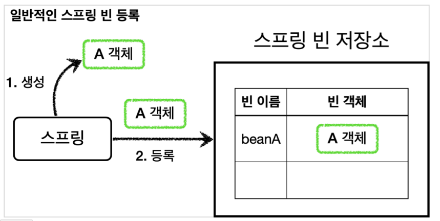
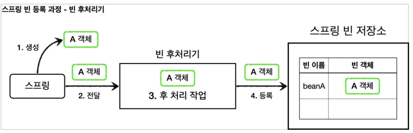
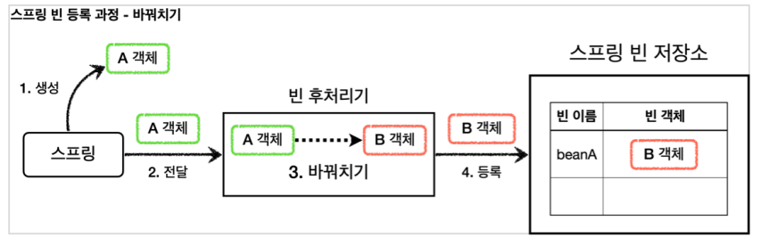
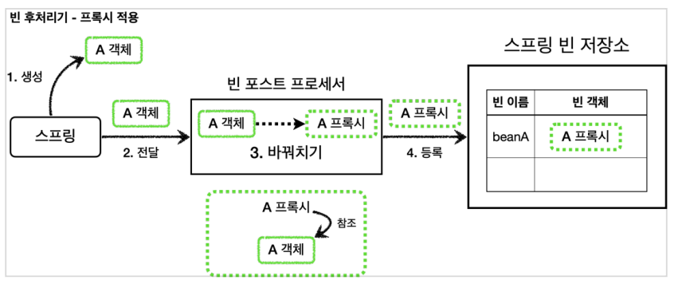

## 빈 후처리기



@Bean 이나 컴포넌트 스캔으로 스프링 빈을 등록하면, 스프링은 대상 객체를 생성하고 스프링 컨테이너 내부의 빈 저장소에 등록한다. 그리고 이후에는 스프링 컨테이너를 통해 등록한 스프링 빈을 조회해서 사용하면 된다.

스프링이 빈 저장소에 등록할 목적으로 생성한 객체를 빈 저장소에 등록하기 직전에 조작하고 싶다면 빈 후처리기를 사용하면 된다.



1. 생성: 스프링 빈 대상이 되는 객체를 생성한다. ( @Bean , 컴포넌트 스캔 모두 포함)
2. 전달: 생성된 객체를 빈 저장소에 등록하기 직전에 빈 후처리기에 전달한다.
3. 후 처리 작업: 빈 후처리기는 전달된 스프링 빈 객체를 조작하거나 다른 객체로 바뀌치기 할 수 있다.
4. 등록: 빈 후처리기는 빈을 반환한다. 전달 된 빈을 그대로 반환하면 해당 빈이 등록되고, 바꿔치기 하면 다른 객체가 빈 저장소에 등록된다.

```
public interface BeanPostProcessor {
  Object postProcessBeforeInitialization(Object bean, String beanName) throws BeansException
  Object postProcessAfterInitialization(Object bean, String beanName) throws BeansException
}
```

postProcessBeforeInitialization : 객체 생성 이후에 @PostConstruct 같은 초기화가 발생하기 전에 호출되는 포스트 프로세서이다.
postProcessAfterInitialization : 객체 생성 이후에 @PostConstruct 같은 초기화가 발생한 다음에 호출되는 포스트 프로세서이다.

빈 후처리기를 이용하여 A라는 객체를 B라는 객체로 바꿔서 빈 저장소에 등록해보자.


```
public class BeanPostProcessorTest {
  @Test
  void postProcessor() {
    ApplicationContext applicationContext = new AnnotationConfigApplicationContext(BeanPostProcessorConfig.class);
    //beanA 이름으로 B 객체가 빈으로 등록된다.
    B b = applicationContext.getBean("beanA", B.class);
    b.helloB();
    //A는 빈으로 등록되지 않는다.
    Assertions.assertThrows(NoSuchBeanDefinitionException.class,
    () -> applicationContext.getBean(A.class));
  }

  @Slf4j
  @Configuration
  static class BeanPostProcessorConfig {
    @Bean(name = "beanA")
    public A a() {
      return new A();
    }

    @Bean
    public AToBPostProcessor helloPostProcessor() {
      return new AToBPostProcessor();
    }
  }

  @Slf4j
  static class A {
    public void helloA() {
      log.info("hello A");
    }
  }

  @Slf4j
  static class B {
    public void helloB() {
      log.info("hello B");
    }
  }

  @Slf4j
  static class AToBPostProcessor implements BeanPostProcessor {
    @Override
    public Object postProcessAfterInitialization(Object bean, String beanName) throws BeansException {
      log.info("beanName={} bean={}", beanName, bean);
      if (bean instanceof A) {
        return new B();
      }
      return bean;
    }
  }
}
```

AToBPostProcessor
빈 후처리기이다. 인터페이스인 BeanPostProcessor 를 구현하고, 스프링 빈으로 등록하면 스프링 컨테이너가 빈 후처리기로 인식하고 동작한다.
이 빈 후처리기는 A 객체를 새로운 B 객체로 바꿔치기 한다. 파라미터로 넘어오는 빈( bean ) 객체가 A 의 인스턴스이면 새로운 B 객체를 생성해서 반환한다. 여기서 A 대신에 반환된 값인 B 가 스프링 컨테이너에 등록된다. 다음 실행결과를 보면 beanName=beanA , bean=A 객체의 인스턴스가 빈 후처리기에 넘어온 것을 확인할 수 있다.

```
..AToBPostProcessor - beanName=beanA
bean=hello.proxy.postprocessor...A@21362712
..B - hello B
```

B b = applicationContext.getBean("beanA", B.class)
실행 결과를 보면 최종적으로 "beanA" 라는 스프링 빈 이름에 A 객체 대신에 B 객체가 등록된 것을 확인할 수 있다. A 는 스프링 빈으로 등록조차 되지 않는다.

빈 후처리기는 빈을 조작하고 변경할 수 있는 후킹 포인트이다.
이것은 빈 객체의 특정 메소드를 호출하거나 다른 객체로 바꾸어 버릴 수 있을 정도로 유용하다.
일반적으로 스프링 컨테이너가 등록하는, 특히 컴포넌트 스캔의 대상이 되는 빈들은 중간에 조작할 방법이 없는데, 빈 후처리기를 사용하면 개발자가 등록하는 모든 빈을 중간에 조작할 수 있다. 이 말은 빈 객체를 **프록시**로 교체하는 것도 가능하다는 뜻이다.

> @PostConstruct 는 스프링 빈 생성 이후에 빈을 초기화 하는 역할을 한다. 그런데 생각해보면 빈의 초기화 라는 것이 단순히 @PostConstruct 애노테이션이 붙은 초기화 메서드를 한번 호출만 하면 된다.
> 스프링은 CommonAnnotationBeanPostProcessor 라는 빈 후처리기를 자동으로 등록하는데, 여기에서 @PostConstruct 애노테이션이 붙은 메서드를 호출한다. 따라서 스프링 스스로도 스프링 내부의 기능을 확장하기 위해 빈 후처리기를 사용한다.

### 빈 후처리기를 이용한 프록시 빈 등록

빈 후처리기를 사용해서 실제 객체 대신 프록시를 스프링 빈으로 등록해보자.
이렇게 하면 수동으로 등록하는 빈은 물론이고, 컴포넌트 스캔을 사용하는 빈까지 모두 프록시를 적용할 수 있다.



```
@Slf4j
public class PackageLogTraceProxyPostProcessor implements BeanPostProcessor {
  private final String basePackage;
  private final Advisor advisor;

  public PackageLogTraceProxyPostProcessor(String basePackage, Advisor advisor) {
    this.basePackage = basePackage;
    this.advisor = advisor;
  }

  @Override
  public Object postProcessAfterInitialization(Object bean, String beanName) throws BeansException {
    log.info("param beanName={} bean={}", beanName, bean.getClass());

    //프록시 적용 대상 여부 체크
    //프록시 적용 대상이 아니면 원본을 그대로 반환
    String packageName = bean.getClass().getPackageName();
    if (!packageName.startsWith(basePackage)) {
      return bean;
    }

    //프록시 대상이면 프록시를 만들어서 반환
    ProxyFactory proxyFactory = new ProxyFactory(bean);
    proxyFactory.addAdvisor(advisor);
    Object proxy = proxyFactory.getProxy();
    log.info("create proxy: target={} proxy={}", bean.getClass(), proxy.getClass());
    return proxy;
  }
}
```

PackageLogTraceProxyPostProcessor 는 원본 객체를 프록시 객체로 변환하는 역할을 한다. 이때 프록시 팩토리를 사용하는데, 프록시 팩토리는 advisor 가 필요하기 때문에 이 부분은 외부에서 주입 받도록 했다.

모든 스프링 빈들에 프록시를 적용할 필요는 없다. 여기서는 특정 패키지와 그 하위에 위치한 스프링 빈들만 프록시를 적용한다. 여기서는 hello.proxy.app 과 관련된 부분에만 적용하면 된다. 다른 패키지의 객체들은 원본 객체를 그대로 반환한다.

<hr>

우리가 직접 스프링 빈을 등록하게 되면 프록시 빈을 등록할 수 있었지만, 컴포넌트 스캔을 사용하는 경우 컴포넌트 스캔으로 스프링 컨테이너에 이미 빈을 등록해서 프록시 빈을 등록하는것이 불가능 했다. 하지만 빈 후처리기를 이용하면 프록시를 생성하는 부분을 하나로 집중할 수 있고 컴포넌트 스캔처럼 스프링이 직접 대상을 빈으로 등록하는 경우에도 중간에 빈 등록 과정을 가로채서 원본 대신에 프록시를 스프링 빈으로 등록할 수 있다.

또한 이 예제 코드에서 프록시의 적용 대상 여부를 간단히 패키지를 기준으로 하였다. 하지만 포인트컷을 사용해 클래스, 메서드 단위의 필터 기능으로 프록시 적용 대상 여부를 정밀하게 설정할 수 있다.
결과적으로 포인트컷은 다음 두 곳에 사용된다.

1. 프록시 적용 대상 여부를 체크해서 꼭 필요한 곳에만 프록시를 적용한다. (빈 후처리기 - 자동 프록시 생성)
2. 프록시의 어떤 메서드가 호출 되었을 때 어드바이스를 적용할 지 판단한다. (프록시 내부)

<script src="https://utteranc.es/client.js"
        repo="chojs23/comments"
        issue-term="pathname"
        theme="github-light"
        crossorigin="anonymous"
        async>
</script>
