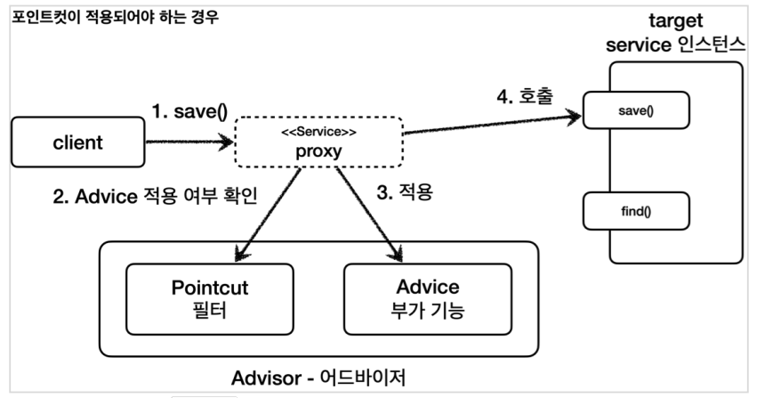

## 어드바이저

포인트컷( Pointcut ): 어디에 부가 기능을 적용할지, 어디에 부가 기능을 적용하지 않을지 판단하는 필터링 로직이다. 주로 클래스와 메서드 이름으로 필터링 한다. 이름 그대로 어떤 포인트(Point)에 기능을 적용할지 하지 않을지 잘라서(cut) 구분하는 것이다.
어드바이스( Advice ): 프록시가 호출하는 부가 기능이다. 단순하게 프록시 로직이라 생각하면 된다.
어드바이저( Advisor ): 하나의 포인트컷과 하나의 어드바이스를 가지고 있는 것이다. 쉽게 이야기해서 포인트컷1 + 어드바이스1이다.

앞서서 배운 프록시의 부가 기능 로직을 적용 할 때, 포인트 컷은 어디에 적용할지 선택하고, 어드바이스로 어떤 로직을 적용할지 선택한다. 포인트 컷과 어드바이스를 모두 알고있는 것이 어드바이저 이다.

조언( Advice )을 어디( Pointcut )에 할 것인가?
조언자( Advisor )는 어디( Pointcut )에 조언( Advice )을 해야할지 알고 있다.


AdvisorTest

```
@Slf4j
public class AdvisorTest {
  @Test
  void advisorTest1() {
    ServiceInterface target = new ServiceImpl();
    ProxyFactory proxyFactory = new ProxyFactory(target);
    DefaultPointcutAdvisor advisor = new DefaultPointcutAdvisor(Pointcut.TRUE, new TimeAdvice());
    proxyFactory.addAdvisor(advisor);
    ServiceInterface proxy = (ServiceInterface) proxyFactory.getProxy();
    proxy.save();
    proxy.find();
  }
}
```

new DefaultPointcutAdvisor : Advisor 인터페이스의 가장 일반적인 구현체이다. 생성자를 통해 하나의 포인트컷과 하나의 어드바이스를 넣어주면 된다. 어드바이저는 하나의 포인트컷과 하나의 어드바이스로 구성된다.

proxyFactory.addAdvisor(advisor) : 프록시 팩토리에 적용할 어드바이저를 지정한다. 어드바이저는 내부에 포인트컷과 어드바이스를 모두 가지고 있다. 따라서 어디에 어떤 부가 기능을 적용해야 할지 어드바이스 하나로 알 수 있다. 프록시 팩토리를 사용할 때 어드바이저는 필수이다.

프록시 팩토리 예제 코드에서 proxyFactory.addAdvice(new TimeAdvice()) 이렇게 어드바이저가 아니라 어드바이스를 바로 적용했다. 이것은 단순히 편의 메서드이고 결과적으로 해당 메서드 내부에서 지금 코드와 똑같은 다음 어드바이저가 생성된다.
DefaultPointcutAdvisor(Pointcut.TRUE, new TimeAdvice())

실행결과

```
#save() 호출
TimeAdvice - TimeProxy 실행
ServiceImpl - save 호출
TimeAdvice - TimeProxy 종료 resultTime=0ms

#find() 호출
TimeAdvice - TimeProxy 실행
ServiceImpl - find 호출
TimeAdvice - TimeProxy 종료 resultTime=1ms
```

이번에는 save() 메서드에는 어드바이스 로직을 적용하지만, find() 메서드에는 어드바이스 로직을 적용하지 않도록 해보자.

이번에는 해당 요구사항을 만족하도록 포인트컷을 직접 구현해보자.

```
public interface Pointcut {
  ClassFilter getClassFilter();
  MethodMatcher getMethodMatcher();
}
public interface ClassFilter {
  boolean matches(Class<?> clazz);
}
public interface MethodMatcher {
  boolean matches(Method method, Class<?> targetClass);
  //..
}
```

포인트컷은 크게 ClassFilter 와 MethodMatcher 둘로 이루어진다. 하나는 클래스가 맞는지, 하나는 메서드가 맞는지 확인할 때 사용한다. 둘다 true 로 반환해야 어드바이스를 적용할 수 있다.

```
@Test
@DisplayName("직접 만든 포인트컷")
void advisorTest2() {
  ServiceImpl target = new ServiceImpl();
  ProxyFactory proxyFactory = new ProxyFactory(target);
  DefaultPointcutAdvisor advisor = new DefaultPointcutAdvisor(new MyPointcut(), new TimeAdvice());
  proxyFactory.addAdvisor(advisor);
  ServiceInterface proxy = (ServiceInterface) proxyFactory.getProxy();
  proxy.save();
  proxy.find();
}

static class MyPointcut implements Pointcut {
  @Override
  public ClassFilter getClassFilter() {
    return ClassFilter.TRUE;
  }

  @Override
  public MethodMatcher getMethodMatcher() {
    return new MyMethodMatcher();
  }
}
static class MyMethodMatcher implements MethodMatcher {
  private String matchName = "save";

  @Override
  public boolean matches(Method method, Class<?> targetClass) {
    boolean result = method.getName().equals(matchName);
    log.info("포인트컷 호출 method={} targetClass={}", method.getName(), targetClass);
    log.info("포인트컷 결과 result={}", result);
    return result;
  }

  @Override
  public boolean isRuntime() {
    return false;
  }

  @Override
  public boolean matches(Method method, Class<?> targetClass, Object... args)
  {
    throw new UnsupportedOperationException();
  }
}
```

MyPointcut
직접 구현한 포인트컷이다. Pointcut 인터페이스를 구현한다.
현재 메서드 기준으로 로직을 적용하면 된다. 클래스 필터는 항상 true 를 반환하도록 했고, 메서드 비교 기능은 MyMethodMatcher 를 사용한다.

MyMethodMatcher
직접 구현한 MethodMatcher 이다. MethodMatcher 인터페이스를 구현한다.
matches() : 이 메서드에 method , targetClass 정보가 넘어온다. 이 정보로 어드바이스를 적용할지 적용하지 않을지 판단할 수 있다.
여기서는 메서드 이름이 "save" 인 경우에 true 를 반환하도록 판단 로직을 적용했다.

실행결과

```
#save() 호출
AdvisorTest - 포인트컷 호출 method=save targetClass=class
hello.proxy.common.service.ServiceImpl
AdvisorTest - 포인트컷 결과 result=true
TimeAdvice - TimeProxy 실행
ServiceImpl - save 호출
TimeAdvice - TimeProxy 종료 resultTime=1ms

#find() 호출
AdvisorTest - 포인트컷 호출 method=find targetClass=class
hello.proxy.common.service.ServiceImpl
AdvisorTest - 포인트컷 결과 result=false
ServiceImpl - find 호출
```

save() 를 호출할 때는 어드바이스가 적용되지만, find() 를 호출할 때는 어드바이스가 적용되지 않는다.



1. 클라이언트가 프록시의 save() 를 호출한다.
2. 포인트컷에 Service 클래스의 save() 메서드에 어드바이스를 적용해도 될지 물어본다.
3. 포인트컷이 true 를 반환한다. 따라서 어드바이스를 호출해서 부가 기능을 적용한다.
4. 이후 실제 인스턴스의 save() 를 호출한다.


1. 클라이언트가 프록시의 find() 를 호출한다.
2. 포인트컷에 Service 클래스의 find() 메서드에 어드바이스를 적용해도 될지 물어본다.
3. 포인트컷이 false 를 반환한다. 따라서 어드바이스를 호출하지 않고, 부가 기능도 적용되지 않는다.
4. 실제 인스턴스를 호출한다.

<br>
<hr>

### 스프링이 제공하는 포인트컷

스프링이 제공하는 NameMatchMethodPointcut 를 사용해서 구현해보자.

```
@Test
@DisplayName("스프링이 제공하는 포인트컷")
void advisorTest3() {
  ServiceImpl target = new ServiceImpl();
  ProxyFactory proxyFactory = new ProxyFactory(target);
  NameMatchMethodPointcut pointcut = new NameMatchMethodPointcut();
  pointcut.setMappedNames("save");
  DefaultPointcutAdvisor advisor = new DefaultPointcutAdvisor(pointcut, new TimeAdvice());
  proxyFactory.addAdvisor(advisor);
  ServiceInterface proxy = (ServiceInterface) proxyFactory.getProxy();
  proxy.save();
  proxy.find();
}
```

NameMatchMethodPointcut

NameMatchMethodPointcut pointcut = new NameMatchMethodPointcut();
pointcut.setMappedNames("save");
NameMatchMethodPointcut 을 생성하고 setMappedNames(...) 으로 메서드 이름을 지정하면 포인트컷이 완성된다.

실행결과

```
#save() 호출
TimeAdvice - TimeProxy 실행
ServiceImpl - save 호출
TimeAdvice - TimeProxy 종료 resultTime=1ms

#find() 호출
ServiceImpl - find 호출
```

위에서 직접 포인트 컷을 구현했을때와 마찬가지로 save를 호출할 때는 어드바이스가 적용되었지만, find 호출 시 어드바이스가 적용되지 않았다.

스프링이 제공하는 포인트컷

스프링은 무수히 많은 포인트컷을 제공한다.
대표적인 몇가지만 알아보자.
NameMatchMethodPointcut : 메서드 이름을 기반으로 매칭한다. 내부에서는 PatternMatchUtils 를 사용한다.

- 예) \*xxx\* 허용

JdkRegexpMethodPointcut : JDK 정규 표현식을 기반으로 포인트컷을 매칭한다.
TruePointcut : 항상 참을 반환한다.
AnnotationMatchingPointcut : 애노테이션으로 매칭한다.
AspectJExpressionPointcut : aspectJ 표현식으로 매칭한다.

**가장 중요한 것은 aspectJ 표현식**

일반적으로 사용하기도 편리하고 기능도 가장 많은 aspectJ 표현식을 기반으로 사용하는 AspectJExpressionPointcut 을 사용하게 된다. 이후 스프링 AOP에서 자세히 다룰것이다.

<br>
<hr>

### 여러 어드바이저 함께 적용

어드바이저는 하나의 포인트컷과 하나의 어드바이스를 가지고 있다.
만약 여러 어드바이저를 하나의 target 에 적용하려면 어떻게 해야할까?
쉽게 이야기해서 하나의 target 에 여러 어드바이스를 적용하려면 어떻게 해야할까?

프록시를 여러개 만들어서 체인하는 형식으로 만들면 되긴한다.


이 방법이 잘못된 것은 아니지만, 프록시를 2번 생성해야 한다는 문제가 있다. 만약 적용해야 하는 어드바이저가 10개라면 10개의 프록시를 생성해야한다.

스프링은 이 문제를 해결하기 위해 하나의 프록시에 여러 어드바이저를 적용할 수 있게 만들어두었다.


```
@Test
@DisplayName("하나의 프록시, 여러 어드바이저")
void multiAdvisorTest2() {
  //proxy -> advisor2 -> advisor1 -> target
  DefaultPointcutAdvisor advisor2 = new DefaultPointcutAdvisor(Pointcut.TRUE, new Advice2());
  DefaultPointcutAdvisor advisor1 = new DefaultPointcutAdvisor(Pointcut.TRUE, new Advice1());

  ServiceInterface target = new ServiceImpl();
  ProxyFactory proxyFactory1 = new ProxyFactory(target);
  proxyFactory1.addAdvisor(advisor2);
  proxyFactory1.addAdvisor(advisor1);
  ServiceInterface proxy = (ServiceInterface) proxyFactory1.getProxy();
  //실행
  proxy.save();
}
```

프록시 팩토리에 원하는 만큼 addAdvisor() 를 통해서 어드바이저를 등록하면 된다.
등록하는 순서대로 advisor 가 호출된다. 여기서는 advisor2 , advisor1 순서로 등록했다.


실행결과

```
MultiAdvisorTest$Advice2 - advice2 호출
MultiAdvisorTest$Advice1 - advice1 호출
ServiceImpl - save 호출
```

> 스프링은 AOP를 적용할 때, 최적화를 진행해서 지금처럼 프록시는 하나만 만들고, 하나의 프록시에 여러 어드바이저를 적용한다.
> 정리하면 하나의 target 에 여러 AOP가 동시에 적용되어도, 스프링의 AOP는 target 마다 하나의 프록시만 생성한다. 이부분을 꼭 기억해두자.

<script src="https://utteranc.es/client.js"
        repo="chojs23/comments"
        issue-term="pathname"
        theme="github-dark"
        crossorigin="anonymous"
        async>
</script>
