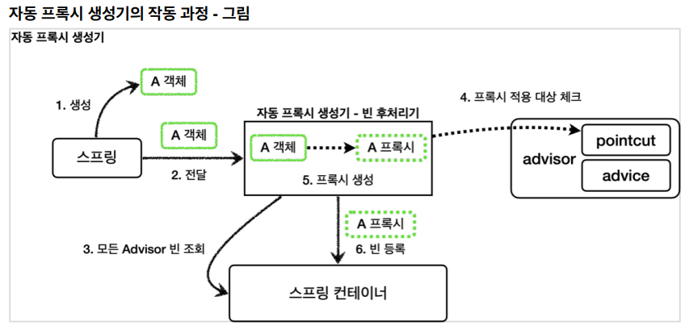

## 스프링이 제공하는 빈 후처리기

먼저 스프링에 라이브러리를 추가하자.

```
implementation 'org.springframework.boot:spring-boot-starter-aop'
```

이 라이브러리를 추가하면 aspectjweaver 라는 aspectJ 관련 라이브러리를 등록하고, 스프링 부트가 AOP 관련 클래스를 자동으로 스프링 빈에 등록한다.

### AutoProxyCreator

스프링 부트 자동 설정으로 AnnotationAwareAspectJAutoProxyCreator 라는 빈 후처리기가 스프링 빈에 자동으로 등록된다. 이 빈 후처리기는자동으로 프록시를 생성해주는 빈 후처리기이다. 스프링 빈으로 등록된 Advisor 들을 자동으로 찾아서 프록시가 필요한 곳에 자동으로 프록시를 적용해준다.
Advisor 안에는 Pointcut 과 Advice 가 이미 모두 포함되어 있으므로 Advisor 만 알고 있으면 그 안에 있는 Pointcut 으로 어떤 스프링 빈에 프록시를 적용해야 할지 알 수 있다. 그리고 Advice 로 부가기능을 적용하면 된다.

> AnnotationAwareAspectJAutoProxyCreator 는 @AspectJ와 관련된 AOP 기능도 자동으로 찾아서 처리해준다.
> Advisor 는 물론이고, @Aspect 도 자동으로 인식해서 프록시를 만들고 AOP를 적용해준다.



자동 프록시 생성기 - 빈 후처리기는 스프링 컨테이너에서 모든 Advisor를 조회한다.
앞서 조회한 Advisor 에 포함되어 있는 포인트컷을 사용해서 해당 객체가 프록시를 적용할 대상인지 아닌지 판단한다. 이때 객체의 클래스 정보는 물론이고, 해당 객체의 모든 메서드를 포인트컷에 하나하나 모두 매칭해본다. 그래서 조건이 하나라도 만족하면 프록시 적용 대상이 된다.

```
@Configuration
public class AutoProxyConfig {
  @Bean
  public Advisor advisor1(LogTrace logTrace) {
    NameMatchMethodPointcut pointcut = new NameMatchMethodPointcut();
    pointcut.setMappedNames("request*", "order*", "save*");

    LogTraceAdvice advice = new LogTraceAdvice(logTrace);

    //advisor = pointcut + advice
    return new DefaultPointcutAdvisor(pointcut, advice);
  }
}
```

AutoProxyConfig 코드를 보면 advisor1 이라는 어드바이저 하나만 등록했다.
빈 후처리기는 이제 등록하지 않아도 된다. 스프링은 자동 프록시 생성기라는 (AnnotationAwareAspectJAutoProxyCreator) 빈 후처리기를 자동으로 등록해준다.

중요: 포인트컷은 2가지에 사용된다.

1. 프록시 적용 여부 판단 - 생성 단계
   - 자동 프록시 생성기는 포인트컷을 사용해서 해당 빈이 프록시를 생성할 필요가 있는지 없는지 체크한다.
   - 클래스 + 메서드 조건을 모두 비교한다. 이때 모든 메서드를 체크하는데, 포인트컷 조건에 하나하나 매칭해본다. 만약 조건에 맞는 것이 하나라도 있으면 프록시를 생성한다.
     - 예) orderControllerV1 은 request() , noLog() 가 있다. 여기에서 request() 가 조건에 만족하므로 프록시를 생성한다.
   - 만약 조건에 맞는 것이 하나도 없으면 프록시를 생성할 필요가 없으므로 프록시를 생성하지 않는다.
2. 어드바이스 적용 여부 판단 - 사용 단계
   - 프록시가 호출되었을 때 부가 기능인 어드바이스를 적용할지 말지 포인트컷을 보고 판단한다.
   - 앞서 설명한 예에서 orderControllerV1 은 이미 프록시가 걸려있다.
   - orderControllerV1 의 request() 는 현재 포인트컷 조건에 만족하므로 프록시는 어드바이스를 먼저 호출하고, target 을 호출한다.
   - orderControllerV1 의 noLog() 는 현재 포인트컷 조건에 만족하지 않으므로 어드바이스를 호출하지 않고 바로 target 만 호출한다.

> 프록시를 모든 곳에 생성하는 것은 비용 낭비이다. 꼭 필요한 곳에 최소한의 프록시를 적용해야 한다. 그래서 자동 프록시 생성기는 모든 스프링 빈에 프록시를 적용하는 것이 아니라 포인트컷으로 한번 필터링해서 어드바이스가 사용될 가능성이 있는 곳에만 프록시를 생성한다.

<hr>

위의 자동 프록시 생성기를 적용하고 어플리케이션 서버를 실행하면 스프링이 초기화 되면서 기대하지 않은 로그들이 올라온다.

```
EnableWebMvcConfiguration.requestMappingHandlerAdapter()
EnableWebMvcConfiguration.requestMappingHandlerAdapter() time=63ms
```

지금 사용한 포인트컷이 단순히 메서드 이름에 "request*", "order*", "save\*" 만 포함되어 있으면 매칭 된다고 판단하기 때문이다.
결국 스프링이 내부에서 사용하는 빈에도 메서드 이름에 request 라는 단어만 들어가 있으면 프록시가 만들어지고 되고, 어드바이스도 적용되는 것이다.
따라서 패키지에 메서드 이름까지 함께 지정할 수 있는 매우 정밀한 포인트컷이 필요하다.

### AspectJExpressionPointcut

AspectJ라는 AOP에 특화된 포인트컷 표현식을 적용할 수 있다.

```
@Configuration
public class AutoProxyConfig {
  //@Bean
  public Advisor advisor1(LogTrace logTrace) {
    ...
  }

  @Bean
  public Advisor advisor2(LogTrace logTrace) {
    AspectJExpressionPointcut pointcut = new AspectJExpressionPointcut();
    pointcut.setExpression("execution(* hello.proxy.app..*(..))");

    LogTraceAdvice advice = new LogTraceAdvice(logTrace);

    //advisor = pointcut + advice
    return new DefaultPointcutAdvisor(pointcut, advice);
  }
}
```

AspectJExpressionPointcut : AspectJ 포인트컷 표현식을 적용할 수 있다.
execution(_ hello.proxy.app.._(..)) : AspectJ가 제공하는 포인트컷 표현식이다.

- \* : 모든 반환 타입
- hello.proxy.app.. : 해당 패키지와 그 하위 패키지
- \*(..) : \* 모든 메서드 이름, (..) 파라미터는 상관 없음

```
pointcut.setExpression("execution(* hello.proxy.app..*(..)) && !execution(* hello.proxy.app..noLog(..))");
```

&& : 두 조건을 모두 만족해야 함
! : 반대

hello.proxy.app 패키지와 하위 패키지의 모든 메서드는 포인트컷의 매칭하되, noLog() 메서드는 제외하라는 뜻이다.

<hr>

### 하나의 프록시에 여러 Advisor 적용

어떤 스프링 빈이 advisor1 , advisor2 가 제공하는 포인트컷의 조건을 모두 만족하면 프록시 자동 생성기는 프록시를 몇 개 생성할까?
프록시 자동 생성기는 프록시를 하나만 생성한다. 왜냐하면 프록시 팩토리가 생성하는 프록시는 내부에 여러 advisor 들을 포함할 수 있기 때문이다. 따라서 프록시를 여러 개 생성해서 비용을 낭비할 이유가 없다.


- advisor1 의 포인트컷만 만족 프록시1개 생성, 프록시에 advisor1 만 포함
- advisor1 , advisor2 의 포인트컷을 모두 만족 프록시1개 생성, 프록시에 advisor1 , advisor2 모두 포함


<script src="https://utteranc.es/client.js"
        repo="chojs23/comments"
        issue-term="pathname"
        theme="github-dark"
        crossorigin="anonymous"
        async>
</script>
