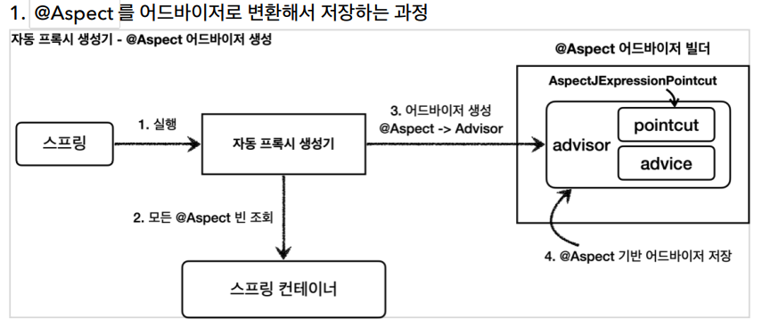
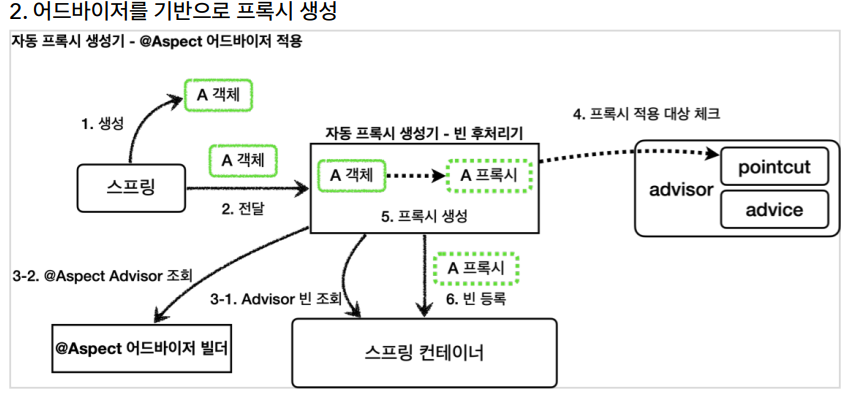
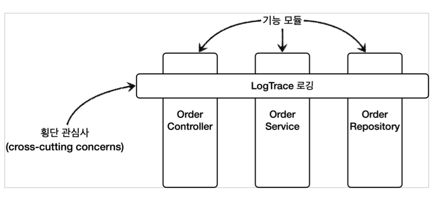

## @Aspect 프록시

스프링 애플리케이션에 프록시를 적용하려면 포인트컷과 어드바이스로 구성되어 있는 어드바이저를 만들어서 스프링 빈으로 등록하면 된다. 그러면 나머지는 자동 프록시 생성기가 모두 자동으로 처리해준다. 자동 프록시 생성기는 스프링 빈으로 등록된 어드바이저들을 찾고, 포인트컷이 매칭되는 경우에 스프링 빈들에 자동으로 프록시를 적용해준다.

스프링은 @Aspect 애노테이션으로 매우 편리하게 포인트컷과 어드바이스로 구성되어 있는 어드바이저 생성 기능을 지원한다.

어드바이저를 직접 만들었던 부분을 @Aspect 애노테이션을 사용해서 만들어보자.

```
@Slf4j
@Aspect
public class LogTraceAspect {
  private final LogTrace logTrace;

  public LogTraceAspect(LogTrace logTrace) {
    this.logTrace = logTrace;
  }

  @Around("execution(* hello.proxy.app..*(..))") // <-- 포인트 컷
  public Object execute(ProceedingJoinPoint joinPoint) throws Throwable { //<-- 어드바이스
    TraceStatus status = null;

    // log.info("target={}", joinPoint.getTarget()); //실제 호출 대상
    // log.info("getArgs={}", joinPoint.getArgs()); //전달인자
    // log.info("getSignature={}", joinPoint.getSignature()); //join point 시그니처

    try {
      String message = joinPoint.getSignature().toShortString();
      status = logTrace.begin(message);
      //로직 호출
      Object result = joinPoint.proceed();
      logTrace.end(status);
      return result;
    } catch (Exception e) {
      logTrace.exception(status, e);
      throw e;
    }
  }
}
```

-   @Aspect : 애노테이션 기반 프록시를 적용할 때 필요하다.
-   @Around("execution(_ hello.proxy.app.._(..))")
    -   @Around 의 값에 포인트컷 표현식을 넣는다. 표현식은 AspectJ 표현식을 사용한다.
    -   @Around 의 메서드는 어드바이스( Advice )가 된다.
-   ProceedingJoinPoint joinPoint : 어드바이스에서 살펴본 MethodInvocation invocation 과 유사한 기능이다. 내부에 실제 호출 대상, 전달 인자, 그리고 어떤 객체와 어떤 메서드가 호출되었는지 정보가 포함되어 있다.
-   joinPoint.proceed() : 실제 호출 대상( target )을 호출한다.

```
@Configuration
public class AopConfig {
  @Bean
  public LogTraceAspect logTraceAspect(LogTrace logTrace) {
    return new LogTraceAspect(logTrace);
  }
}
```

<hr>

앞서 자동 프록시 생성기를 학습할 때, 자동 프록시 생성기 (AnnotationAwareAspectJAutoProxyCreator)는 Advisor 를 자동으로 찾아와서 필요한 곳에 프록시를 생성하고 적용해준다고 했다. 자동 프록시 생성기는 여기에 추가로 하나의 역할을 더 하는데, 바로 **@Aspect** 를 찾아서 이것을 **Advisor** 로 만들어준다.



**@Aspect 어드바이저 빌더**
BeanFactoryAspectJAdvisorsBuilder 클래스이다. @Aspect 의 정보를 기반으로 포인트컷, 어드바이스, 어드바이저를 생성하고 보관하는 것을 담당한다. @Aspect 의 정보를 기반으로 어드바이저를 만들고, @Aspect 어드바이저 빌더 내부 저장소에 캐시한다. 캐시에 어드바이저가 이미 만들어져 있는 경우 캐시에 저장된 어드바이저를 반환한다.



@Aspect 를 사용해서 애노테이션 기반 프록시를 매우 편리하게 적용해보았다. 실무에서 프록시를 적용할 때는 대부분이 이 방식을 사용한다.

지금까지 우리가 진행한 애플리케이션 전반에 로그를 남기는 기능 등의 부가기능은 특정 기능 하나에 관심이 있는 기능이 아니다. 애플리케이션의 여러 기능들 사이에 걸쳐서 들어가는 관심사이다.



이것을 바로 **횡단 관심사(cross-cutting concerns)**라고 한다. 프록시를 사용해서 이렇게 여러곳에 걸쳐 있는 횡단 관심사의 문제를 해결하였다.

<script src="https://utteranc.es/client.js"
        repo="chojs23/comments"
        issue-term="pathname"
        theme="github-light"
        crossorigin="anonymous"
        async>
</script>
