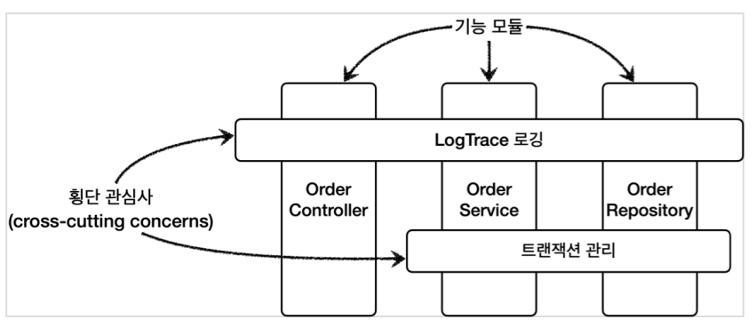

## AOP

부가 기능과 부가 기능을 어디에 적용할지 선택하는 기능을 합해서 하나의 모듈로 만들었는데 이것이 바로 애스펙트(aspect)이다. 애스펙트는 부가 기능과, 해당 부가 기능을 어디에 적용할지 정의한 것이다.

우리가 이전에 알아본 @Aspect 바로 그것이다. 그리고 스프링이 제공하는 어드바이저도 어드바이스(부가 기능)과 포인트컷(적용 대상)을 가지고 있어서 개념상 하나의 애스펙트이다.
애스펙트를 사용한 프로그래밍 방식을 관점 지향 프로그래밍 **AOP**(Aspect-Oriented Programming) 이라 한다.
AOP는 OOP를 대체하기 위한 것이 아니라 횡단 관심사를 깔끔하게 처리하기 어려운 OOP의 부족한 부분을 보조하는 목적으로 개발되었다.

AOP의 대표적인 구현으로 AspectJ 프레임워크가 있다.

### AOP 적용 방식

AOP를 사용하면 핵심 기능과 부가 기능이 코드상 완전히 분리되어서 관리된다.AOP를 사용할 때 부가 기능 로직은 세 가지 방식으로 실제 로직에 추가된다.

-   컴파일 시점
-   클래스 로딩 시점
-   런타임 시점(프록시)

#### 컴파일 시점 AOP 적용

.java 소스 코드를 컴파일러를 사용해서 .class 를 만드는 시점에 부가 기능 로직을 추가할 수 있다. 이때는 AspectJ가 제공하는 특별한 컴파일러를 사용해야 한다. 컴파일 된 .class 를 디컴파일 해보면 애스펙트 관련 호출 코드가 들어간다.
AspectJ 컴파일러는 Aspect를 확인해서 해당 클래스가 적용 대상인지 먼저 확인하고, 적용 대상인 경우에 부가 기능 로직을 적용한다.
이렇게 원본 로직에 부가 기능 로직이 추가되는 것을 **위빙**(Weaving)이라 한다.

컴파일 시점 - 단점
컴파일 시점에 부가 기능을 적용하려면 특별한 컴파일러도 필요하고 복잡하다.

#### 클래스 로딩 시점 AOP 적용

자바를 실행하면 자바 언어는 .class 파일을 JVM 내부의 클래스 로더에 보관한다. 이때 중간에서 .class 파일을 조작한 다음 JVM에 올릴 수 있다. 자바 언어는 .class 를 JVM에 저장하기 전에 조작할 수 있는 기능을 제공한다. 이 시점에 애스펙트를 적용하는 것을 로드 타임 위빙이라 한다.

클래스 로딩 시점 - 단점
로드 타임 위빙은 자바를 실행할 때 특별한 옵션( java -javaagent )을 통해 클래스 로더 조작기를 지정해야 하는데, 이 부분이 번거롭고 운영하기 어렵다.

### 런타임 시점(프록시) AOP 적용

런타임 시점은 컴파일도 다 끝나고, 클래스 로더에 클래스도 다 올라가서 이미 자바가 실행되고 난 다음을 말한다. 자바의 메인( main ) 메서드가 이미 실행된 다음이다.
스프링과 같은 컨테이너의 도움을 받고 프록시와 DI, 빈 포스트 프로세서 같은
개념들을 총 동원해야 한다. 이렇게 하면 최종적으로 프록시를 통해 스프링 빈에 부가 기능을 적용할 수 있다. 지금까지 우리가 학습한 것이 바로 프록시 방식의 AOP이다.

### AOP 적용 위치

AOP는 지금까지 학습한 메서드 실행 위치 뿐만 아니라 다음과 같은 다양한 위치에 적용할 수 있다.

-   적용 가능 지점(조인 포인트): 생성자, 필드 값 접근, static 메서드 접근, 메서드 실행

    -   이렇게 AOP를 적용할 수 있는 지점을 조인 포인트(Join point)라 한다.

-   프록시 방식을 사용하는 스프링 AOP는 메서드 실행 지점에만 AOP를 적용할 수 있다.
    -   프록시는 메서드 오버라이딩 개념으로 동작한다. 따라서 생성자나 static 메서드, 필드 값 접근에는 프록시 개념이 적용될 수 없다.
    -   프록시를 사용하는 **스프링 AOP의 조인 포인트는 메서드 실행으로 제한**된다.
-   프록시 방식을 사용하는 스프링 AOP는 스프링 컨테이너가 관리할 수 있는 **스프링 빈에만 AOP를 적용**할 수 있다.

  
