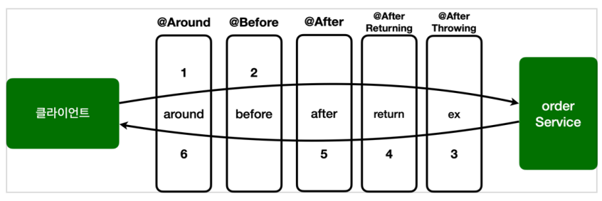

## 스프링 AOP 어드바이스 종류

어드바이스는 @Around 외에도 여러가지 종류가 있다.

어드바이스 종류

@Around : 메서드 호출 전후에 수행, 가장 강력한 어드바이스, 조인 포인트 실행 여부 선택, 반환 값 변환,
예외 변환 등이 가능
@Before : 조인 포인트 실행 이전에 실행
@AfterReturning : 조인 포인트가 정상 완료후 실행
@AfterThrowing : 메서드가 예외를 던지는 경우 실행
@After : 조인 포인트가 정상 또는 예외에 관계없이 실행(finally)

예제 코드로 확인해보자.

AspectV6Advice

```
@Slf4j
@Aspect
public class AspectV6Advice {
  @Around("hello.aop.order.aop.Pointcuts.orderAndService()")
  public Object doTransaction(ProceedingJoinPoint joinPoint) throws Throwable
  {
    try {
      //@Before
      log.info("[around][트랜잭션 시작] {}", joinPoint.getSignature());
      Object result = joinPoint.proceed();
      //@AfterReturning
      log.info("[around][트랜잭션 커밋] {}", joinPoint.getSignature());
      return result;
    } catch (Exception e) {
      //@AfterThrowing
      log.info("[around][트랜잭션 롤백] {}", joinPoint.getSignature());
      throw e;
    } finally {
      //@After
      log.info("[around][리소스 릴리즈] {}", joinPoint.getSignature());
    }
  }

  @Before("hello.aop.order.aop.Pointcuts.orderAndService()")
  public void doBefore(JoinPoint joinPoint) {
    log.info("[before] {}", joinPoint.getSignature());
  }

  @AfterReturning(value = "hello.aop.order.aop.Pointcuts.orderAndService()", returning = "result")
  public void doReturn(JoinPoint joinPoint, Object result) {
    log.info("[return] {} return={}", joinPoint.getSignature(), result);
  }

  @AfterThrowing(value = "hello.aop.order.aop.Pointcuts.orderAndService()", throwing = "ex")
  public void doThrowing(JoinPoint joinPoint, Exception ex) {
    log.info("[ex] {} message={}", joinPoint.getSignature(), ex.getMessage());
  }

  @After(value = "hello.aop.order.aop.Pointcuts.orderAndService()")
  public void doAfter(JoinPoint joinPoint) {
    log.info("[after] {}", joinPoint.getSignature());
  }
}
```

doTransaction() 메서드에 남겨둔 주석을 보자.
복잡해 보이지만 사실 @Around 를 제외한 나머지 어드바이스들은 @Around 가 할 수 있는 일의 일부만 제공할 뿐이다. 따라서 @Around 어드바이스만 사용해도 필요한 기능을 모두 수행할 수 있다.

모든 어드바이스는 org.aspectj.lang.JoinPoint 를 첫번째 파라미터에 사용할 수 있다. (생략해도 된다.) 단 @Around 는 ProceedingJoinPoint 을 사용해야 한다.



<hr>

@Around 외에 다른 어드바이스가 존재하는 이유
@Around 하나만 있어도 모든 기능을 수행할 수 있다. 그런데 다른 어드바이스들이 존재하는 이유는 무엇일까?

다음 코드를 보자.

```
@Around("hello.aop.order.aop.Pointcuts.orderAndService()")
public void doBefore(ProceedingJoinPoint joinPoint) {
  log.info("[before] {}", joinPoint.getSignature());
}
```

이 코드는 타켓을 호출하지 않는 문제가 있다.
이 코드를 개발한 의도는 타켓 실행 전에 로그를 출력하는 것이다. 그런데 @Around 는 항상 joinPoint.proceed() 를 호출해야 한다. 만약 실수로 호출하지 않으면 타켓이 호출되지 않는 치명적인 버그가 발생한다.

```
@Before("hello.aop.order.aop.Pointcuts.orderAndService()")
public void doBefore(JoinPoint joinPoint) {
  log.info("[before] {}", joinPoint.getSignature());
}
```

@Before 는 joinPoint.proceed() 를 호출하는 고민을 하지 않아도 된다.

@Around 가 가장 넓은 기능을 제공하는 것은 맞지만, 실수할 가능성이 있다. 반면에 @Before , @After 같은 어드바이스는 기능은 적지만 실수할 가능성이 낮고, 코드도 단순하다. 그리고 가장 중요한 점이 있는데, 바로 이 코드를 작성한 의도가 명확하게 들어난다는 점이다. @Before 라는 애노테이션을 보는 순간 이 코드는 타켓 실행 전에 한정해서 어떤 일을 하는 코드구나 라는 것이 들어난다.

  <script src="https://utteranc.es/client.js"
          repo="chojs23/comments"
          issue-term="pathname"
          theme="github-light"
          crossorigin="anonymous"
          async>
  </script>
