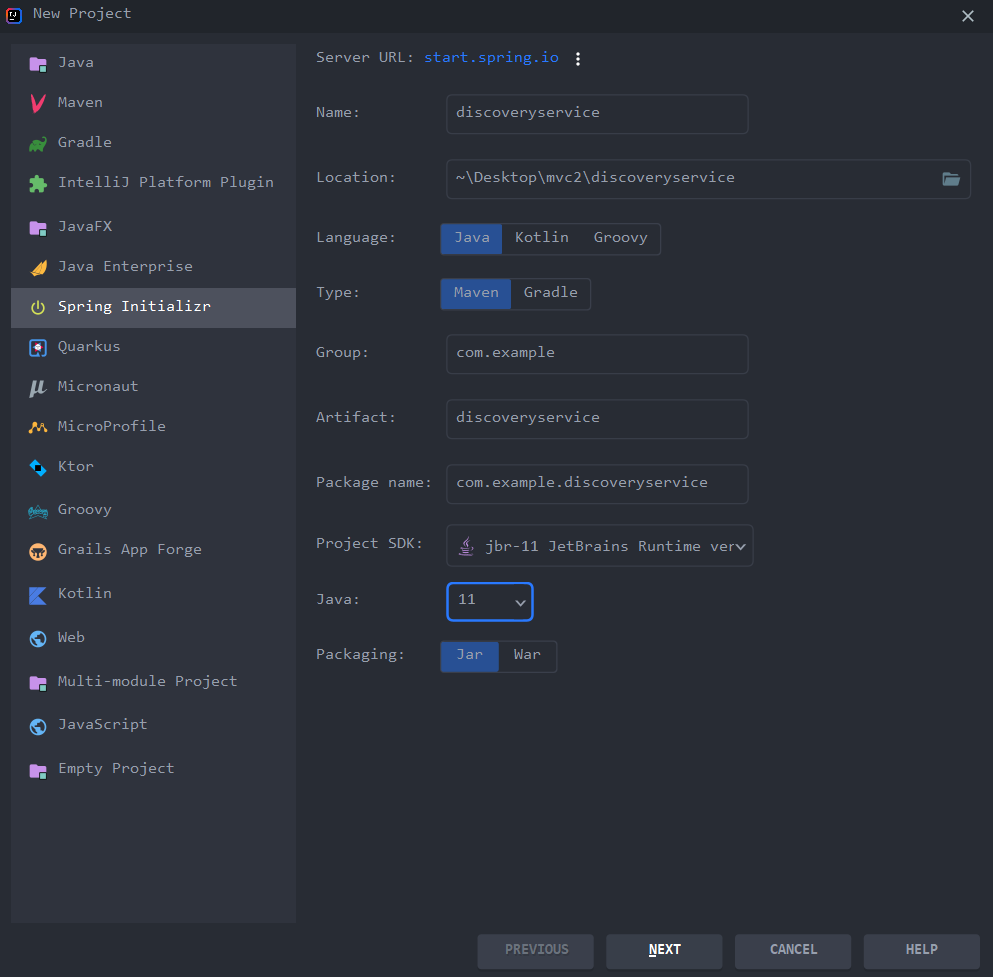
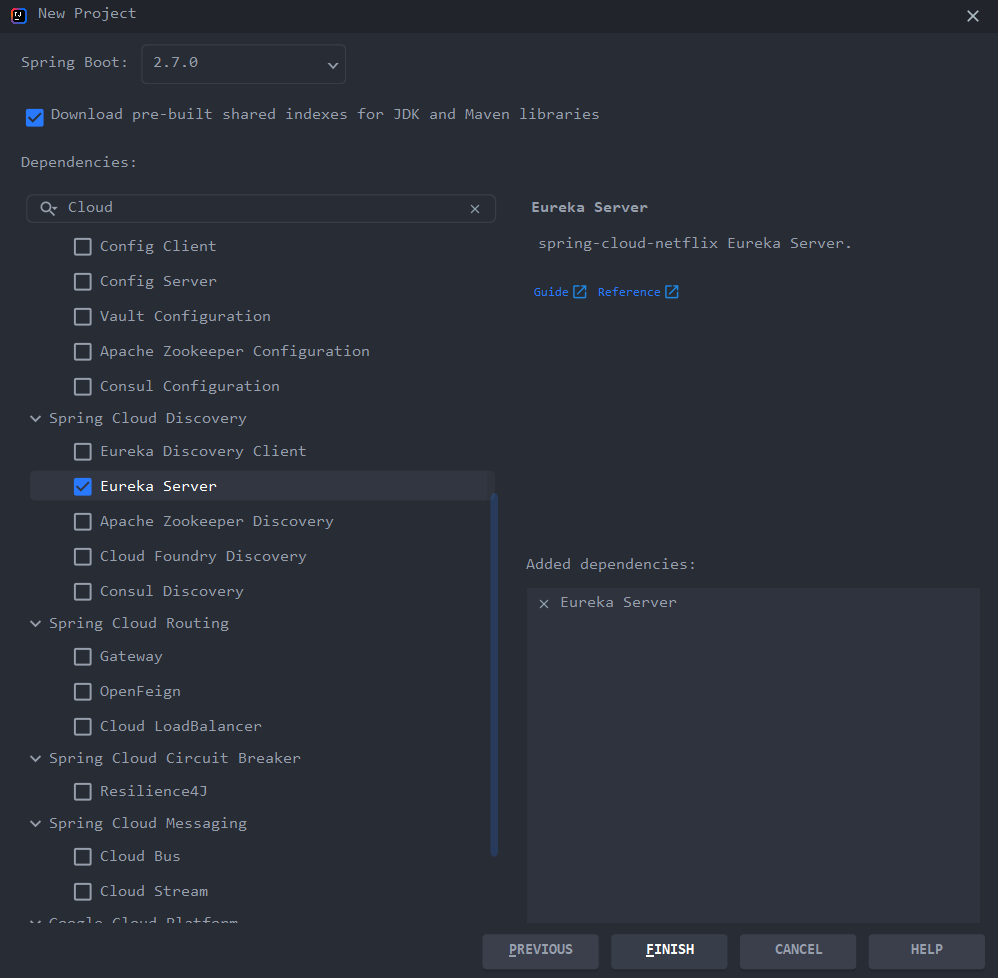
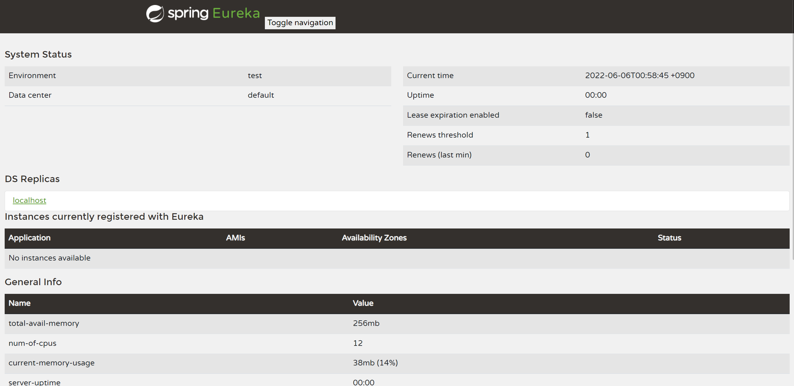

## Spring Cloud Netflix Eureka

Spring Cloud Eureka 의 기능으로 Service Discovery가 있다. Service Discovery란 외부에서 마이크로서비스를 검색하는 개념이다.

Spring Cloud Eureka 에서 key,value 형태로 어떤 서비스(key)가 어떤 위치에 있는지(value) 등록해놓는다. 서비스들의 등록 작업과 검색 작업을 해주는 것을 Service Discovery라 한다.

클라이언트는 자신의 요청 정보를 API Gateway(Load Balancer)에 전달하고 그 요청정보가 Service Discovery에 전달되서 필요한 정보가 어디있는지 물어본다. Service Discovery는 클라이언트에게 어떤 서버로 가야하는지를 알려준다. 클라이언트는 그 정보를 통해 해당 서버로 자신의 요청을 보내고 결과를 받는 구조이다.

따라서 Service Discovery의 역할은 각각의 마이크로 서비스가 어디에 누가 저장되어 있으며 요청정보가 들어왔을 때 해당 요청정보에 따라서 필요한 서비스의 위치를 알려주는 역할이다.

## 스프링 부트 프로젝트 생성

유레카 서버로 사용할 스프링 부트 프로젝트를 생성하자.





스프링 부트 2.7.0 버전을 사용하고 dependencies 항목에 Eureka Server을 추가해주자.

pom.xml 파일에 해당 dependencies가 적용된 것을 확인 할 수 있다.

```
<dependencies>
        <dependency>
            <groupId>org.springframework.cloud</groupId>
            <artifactId>spring-cloud-starter-netflix-eureka-server</artifactId>
        </dependency>

        <dependency>
            <groupId>org.springframework.boot</groupId>
            <artifactId>spring-boot-starter-test</artifactId>
            <scope>test</scope>
        </dependency>
    </dependencies>
```

스프링 부트 프로젝트 실행 파일에 해당 애노테이션을 추가해주자
@EnableEurekaServer

```
@SpringBootApplication
@EnableEurekaServer
public class EcommerceApplication {

    public static void main(String[] args) {
        SpringApplication.run(EcommerceApplication.class, args);
    }

}
```

지금 만든 스프링 부트 프로젝트는 Eureka Server의 역할을 하기위해 Eureka Server로 등록을 하기위해 애노테이션을 추가해주었다.

이제 application.yml 파일을 작성하자

```
server:
  port: 8761

spring:
  application:
    name: discoveryservice

eureka:
  client:
    register-with-eureka: false
    fetch-registry: false
```

Eureka Server는 웹 서비스 형태로 기동이 되고 port 번호를 8761로 지정해주었다.

스프링 부트가 각각의 마이크로서비스에 고유한 ID를 부여해야 하는데 그 ID의 역할로써 application.name을 discoveryservice로 지정해주었다.

유레카 서버를 만드는데 클라이언트 설정을 하는 이유는 스프링 부트에 유레카 라이브러리가 포함된 채 기동이 되고 register-with-eureka, fetch-registry 는 기본값으로 true가 되어 있는데 그렇게 되면 유레카 클라이언트의 역할로써 자기 자신을 유레카 서버에 등록시키고 인스턴스 정보를 주기적으로 가져온다. 따라서 자신의 정보를 자신에게 등록하게되어 의미가 없는 작업이라 false로 설정해 주었다.

스프링 부트 어플리케이션을 실행하고 http://localhost:8761/ 에 접속해보자.



위와 같은 유레카 대시보드 화면이 나오면 정삭적으로 유레카 서버가 실행된 것이다.

<script src="https://utteranc.es/client.js"
        repo="chojs23/comments"
        issue-term="pathname"
        theme="github-dark"
        crossorigin="anonymous"
        async>
</script>
