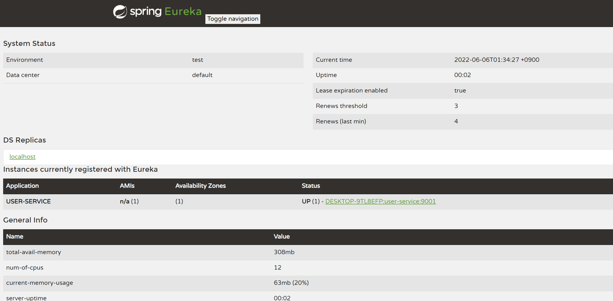
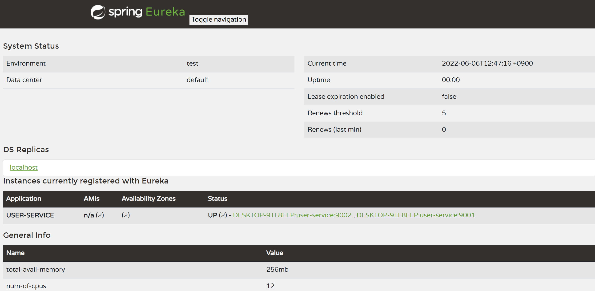

## 마이크로 서비스 등록

이전에 만든 유레카 서버에 유저 서비스 마이크로서비스를 만들어서 등록해보자.


이 마이크로서비스는 유레카 서버의 클라이언트의 역할로 등록이 될 것이기 때문에 dependencies 항목에 Eureka Discovery Client를 등록해주자.


추가로 웹 서비스를 만들기 위해 Spring Web과 편리한 기능을 제공해주는 lombok과 devtools도 추가해주자.

```
@SpringBootApplication
@EnableDiscoveryClient
public class UserServiceApplication {

    public static void main(String[] args) {
        SpringApplication.run(UserServiceApplication.class, args);
    }

}
```

유레카 서버와 마찬가지로 유레카 클라이언트도 스프링부트 실행파일에 @EnableDiscoveryClient 애노테이션을 등록해주자.

application.yml

```

server:
  port: 9001

spring:
  application:
    name: user-service
eureka:
  client:
    fetch-registry: true
    register-with-eureka: true
    service-url:
      defaultZone: http://127.0.0.1:8761/eureka
```

포트번호는 9001번으로 설정하였고 user-service라는 이름으로 등록한다. 유레카 서버에 클라이언트로써 등록하고 service-url.defaultZone 을 우리가 등록한 유레카 서버의 엔드포인트에 마이크로서비스 정보를 등록하기위해 설정하였다.

이제 유레카 서버를 작동시키고 유저서비스 또한 작동시켜보자. 유레카 서버가 기동중이지 않으면 유레카 클라이언트 서비스를 작동시킬 때 오류가 발생한다.



우리가 만든 user-service 마이크로서비스가 유레카 서버에 잘 등록된 것을 확인할 수 있다.

<hr>

똑같은 user-service를 유레카 서버에 하나 더 등록해보자.


인텔리제이의 Run Configurations에 가서 user-service를 하나 더 만들고 vm option에 -Dserver.port=9002 로 설정해주자. 서버 포트를 바꿔주지 않으면 user-service의 application.yml에 설정한 9001번 포트에서 실행되기 때문에 두 user-service를 실행할 수 없어서 나중에 실행한 유저 서비스에서 해당 포트에서 어플리케이션이 실행중이라는 오류가 나온다.



유레카 대시보드에 가보면 user-service의 availability zones 가 2로 바뀌어있고 status에 2개의 user-service를 볼 수 있다.

이번엔 커맨드라인에서 세번째 user-service를 등록해보자.

콘솔명령창에
mvn spring-boot:run -Dspring-boot.run.jvmArguments='-Dserver.port=9003'
을 입력해주자

9003번 포트에 새로운 서비스가 실행되는것을 확인 할 수 있다.


네번째 서비스를 등록해보자

콘솔명령창에 user-service 작업 디렉토리로 이동 후 mvn clean 으로 빌드 정보를 다 삭제하자. 그리고 mvn compile package 명령어로 빌드하고 패키징 하자. 그럼 작업 폴더에 target 폴더가 생기고 빌드된 jar 파일이 생긴걸 확인할 수 있다.

이제 빌드된 jar 파일을 실행해보자.

콘솔 창에 java -jar -Dserver.port=9004 ./target/user-service-0.0.1-SNAPSHOT.jar 을 입력해주면 4 번째 서버가 구동되는걸 확인할 수 있다.


<hr>

매번 인스턴스를 달리해서 서버를 기동할 때 마다 포트번호를 지정해 주는 작업이 매우 번거롭기 때문에 스프링부트의 랜덤포트 방법을 이용하자.

user-service의 application.yml 파일의 포트번호를 0으로 수정해주자

```
server:
  port: 0
```

0번으로 지정해주면 매번 랜덤한 포트번호를 사용하겠다는 뜻이다.

서버를 기동시키면 Tomcat started on port(s): 9856 (http) with context path '' 으로 랜덤한 포트번호가 지정되어진다.


유레카 대시보드에는 0번 포트에서 실행중인거로 나온다.

여러 서비스를 실행해도 유레카 대시보드에는 0번 포트에 하나만 실행중인 것처럼 나온다.

이를 해결하기 위해 application.yml 파일에 다음을 추가하자

```
eureka:
  instance:
    instance-id: ${spring.cloud.client.hostname}:${spring.application.instance_id:${random.value}}
```

이제 유레카 대시보드를 보면 정상적으로 여러 인스턴스가 보인다.

<script src="https://utteranc.es/client.js"
        repo="chojs23/comments"
        issue-term="pathname"
        theme="github-light"
        crossorigin="anonymous"
        async>
</script>
