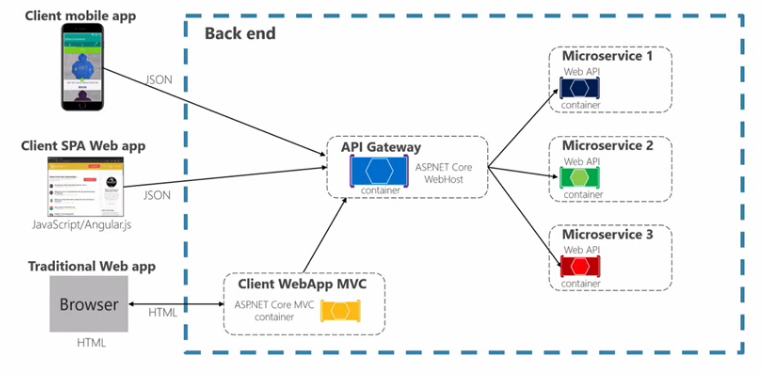
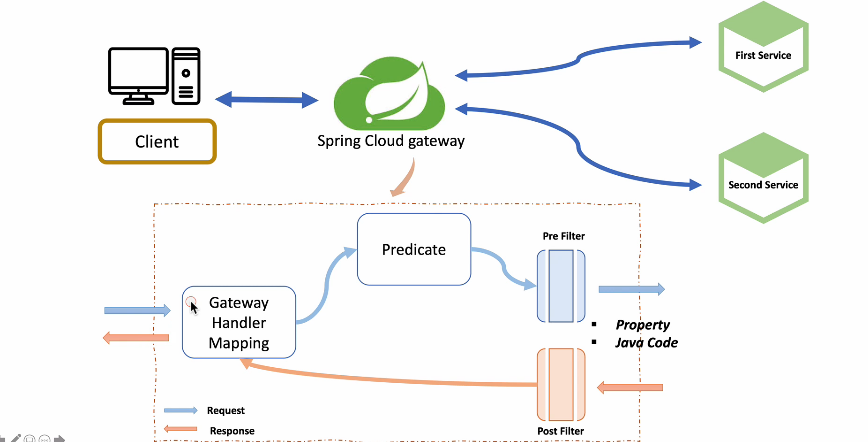
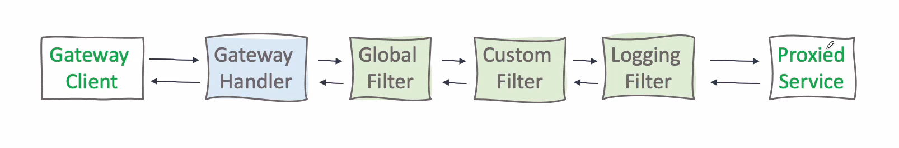

## API Gateway Service란?

API Gateway Service는 사용자가 설정한 라우팅 설정에 따라서 각 엔드포인트로 클라이언트 대신 요청을 보내고 응답을 받으면 클라이언트에게 전해주는 일종의 프록시 역할을 한다. 시스템의 내부 구조는 숨기고 외부의 요청에 대해서 적절한 형태로 가공해서 응답할 수 있는 장점이 있다.



API Gateway Service를 사용하게 되면 다음과 같은 기능을 이용할 수 있다.

-   인증 및 권한 부여
-   서비스 통합 검색
-   응답 캐싱
-   정책, 회로 차단
-   속도 제한
-   부하 분산
-   로깅, 추적, 상관 관계
-   헤더, 쿼리 문자열 및 청구 변환
-   IP 허용 목록에 추가

## Spring Cloud Gateway

스프링 클라우드 게이트웨이 서비스를 이용해 API gateway 서비스와 라우팅 서비스를 구현해보자.

간단하게 first-service 와 second-service 두 서비스를 만들어서 스프링 클라우드 게이트웨이를 적용해보자

스프링 부트 프로젝트 생성 - first-service, second-service

Dependencies

-   Spring Boot DevTools
-   Eureka Discovery Client
-   Gateway

FirstServiceController

```
@RestController
@RequestMapping("/first-service")
public class FirstServiceController {
    @GetMapping("/welcome")
    public String welcome(){
        return "Welcome to First Service";
    }
}
```

SecondServiceController

```
@RestController
@RequestMapping("/second-service")
public class SecondServiceController {
    @GetMapping("/welcome")
    public String welcome(){
        return "Welcome to Second Service";
    }
}
```

First-Service applcation.yml

```
server:
  port: 8081
spring:
  application:
    name: my-first-service
eureka:
  client:
    fetch-registry: false
    register-with-eureka: false
```

Second-Service applcation.yml

```
server:
  port: 8082
spring:
  application:
    name: my-first-service
eureka:
  client:
    fetch-registry: false
    register-with-eureka: false
```

이제 게이트웨이 서비스 프로젝트를 생성하자

Dependencies

-   lombok
-   Gateway
-   Eureka Discovery Client

application.yml

```
server:
  port: 8000
eureka:
  client:
    register-with-eureka: false
    fetch-registry: false
    service-url:
      defaultZone: http://localhost:8761/eureka

spring:
  application:
    name: apigateway-service

  cloud:
    gateway:
      routes:
        - id: first-service
          uri: http://localhost:8081/
          predicates:
            - Path=/first-service/**
        - id: second-service
          uri: http://localhost:8082/
          predicates:
            - Path=/second-service/**
```

gateway.routes 에서 여러 라우트 객체를 등록할 수 있다. first service 와 second service의 라우트 정보를 등록하자. predicates 는 조건절이라고 생각하면 된다. 사용자의 Path 정보가 조건과 같으면 무조건 지정된 uri 로 이동한다.

이제 만든 서비스들의 서버를 실행시키고 localhost:8000/first-service/welcome 으로 들어가보면 요청정보가 그대로 8081포트로 가서 welcome 컨트롤러가 정상작동하는것을 확인할 수 있다.

### 필터 적용



게이트웨이 라우터를 자바코드에서 필터적용을 해보자.

```
@Configuration
public class FilterConfig {

    @Bean
    public RouteLocator gatewayRoutes(RouteLocatorBuilder builder) {
        return builder.routes()
                .route(r->r.path("/first-service/**")
                        .filters(f->f.addRequestHeader("first-request","first-request-header")
                                     .addResponseHeader("first-response","first-response-header"))
                        .uri("http://localhost:8081"))
                .route(r->r.path("/second-service/**")
                        .filters(f->f.addRequestHeader("second-request","second-request-header")
                                .addResponseHeader("second-response","second-response-header"))
                        .uri("http://localhost:8082"))
                .build();
    }
}
```

application.yml 에서 적용해보자

```
spring:
  application:
    name: apigateway-service

  cloud:
    gateway:
      routes:
        - id: first-service
          uri: http://localhost:8081/
          predicates:
            - Path=/first-service/**
          filters:
            - AddRequestHeader=first-request, first-request-header2
            - AddResponseHeader=first-response, first-response-header2
        - id: second-service
          uri: http://localhost:8082/
          predicates:
            - Path=/second-service/**
          filters:
            - AddRequestHeader=second-request, second-request-header2
            - AddResponseHeader=second-response, second-response-header2
```

### Custom Filter

```
@Component
@Slf4j
public class CustomFilter extends AbstractGatewayFilterFactory<CustomFilter.Config> {
    public CustomFilter(){
        super(Config.class);
    }

    @Override
    public GatewayFilter apply(Config config) {
        //Custom Pre Filter
        return (exchange, chain) ->{
            ServerHttpRequest request = exchange.getRequest();
            ServerHttpResponse response = exchange.getResponse();

            log.info("Custom PRE filter: request id -> {}", request.getId());

            //Custom Post Filter
            return chain.filter(exchange).then(Mono.fromRunnable(()->{
                log.info("Custom POST filter: response code -> {}", response.getStatusCode());
            }));
        };
    }

    public static class Config {
        // Put the configuration properties
    }

}
```

ServerHttpRequest,ServerHttpResponse : Gateway 서버는 톰캣(동기식) 서버가 아니라 Netty(비동기) 서버가 실행되어서 httpServletRequest가 아니다.

application.yml

```
spring:
  application:
    name: apigateway-service

  cloud:
    gateway:
      routes:
        - id: first-service
          uri: http://localhost:8081/
          predicates:
            - Path=/first-service/**
          filters:
            - CustomFilter
#            - AddRequestHeader=first-request, first-request-header2
#            - AddResponseHeader=first-response, first-response-header2

        - id: second-service
          uri: http://localhost:8082/
          predicates:
            - Path=/second-service/**
          filters:
            - CustomFilter
#            - AddRequestHeader=second-request, second-request-header2
#            - AddResponseHeader=second-response, second-response-header2
```

first service 와 second service에 각각 Custom filter를 적용시켰다.

### Global Filter

```
@Component
@Slf4j
public class GlobalFilter extends AbstractGatewayFilterFactory<GlobalFilter.Config> {
    public GlobalFilter(){
        super(Config.class);
    }

    @Override
    public GatewayFilter apply(Config config) {
        //Custom Pre Filter
        return (exchange, chain) ->{
            ServerHttpRequest request = exchange.getRequest();
            ServerHttpResponse response = exchange.getResponse();

            log.info("Global filter baseMessage: {}", config.getBaseMessage());

            if (config.isPostLogger()) {
                log.info("Global filter Start: request id -> {}", request.getId());
            }

            //Custom Post Filter
            return chain.filter(exchange).then(Mono.fromRunnable(()->{
                if (config.isPostLogger()) {
                    log.info("Global filter End: response code -> {}", response.getStatusCode());
                }
            }));
        };
    }

    @Data
    public static class Config {
        private String baseMessage;
        private boolean preLogger;
        private boolean postLogger;
    }
}
```

application.yml

```
spring:
  application:
    name: apigateway-service

  cloud:
    gateway:
      default-filters:
        - name: GlobalFilter
          args:
            baseMessage: Spring Cloud Gateway Global Filter
            preLogger: true
            postLogger: true
      routes:
        - id: first-service
          uri: http://localhost:8081/
          predicates:
            - Path=/first-service/**
          filters:
            - CustomFilter
#            - AddRequestHeader=first-request, first-request-header2
#            - AddResponseHeader=first-response, first-response-header2

        - id: second-service
          uri: http://localhost:8082/
          predicates:
            - Path=/second-service/**
          filters:
            - CustomFilter
#            - AddRequestHeader=second-request, second-request-header2
#            - AddResponseHeader=second-response, second-response-header2
```

cloud:
gateway:
default-filters:

-   name: GlobalFilter
    args:
    baseMessage: Spring Cloud Gateway Global Filter
    preLogger: true
    postLogger: true

에서 args는 만든 Global Filter 의 Config 값 설정이다.

localhost:8000/first-service/welcome 에 GET 요청을 보내보자


글로벌 필터와 커스텀 필터가 잘 적용된 것을 확인할 수 있다.

### Custom Filter (Logging)



Logging 필터를 만들고 위와 같은 구조로 필터를 적용해보자

```
@Component
@Slf4j
public class LoggingFilter extends AbstractGatewayFilterFactory<LoggingFilter.Config> {
    public LoggingFilter(){
        super(Config.class);
    }

    @Override
    public GatewayFilter apply(Config config) {
        GatewayFilter filter =new OrderedGatewayFilter((exchange, chain) -> {
            ServerHttpRequest request = exchange.getRequest();
            ServerHttpResponse response = exchange.getResponse();

            log.info("Logging filter baseMessage: {}", config.getBaseMessage());

            if (config.isPostLogger()) {
                log.info("Logging PRE filter : request id -> {}", request.getId());
            }

            //Custom Post Filter
            return chain.filter(exchange).then(Mono.fromRunnable(()->{
                if (config.isPostLogger()) {
                    log.info("Logging POST filter : response code -> {}", response.getStatusCode());
                }
            }));
        }, Ordered.HIGHEST_PRECEDENCE);

        return filter;
    }
    @Data
    public static class Config {
        private String baseMessage;
        private boolean preLogger;
        private boolean postLogger;
    }
}
```

Ordered.HIGHEST_PRECEDENCE 로 우선순위를 가장 높게 했다. 이 우선순위를 변경하여 어떤 필터가 먼저 적용될지 정할 수 있다.

application.yml

```
spring:
  application:
    name: apigateway-service

  cloud:
    gateway:
      default-filters:
        - name: GlobalFilter
          args:
            baseMessage: Spring Cloud Gateway Global Filter
            preLogger: true
            postLogger: true
      routes:
        - id: first-service
          uri: http://localhost:8081/
          predicates:
            - Path=/first-service/**
          filters:
            - CustomFilter
#            - AddRequestHeader=first-request, first-request-header2
#            - AddResponseHeader=first-response, first-response-header2

        - id: second-service
          uri: http://localhost:8082/
          predicates:
            - Path=/second-service/**
          filters:
            - name: CustomFilter
#            - AddRequestHeader=second-request, second-request-header2
#            - AddResponseHeader=second-response, second-response-header2
            - name: LoggingFilter
              args:
                baseMessage: Spring Cloud Gateway Global Filter
                preLogger: true
                postLogger: true
```

second-service에만 LoggingFilter을 적용하였다. 참고로 커스텀 필터에 args를 적용하고 싶을 때는 name:CustomFilter 같이 name을 정하고 args를 적어야 한다.


정상적으로 적용이 된것을 확인할 수 있다.

<script src="https://utteranc.es/client.js"
        repo="chojs23/comments"
        issue-term="pathname"
        theme="github-dark"
        crossorigin="anonymous"
        async>
</script>
