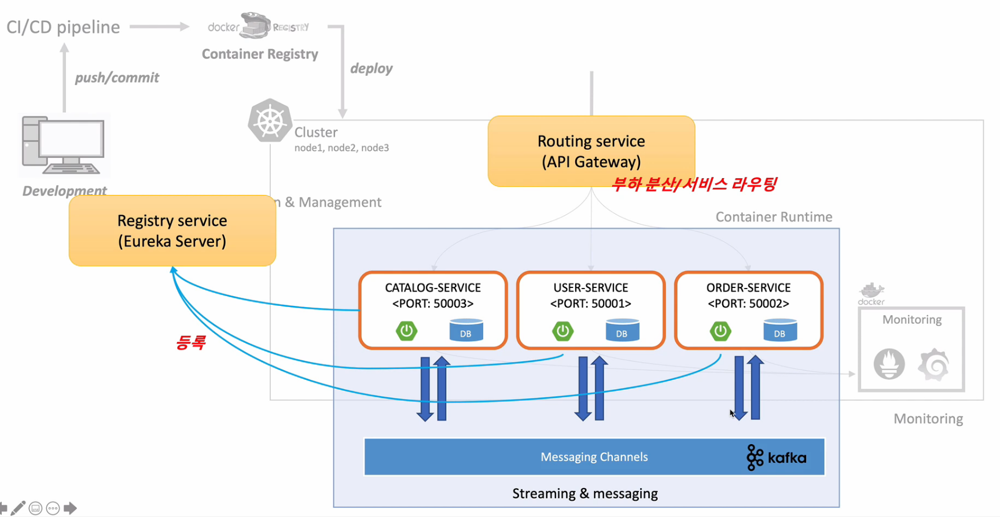
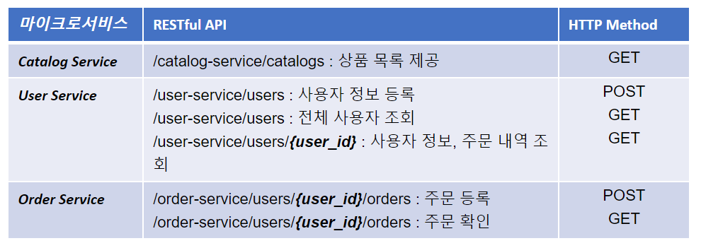

## E-commerce 애플리케이션 구성

애플리케이션 구성요소는 다음과 같다

Git Repository

마이크로서비스 소스 관리 및 프로파일 관리

Config Server

Git 저장소에 등록된 프로파일 정보 및 설정 정보

Eureka Server

마이크로서비스 등록 및 검색

API Gateway Server

마이크로서비스 부하 분산 및 서비스 라우팅

Microservices

회원 MS, 주문 MS, 상품(카테고리) MS

Queuing System

마이크로서비스 간 메시지 발행 및 구독

 

애플리케이션의 API 목록은 다음과 같다.

