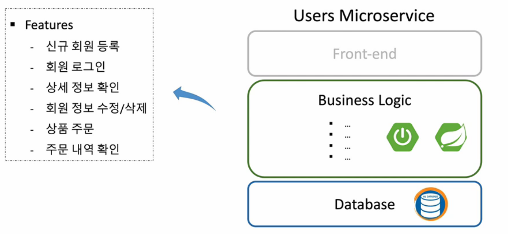
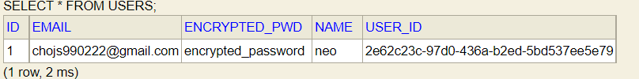

## User Service

마이크로서비스로 등록할 유저 서비스를 만들어 보자.

마이크로서비스 환경에 집중하기 위해 프론트엔드단은 작업하지 않는다.




스프링 부트 프로젝트를 생성하자. Dependencies로 다음을 추가해주자.

Dependencies : DevTools, Lombok, Spring Web, Eureka Discovery Client

프로젝트 생성 후 유레카 서버에 등록하기 위해 어플리케이션 클래스에 애노테이션을 추가하자.

```
@SpringBootApplication
@EnableDiscoveryClient
public class UserServiceApplication {

    public static void main(String[] args) {
        SpringApplication.run(UserServiceApplication.class, args);
    }

}
```

application.yml 파일을 설정하자.

```
server:
  port: 0

spring:
  application:
    name: user-service
eureka:
  instance:
    instance-id: ${spring.cloud.client.hostname}:${spring.application.instance_id:${random.value}}
  client:
    fetch-registry: true
    register-with-eureka: true
    service-url:
      defaultZone: http://127.0.0.1:8761/eureka

greeting:
  message: Welcome to the Simple E-commerce
```

유저 컨트롤러를 만들어 보자.

```
@RestController
@RequestMapping("/")
public class UserController {
    private Environment env;

    @Autowired
    public UserController(Environment env){
        this.env=env;
    }

    @GetMapping("/health_check")
    public String status(){
        return "It's Working in User Service";
    }

    @GetMapping("/welcome")
    public String welcome(){
        return env.getProperty("greeting.message");
    }
}
```

Environment 객체로 application.yml 의 값을 가져왔는데 @Value 어노테이션을 이용해 가져와보자.

```
@Component
@Data
//@AllArgsConstructor
//@NoArgsConstructor
public class Greeting {
    @Value("${greeting.message}")
    private String message;
}
```

User Controller

```
@GetMapping("/welcome")
    public String welcome(){
        //return env.getProperty("greeting.message");
        return greeting.getMessage();
    }
```

### H2 Database 연동

H2 데이터베이스에 연동하기 위해 dependencies에 다음을 추가하자.
h2 버전은 1.3.176 을 사용하였다.

```
<dependency>
    <groupId>com.h2database</groupId>
    <artifactId>h2</artifactId>
    <version>1.3.176</version>
    <scope>runtime</scope>
</dependency>
```

application.yml h2 설정을 추가해주자.

```
spring:
  application:
    name: user-service
  h2:
    console:
      enabled: true
      settings:
        web-allow-others: true
      path: /h2-console
```

### 회원 가입

-   POST -> /users/


dependencies 추가

```
<dependency>
    <groupId>jakarta.validation</groupId>
    <artifactId>jakarta.validation-api</artifactId>
</dependency>

<dependency>
    <groupId>org.springframework.boot</groupId>
    <artifactId>spring-boot-starter-data-jpa</artifactId>
</dependency>

<dependency>
    <groupId>org.modelmapper</groupId>
    <artifactId>modelmapper</artifactId>
    <version>2.3.8</version>
</dependency>
```

RequestUser

```
@Data
public class RequestUser {
    @NotNull(message = "Email cannot be null")
    @Size(min=2,message = "Email not be less than two character")
    @Email
    private String email;

    @NotNull(message = "Name cannot be null")
    @Size(min=2,message = "Name not be less than two character")
    private String name;

    @NotNull(message = "Password cannot be null")
    @Size(min=6,message = "Password must be equal or greater than 6 characters")
    private String pwd;
}
```

RequestUser 클래스는 json으로 사용자의 입력을 받을 클래스이다.

UserDto

```
@Data
public class UserDto {
    private String email;
    private String name;
    private String pwd;
    private String userId;
    private Date createdAt;

    private String encryptedPwd;
}
```

UserEntity

```
@Data
@Entity
@Table(name="users")
public class UserEntity {
    @Id
    @GeneratedValue(strategy = GenerationType.IDENTITY)
    private Long id;

    @Column(nullable = false,length = 50,unique = true)
    private String email;

    @Column(nullable = false,length = 50)
    private String name;

    @Column(nullable = false,unique = true)
    private String userId;

    @Column(nullable = false,unique = true)
    private String encryptedPwd;
}
```

UserRepository

```
public interface UserRepository extends CrudRepository<UserEntity, Long> {
}
```

RequestUser <-> UserDto<-> UserEntity 사이 객체를 다른 객체로 바꿔주기 위해 modelMapper를 이용할 것이다. 일일히 getter 와 setter을 이용해 변환해 주어도 되지만 번거롭기 때문이다.

userService

```
public interface UserService {
    UserDto createdUser(UserDto userDto);
}
```

userServiceImpl

```
@Service
public class UserServiceImpl implements UserService{

    @Autowired
    UserRepository userRepository;

    @Override
    public UserDto createdUser(UserDto userDto) {
        userDto.setUserId(UUID.randomUUID().toString());

        ModelMapper mapper = new ModelMapper();
        mapper.getConfiguration().setMatchingStrategy(MatchingStrategies.STRICT);
        UserEntity userEntity = mapper.map(userDto, UserEntity.class);
        userEntity.setEncryptedPwd("encrypted_password");

        UserDto returnUserDto = mapper.map(userEntity, UserDto.class);
        return returnUserDto;
    }
}
```

사용자의 비밀번호를 암호화 해야한다. 이후 추가할 것이다.

UserController

```
@RestController
@RequestMapping("/")
public class UserController {
    private Environment env;
    private UserService userService;

    @Autowired
    public UserController(Environment env,UserService userService) {
        this.env = env;
        this.userService = userService;
    }

    @PostMapping("/users")
    public ResponseEntity<ResponseUser> createUser(@RequestBody RequestUser user) {
        ModelMapper mapper = new ModelMapper();
        mapper.getConfiguration().setMatchingStrategy(MatchingStrategies.STRICT);

        UserDto userDto = mapper.map(user, UserDto.class);
        userService.createdUser(userDto);

        ResponseUser responseUser = mapper.map(userDto, ResponseUser.class);

        //return new ResponseEntity(responseUser, HttpStatus.CREATED);
        return ResponseEntity.status(HttpStatus.CREATED).body(responseUser);
    }
}
```

ResponseUser

```
@Data
public class ResponseUser {
    private String email;
    private String name;
    private String userId;
}
```




### Spring Security 연동

사용자의 비밀번호 암호화를 위해 Spring Security를 이용하자

WebSecurityConfigurerAdapter 를 상속받는 Security Configuration 클래스를 생성하고 @EnableWebSecurity 어노테이션을 추가

Authentication -> configure(AuthenticationManagerBuilder auth) 메서드를 재정의

Password encode를 위한 BCryptPasswordEncoder 빈 정의

Authorization -> configure(HttpSecurity http) 매서드 재정의

dependencies 추가

```
<dependency>
            <groupId>org.springframework.boot</groupId>
            <artifactId>spring-boot-starter-security</artifactId>
</dependency>
```

WebSecurity

```
@Configuration
@EnableWebSecurity
public class WebSecurity extends WebSecurityConfigurerAdapter {
    @Override
    protected void configure(HttpSecurity http) throws Exception {
        http.csrf().disable();
        http.authorizeHttpRequests().antMatchers("/users/**").permitAll();

        http.headers().frameOptions().disable();
    }
}
```

UserServiceApplication

```
@SpringBootApplication
@EnableDiscoveryClient
public class UserServiceApplication {

    public static void main(String[] args) {
        SpringApplication.run(UserServiceApplication.class, args);
    }

    @Bean
    public BCryptPasswordEncoder passwordEncoder(){
        return new BCryptPasswordEncoder();
    }
}
```

UserServiceimpl 수정

```
@Service
@RequiredArgsConstructor
public class UserServiceImpl implements UserService{

    private final UserRepository userRepository;
    private final BCryptPasswordEncoder passwordEncoder;


    @Override
    public UserDto createdUser(UserDto userDto) {
        userDto.setUserId(UUID.randomUUID().toString());

        ModelMapper mapper = new ModelMapper();
        mapper.getConfiguration().setMatchingStrategy(MatchingStrategies.STRICT);
        UserEntity userEntity = mapper.map(userDto, UserEntity.class);
        userEntity.setEncryptedPwd(passwordEncoder.encode(userDto.getPwd()));

        userRepository.save(userEntity);

        UserDto returnUserDto = mapper.map(userEntity, UserDto.class);
        return returnUserDto;
    }
}
```

결과


비밀번호가 암호화 되었다.

<script src="https://utteranc.es/client.js"
        repo="chojs23/comments"
        issue-term="pathname"
        theme="github-dark"
        crossorigin="anonymous"
        async>
</script>
