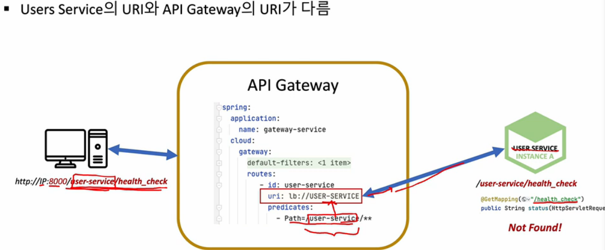

## Spring Cloud Gateway 연동

앞서 만든 api gateway를 사용하자.

api gateway 의 application.yml 파일에 유저 서비스 라우터를 추가하자

```
routes:
        - id: user-service
          uri: lb://USER-SERVICE
          predicates:
            - Path=/user-service/**
```

유레카 서버에 api gateway service가 등록되었다.

그런데 localhost:8000/user-service/health_check 의 경로로 가면 에러 페이지가 나온다.



api gateway를 통해 uri 가 유저 마이크로서비스로 넘어왔을 때 path에 /user-service 가 앞에 붙기 때문에 해당 경로가 컨트롤러에 없어서 생기는 문제이다.

따라서 @GetMapping("/health_check") 를 @GetMapping("user-service/health_check") 로 바꾸면 해결된다.

이제 http://localhost:8000/user-service/health_check 로 이동하면 정상적인 화면이 나온다.

### 사용자 조회

유저 서비스에 사용자 조회 기능을 추가하자

먼저 컨트롤러에서 모든 요청에 user-service/를 달지말고 @RequestMapping("/user-service")로 바꿔주자.

userId로 개별 사용자 조회와 전체 사용자 조회를 만들어 보자.

UserService

```
public interface UserService {
    UserDto createdUser(UserDto userDto);

    UserDto getUserByUserId(String userId);
    Iterable<UserEntity> getUserByAll();
}
```

UserServiceImpl

```
@Service
@RequiredArgsConstructor
public class UserServiceImpl implements UserService{

    private final UserRepository userRepository;
    private final BCryptPasswordEncoder passwordEncoder;


    @Override
    public UserDto getUserByUserId(String userId) {
        UserEntity userEntity = userRepository.findByUserId(userId);

        if (userEntity==null){
            throw new UsernameNotFoundException("User not found");
        }

        UserDto userDto = new ModelMapper().map(userEntity, UserDto.class);

        List<ResponseOrder> orders = new ArrayList<>();
        userDto.setOrders(orders);

        return userDto;
    }

    @Override
    public Iterable<UserEntity> getUserByAll() {
        return userRepository.findAll();
    }
}
```

ResponseUser

```
@Data
@JsonInclude(JsonInclude.Include.NON_NULL)
public class ResponseUser {
    private String email;
    private String name;
    private String userId;

    private List<ResponseOrder> orders;
}
```

아직 Order Service를 만들지 않아서 userDto의 orders list에 빈 ArrayList를 넣어줬다.

UserController

```
@RestController
@RequestMapping("/user-service")
public class UserController {
    private Environment env;
    private UserService userService;

    @Autowired
    public UserController(Environment env,UserService userService) {
        this.env = env;
        this.userService = userService;
    }

    @Autowired
    private Greeting greeting;

    @GetMapping("/health_check")
    public String status() {
        return String.format("It's Working in User Service on PORT %s",
                env.getProperty("local.server.port"));
    }

    @GetMapping("/welcome")
    public String welcome() {
        //return env.getProperty("greeting.message");
        return greeting.getMessage();
    }

    @PostMapping("/users")
    public ResponseEntity<ResponseUser> createUser(@RequestBody RequestUser user) {
        ModelMapper mapper = new ModelMapper();
        mapper.getConfiguration().setMatchingStrategy(MatchingStrategies.STRICT);

        UserDto userDto = mapper.map(user, UserDto.class);
        userService.createdUser(userDto);

        ResponseUser responseUser = mapper.map(userDto, ResponseUser.class);

        //return new ResponseEntity(responseUser, HttpStatus.CREATED);
        return ResponseEntity.status(HttpStatus.CREATED).body(responseUser);
    }

    @GetMapping("/users")
    public ResponseEntity<List<ResponseUser>> getUsers() {
        Iterable<UserEntity> userList = userService.getUserByAll();
        ModelMapper mapper = new ModelMapper();
        List<ResponseUser> result = new ArrayList<>();
        userList.forEach(v->{
            result.add(mapper.map(v, ResponseUser.class));
        });

        return ResponseEntity.status(HttpStatus.OK).body(result);
    }

    @GetMapping("/users/{userId}")
    public ResponseEntity<ResponseUser> getUser(@PathVariable("userId") String userId) {
        UserDto userDto = userService.getUserByUserId(userId);

        ResponseUser result = new ModelMapper().map(userDto, ResponseUser.class);

        return ResponseEntity.status(HttpStatus.OK).body(result);
    }

}
```

<script src="https://utteranc.es/client.js"
        repo="chojs23/comments"
        issue-term="pathname"
        theme="github-light"
        crossorigin="anonymous"
        async>
</script>
