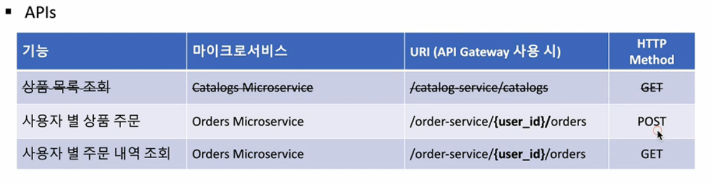

## Catalog, Order Service

Catalog 서비스는 간단히 사용자가 상품 주문 전에 상품 목록을 보여주는 기능을 하는 서비스이다. 앞서 만든 User Service와 비슷하고 사용자가 catalog-service/catalogs 를 GET으로 보내면 상품 목록을 보내준다.

Order 서비스는 사용자가 상품 주문 요청을 할 수 있고, 사용자 별 주문 내역을 알려주는 기능을 한다.

