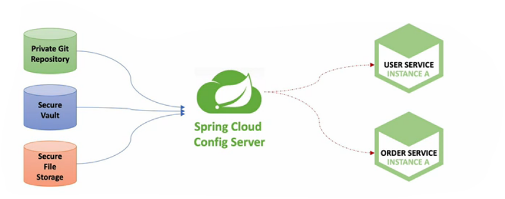

## Configuration Service

Spring Cloud Config는 분산 시스템에서 서버, 클라이언트 구성에 필요한 설정 정보(application.yml)를 외부 시스템에서 관리할 수 있게 해준다.
하나의 중앙화 된 저장소에서 구성요소 관리가 가능하고 각 서비스를 다시 빌드하지 않고 바로 적용 가능하다.
애플리케이션 배포 파이프라인을 통해 DEV-UAT-PROD 환경에 맞는 구성 정보 사용이 가능하다.



각 서비스의 구성 정보를 중앙에 집중된 환경 구성 정보를 모아놓는 스프링 클라우드 컨픽 서버에 보관한다. git을 이용해 구성 정보를 관리하는게 일반적이다.

로컬 깃 리포지토리를 만들고 해당 디렉토리에 ecommerce.yml 파일을 추가하자

```
token:
    expiration_time: 8640000000
    secret: user_token

gateway:
    ip: 192.168.0.2
```

해당 설정 정보를 스프링 클라우드 컨픽 서버에 올리고 다른 서비스가 가져다 쓸 수 있게 할 것이다.

Config service 프로젝트를 생성하자. dependencies 에 Spring Cloud Config를 추가하자.

해당 프로젝트의 application.yml 에 아까 만들어준 로컬 깃 uri를 설정해주자

```
server:
  port: 8888

spring:
  application:
    name: config-service
  cloud:
    config:
      server:
        native:
          search-locations: file:///C:\\Users\\ConyNeo\\Desktop\\git-local-repo
        git:
          uri: file:///C:\\Users\\ConyNeo\\Desktop\\git-local-repo
```

유저 마이크로 서비스의 application.yml 에서 구성정보를 가져올 것이 아니라 스프링 클라우드 컨픽 서비스로부터 정보를 가져올 것이다. 따라서 유저 서비스 구성 파일의 토큰 정보를 주석처리하자.

bootstrap.yml 파일을 만들고 다음을 추가하자

```
spring:
  cloud:
    config:
      uri: http://127.0.0.1:8888
      name: ecommerce
```

아까 깃 리포지토리에 만든 ecommerce.yml 설정 파일을 쓸 것이라는 설정파일이다.

유저 서비스 서버를 기동시켜보면 콘솔에 다음과 같은 내용이 추가된다

```
022-06-13 21:25:50.074  INFO 17556 --- [  restartedMain] c.c.c.ConfigServicePropertySourceLocator : Fetching config from server at : http://127.0.0.1:8888
2022-06-13 21:25:50.558  INFO 17556 --- [  restartedMain] c.c.c.ConfigServicePropertySourceLocator : Located environment: name=ecommerce, profiles=[default], label=null, version=ead8dff973a7633bb82f72fc9168dcdd555b5a51, state=null
2022-06-13 21:25:50.559  INFO 17556 --- [  restartedMain] b.c.PropertySourceBootstrapConfiguration : Located property source: [BootstrapPropertySource {name='bootstrapProperties-configClient'}, BootstrapPropertySource {name='bootstrapProperties-file:///C:\\Users\\ConyNeo\\Desktop\\git-local-repo/file:C:\Users\ConyNeo\Desktop\git-local-repo\ecommerce.yml'}]
```

우리가 8888 포트에 올린 컨픽 서버에서 컨픽 정보를 fetching 해온다고 한다.

### Changing configuration values

깃 리포지토리에 있는 config 정보를 변경하고 싶으면 어떻게 할까? 변경을 하고 그 설정 정보를 가져다 쓰는 서비스들에 적용 시키려면 그 서비스의 서버를 재기동 시켜야 한다. 하지만 매번 변경할 때마다 서버를 재기동하면 config server를 이용하는 이유가 없다.

서버를 재기동 하지 않고 설정 정보 변경을 적용하는 방법으로 Actuator refresh 가 있다. 또 다른 방법으로 Spring cloud bus를 사용하는 것이 있다.

Spring Boot Actuator는 애플리케이션의 상태, 모니터링을 제공하고 Metric 수집을 위한 Http End point를 제공한다.

유저서비스의 application.yml 파일에 다음을 추가하자

```
management:
  endpoints:
    web:
      exposure:
        include: refresh, health, beans
```

configuration 서버에서 가지고 와야 할 정보를 refresh 하기위해 refresh 추가

유저 마이크로 서비스에서 /actuator/refresh 로 POST로 보내면 깃 리포지토리에 있는 config 정보 변경을 감지해서 서버 재기동 없이 설정 정보를 변경할 수 있다.

### Profiles를 사용한 Configuration 적용

로컬 깃 레포지토리에 만든 ecommerce.yml 을 복사해서 ecommerce-dev.yml , ecommerce-prod.yml 을 만들자. dev, prod 는 설정파일의 profile이 되고 마이크로서비스의 bootstrap에 profile을 설정하면 해당 profile 에 해당하는 설정 정보를 가져온다. 지정한 profile이 없으면 default 파일을 찾아가서 ecommerce.yml을 찾아가게된다.

유저 마이크로 서비스의 bootstrap.yml 파일에 프로파일 정보를 넣자

```
spring:
  cloud:
    config:
      uri: http://127.0.0.1:8888
      name: ecommerce
  profiles:
    active: dev
```

dev 프로파일을 찾아갈 것이다.

api gateway service는 prod로 해주자.

<script src="https://utteranc.es/client.js"
        repo="chojs23/comments"
        issue-term="pathname"
        theme="github-light"
        crossorigin="anonymous"
        async>
</script>
