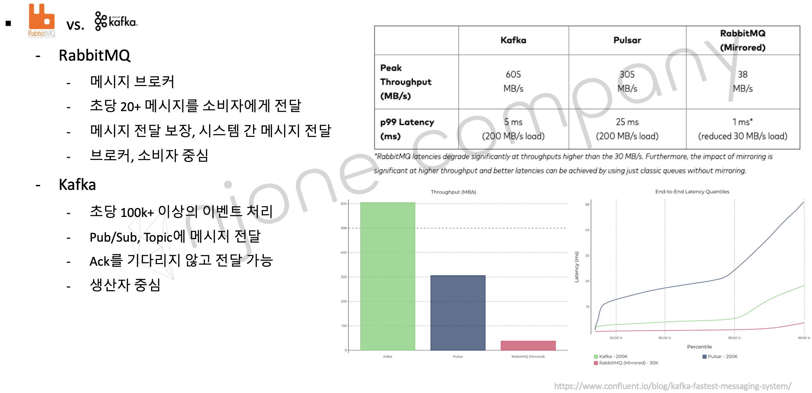
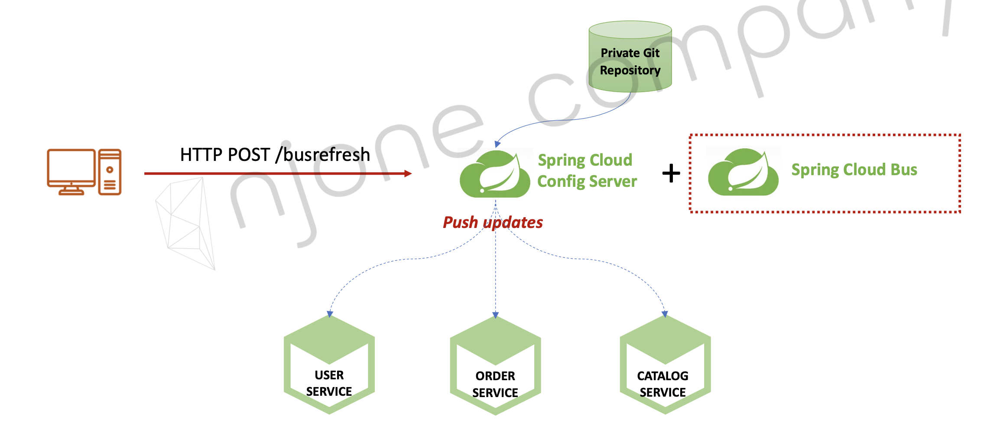

## Spring Cloud Bus

Configuration 서버의 설정 값을 변경하였을 때 각각의 마이크로 서비스가 변경된 환경 설정 값을 변경하기 위해 Spring Cloud Bus 를 사용해보자. Spring cloud bus 는 분산 시스템의 노드(마이크로 서비스)를 경량 메시지 브로커(Rabbit MQ 등)와 연결하고 상태 및 구성에 대한 변경 사항을 연결된 노드에게 전달(Broadcast)한다.

AMQP (Advanced Message Queuing Protocol) : 메시지 지향 미들웨어를 위한 개방형 표준 응용 계층 프로토콜

-   메시지 지향, 큐잉, 라우팅 (P2P,Publisher-Subscriber), 신뢰성, 보안
-   Erlang, RabbitMQ 에서 사용

Kafka

-   Scalar 언어로 개발한 오픈소스 메시지 브로커
-   분산형 스트리밍 플랫폼
-   대용량의 데이터를 처리 가능한 메시징 시스템




분산 시스템의 노드를 경량 메시지 브로커와 연결하고 refresh 시켜주면 어떤 마이크로 서비스에서 refresh 하던 broadcast 로 연결된 모든 노드에게 상태 및 구성에 대한 변경 사항을 전달한다.

만들었던 user service, gateway service, config server 의 dependencies에 다음을 rabbitMQ를 추가하자

```
<dependency>
            <groupId>org.springframework.cloud</groupId>
            <artifactId>spring-cloud-starter-bus-amqp</artifactId>
</dependency>
```

application.yml 에 rabbitMQ 설정을 하자

```
spring:
  application:
    name: apigateway-service
  rabbitmq:
    host: 127.0.0.1
    port: 5672
    username: guest
    password: guest

management:
  endpoints:
    web:
      exposure:
        include: refresh, health, beans, httptrace, busrefresh
```

actuator endpoints 설정에 busrefresh도 추가하자

이제 127.0.0.1:8000/user-service/actuator/busrefresh 에 POST 방식으로 요청을 보내면 user service가 broadcast로 설정하면 메시지 브로커와 연결된 다른 모든 마이크로 서비스에 설정정보 변경을 알린다.

<script src="https://utteranc.es/client.js"
        repo="chojs23/comments"
        issue-term="pathname"
        theme="github-light"
        crossorigin="anonymous"
        async>
</script>
