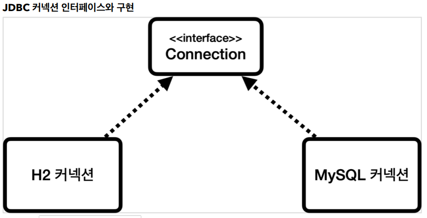

## JDBC 이해

### JDBC 등장 이유

클라이언트, 애플리케이션 서버, DB

웹브라우저(클라이언트) -> 애플리케이션 서버 -> DB

클라이언트가 애플리케이션 서버를 통해 데이터를 저장하거나 조회하면, 애플리케이션 서버는 다음 과정을 통해서 데이터베이스를 사용한다.

1. 커넥션 연결: 주로 TCP/IP를 사용해서 커넥션을 연결한다.
2. SQL 전달: 애플리케이션 서버는 DB가 이해할 수 있는 SQL을 연결된 커넥션을 통해 DB에 전달한다.
3. 결과 응답: DB는 전달된 SQL을 수행하고 그 결과를 응답한다. 애플리케이션 서버는 응답 결과를 활용한다.

문제는 각각의 데이터베이스마다 커넥션을 연결하는 방법, SQL을 전달하는 방법, 그리고 결과를 응답 받는 방법이 모두 다르다는 점이다.

이런 문제를 해결하기 위해 JDBC라는 자바 표준이 등장한다.

JDBC 표준 인터페이스

> JDBC(Java Database Connectivity)는 자바에서 데이터베이스에 접속할 수 있도록 하는 자바 API다.
> JDBC는 데이터베이스에서 자료를 쿼리하거나 업데이트하는 방법을 제공한다. - 위키백과

대표적으로 다음 3가지 기능을 표준 인터페이스로 정의해서 제공한다.

- java.sql.Connection - 연결
- java.sql.Statement - SQL을 담은 내용
- java.sql.ResultSet - SQL 요청 응답

그런데 인터페이스만 있다고해서 기능이 동작하지는 않는다. 이 JDBC 인터페이스를 각각의 DB 벤더 (회사)에서 자신의 DB에 맞도록 구현해서 라이브러리로 제공하는데, 이것을 JDBC 드라이버라 한다. 예를 들어서 MySQL DB에 접근할 수 있는 것은 MySQL JDBC 드라이버라 하고, Oracle DB에 접근할 수 있는 것은 Oracle JDBC 드라이버라 한다.

<hr>

JDBC의 등장으로 다음 2가지 문제가 해결되었다.

1. 데이터베이스를 다른 종류의 데이터베이스로 변경하면 애플리케이션 서버의 데이터베이스 사용 코드도 함께 변경해야하는 문제

- 애플리케이션 로직은 이제 JDBC 표준 인터페이스에만 의존한다. 따라서 데이터베이스를 다른 종류의 데이터베이스로 변경하고 싶으면 JDBC 구현 라이브러리만 변경하면 된다. 따라서 다른 종류의 데이터베이스로 변경해도 애플리케이션 서버의 사용 코드를 그대로 유지할 수 있다.

2. 개발자가 각각의 데이터베이스마다 커넥션 연결, SQL 전달, 그리고 그 결과를 응답 받는 방법을 새로 학습해야하는 문제

- 개발자는 JDBC 표준 인터페이스 사용법만 학습하면 된다. 한번 배워두면 수십개의 데이터베이스에 모두 동일하게 적용할 수 있다.

참고 - 표준화의 한계

> JDBC의 등장으로 많은 것이 편리해졌지만, 각각의 데이터베이스마다 SQL, 데이터타입 등의 일부 사용법 다르다. ANSI SQL이라는 표준이 있기는 하지만 일반적인 부분만 공통화했기 때문에 한계가 있다. 대표적으로 실무에서 기본으로 사용하는 페이징 SQL은 각각의 데이터베이스마다 사용법이 다르다. 결국 데이터베이스를 변경하면 JDBC 코드는 변경하지 않아도 되지만 SQL은 해당 데이터베이스에 맞도록 변경해야한다.
> 참고로 JPA(Java Persistence API)를 사용하면 이렇게 각각의 데이터베이스마다 다른 SQL을 정의해야 하는 문제도 많은 부분 해결할 수 있다.

<br>
<hr>

### JDBC와 최신 데이터 접근 기술

JDBC를 편리하게 사용하는 다양한 기술이 존재한다. 대표적으로 SQL Mapper와 ORM 기술로 나눌 수 있다.


SQL Mapper

- 장점: JDBC를 편리하게 사용하도록 도와준다.
  - SQL 응답 결과를 객체로 편리하게 변환해준다.
  - JDBC의 반복 코드를 제거해준다.
- 단점: 개발자가 SQL을 직접 작성해야한다.

대표 기술: 스프링 JdbcTemplate, MyBatis


ORM 기술

- ORM은 객체를 관계형 데이터베이스 테이블과 매핑해주는 기술이다. 이 기술 덕분에 개발자는 반복적인 SQL을 직접 작성하지 않고, ORM 기술이 개발자 대신에 SQL을 동적으로 만들어 실행해준다. 추가로 각각의 데이터베이스마다 다른 SQL을 사용하는 문제도 중간에서 해결해준다.

- 대표 기술: JPA, 하이버네이트, 이클립스링크
- JPA는 자바 진영의 ORM 표준 인터페이스이고, 이것을 구현한 것으로 하이버네이트와 이클립스 링크 등의 구현 기술이 있다.

> 이런 기술들도 내부에서는 모두 JDBC를 사용한다. 따라서 JDBC를 직접 사용하지는 않더라도, JDBC가 어떻게 동작하는지 기본 원리를 알아두어야 한다. 그래야 해당 기술들을 더 깊이있게 이해할 수 있고, 무엇보다 문제가 발생했을 때 근본적인 문제를 찾아서 해결할 수 있다.

<br>
<hr>

### 데이터 베이스 연결

ConnectionConst

```
public abstract class ConnectionConst {
  public static final String URL = "jdbc:h2:tcp://localhost/~/test";
  public static final String USERNAME = "sa";
  public static final String PASSWORD = "";
}
```

데이터베이스에 접속하는데 필요한 기본 정보를 편리하게 사용할 수 있도록 상수로 만들었다.

DBConnectionUtil

```
import lombok.extern.slf4j.Slf4j;
import java.sql.Connection;
import java.sql.DriverManager;
import java.sql.SQLException;
import static hello.jdbc.connection.ConnectionConst.*;

@Slf4j
public class DBConnectionUtil {
 public static Connection getConnection() {
    try {
      Connection connection = DriverManager.getConnection(URL, USERNAME,
      PASSWORD);
      log.info("get connection={}, class={}", connection,
      connection.getClass());
      return connection;
    } catch (SQLException e) {
      throw new IllegalStateException(e);
    }
  }
}
```

데이터베이스에 연결하려면 JDBC가 제공하는 DriverManager.getConnection(..) 를 사용하면 된다. 이렇게 하면 라이브러리에 있는 데이터베이스 드라이버를 찾아서 해당 드라이버가 제공하는 커넥션을 반환해준다. 여기서는 H2 데이터베이스 드라이버가 작동해서 실제 데이터베이스와 커넥션을 맺고 그 결과를 반환해준다.

실행 결과

```
DBConnectionUtil - get connection=conn0: url=jdbc:h2:tcp://localhost/~/test
user=SA, class=class org.h2.jdbc.JdbcConnection
```

### JDBC DriverManager 연결 이해




1. 애플리케이션 로직에서 커넥션이 필요하면 DriverManager.getConnection() 을 호출한다.
2. DriverManager 는 라이브러리에 등록된 드라이버 목록을 자동으로 인식한다. 이 드라이버들에게 순서대로 다음 정보를 넘겨서 커넥션을 획득할 수 있는지 확인한다.

- URL: 예) jdbc:h2:tcp://localhost/~/test
- 이름, 비밀번호 등 접속에 필요한 추가 정보
- 여기서 각각의 드라이버는 URL 정보를 체크해서 본인이 처리할 수 있는 요청인지 확인한다. 예를 들어서 URL이 jdbc:h2 로 시작하면 이것은 h2 데이터베이스에 접근하기 위한 규칙이다. 따라서 H2 드라이버는 본인이 처리할 수 있으므로 실제 데이터베이스에 연결해서 커넥션을 획득하고 이 커넥션을 클라이언트에 반환한다. 반면에 URL이 jdbc:h2 로 시작했는데 MySQL 드라이버가 먼저 실행되면 이 경우 본인이 처리할 수 없다는 결과를 반환하게 되고, 다음 드라이버에게 순서가 넘어간다.

3. 이렇게 찾은 커넥션 구현체가 클라이언트에 반환된다.
