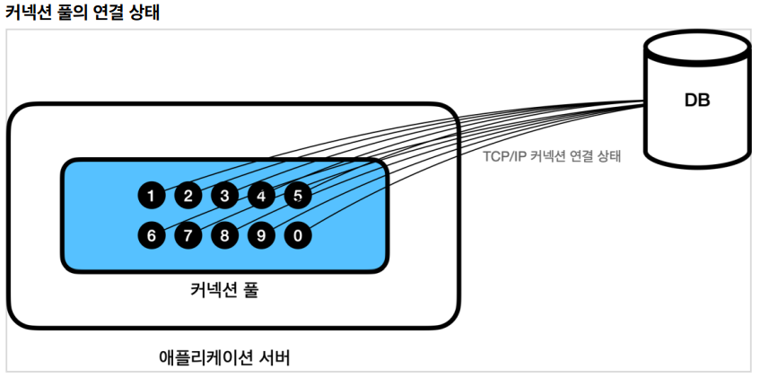

## 커넥션풀과 데이터소스

### 커넥션 풀

데이터베이스 커넥션을 획득할 때는 다음과 같은 복잡한 과정을 거친다.

이렇게 커넥션을 새로 만드는 것은 과정도 복잡하고 시간도 많이 많이 소모되는 일이다. DB는 물론이고 애플리케이션 서버에서도 TCP/IP 커넥션을 새로 생성하기 위한 리소스를 매번 사용해야 한다.

이런 문제를 한번에 해결하는 아이디어가 바로 커넥션을 미리 생성해두고 사용하는 커넥션 풀이라는 방법이다.

애플리케이션을 시작하는 시점에 커넥션 풀은 필요한 만큼 커넥션을 미리 확보해서 풀에 보관한다. 보통 얼마나 보관할 지는 서비스의 특징과 서버 스펙에 따라 다르지만 기본값은 보통 10개이다.

대표적인 커넥션 풀 오픈소스는 commons-dbcp2 , tomcat-jdbc pool , HikariCP 등이 있다.
성능과 사용의 편리함 측면에서 최근에는 hikariCP 를 주로 사용한다. 스프링 부트 2.0 부터는 기본 커넥션 풀로 hikariCP 를 제공한다.

 

### 데이터소스

#### DataSource 이해

애플리케이션 로직에서 DriverManager 를 사용해서 커넥션을 획득하다가 HikariCP 같은 커넥션 풀을 사용하도록 변경하면 커넥션을 획득하는 애플리케이션 코드도 함께 변경해야 한다. 의존관계가 DriverManager 에서 HikariCP 로 변경되기 때문이다.

DataSource 는 커넥션을 획득하는 방법을 추상화 하는 인터페이스이다.
이 인터페이스의 핵심 기능은 커넥션 조회 하나이다.

