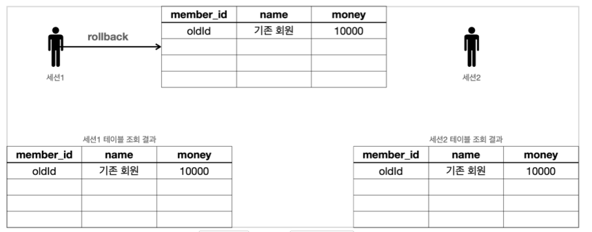

## 트랜잭션

데이터베이스는 트랜잭션이라는 개념을 지원한다. 데이터베이스에서 트랜잭션은 하나의 거래를 안전하게 처리하도록 보장해주는 것을 뜻한다.

모든 작업이 성공해서 데이터베이스에 정상 반영하는 것을 커밋( Commit )이라 하고, 작업 중 하나라도 실패해서 거래 이전으로 되돌리는 것을 롤백( Rollback )이라 한다.

### ACID

트랜잭션은 ACID라 하는 원자성(Atomicity), 일관성(Consistency), 격리성(Isolation), 지속성(Durability)을 보장해야 한다.

- 원자성: 트랜잭션 내에서 실행한 작업들은 마치 하나의 작업인 것처럼 모두 성공 하거나 모두 실패해야 한다.
- 일관성: 모든 트랜잭션은 일관성 있는 데이터베이스 상태를 유지해야 한다. 예를 들어 데이터베이스에서 정한 무결성 제약 조건을 항상 만족해야 한다.
- 격리성: 동시에 실행되는 트랜잭션들이 서로에게 영향을 미치지 않도록 격리한다. 예를 들어 동시에 같은 데이터를 수정하지 못하도록 해야 한다. 격리성은 동시성과 관련된 성능 이슈로 인해 트랜잭션 격리 수준(Isolation level)을 선택할 수 있다.
- 지속성: 트랜잭션을 성공적으로 끝내면 그 결과가 항상 기록되어야 한다. 중간에 시스템에 문제가 발생해도 데이터베이스 로그 등을 사용해서 성공한 트랜잭션 내용을 복구해야 한다.

트랜잭션은 원자성, 일관성, 지속성을 보장한다. 문제는 **격리성**인데 트랜잭션 간에 격리성을 완벽히 보장하려면 트랜잭션을 거의 순서대로 실행해야 한다.
하지만 이렇게 하면 동시 처리 성능이 매우 떨어지게 된다.
이런 문제로 인해 ANSI 표준은 트랜잭션의 격리 수준을 4단계로 나누어 정의했다.

트랜잭션 격리 수준 - Isolation level

- READ UNCOMMITED(커밋되지 않은 읽기)
- READ COMMITTED(커밋된 읽기)
- REPEATABLE READ(반복 가능한 읽기)
- SERIALIZABLE(직렬화 가능)

<br>
<hr>

### 데이터베이스 연결 구조와 DB 세션

트랜잭션을 더 자세히 이해하기 위해 데이터베이스 서버 연결 구조와 DB 세션에 대해 알아보자.


- 사용자는 웹 애플리케이션 서버(WAS)나 DB 접근 툴 같은 클라이언트를 사용해서 데이터베이스 서버에 접근할 수 있다. 클라이언트는 데이터베이스 서버에 연결을 요청하고 커넥션을 맺게 된다. 이때 데이터베이스 서버는 내부에 세션이라는 것을 만든다. 그리고 앞으로 해당 커넥션을 통한 모든 요청은 이 세션을 통해서 실행하게 된다.
- 개발자가 클라이언트를 통해 SQL을 전달하면 현재 커넥션에 연결된 세션이 SQL을 실행한다.
- 세션은 트랜잭션을 시작하고, 커밋 또는 롤백을 통해 트랜잭션을 종료한다. 그리고 이후에 새로운 트랜잭션을 다시 시작할 수 있다.
- 사용자가 커넥션을 닫거나, 또는 DBA(DB 관리자)가 세션을 강제로 종료하면 세션은 종료된다.


- 커넥션 풀이 10개의 커넥션을 생성하면, 세션도 10개 만들어진다.

<br>
<hr>

#### 트랜잭션 예시

- 데이터 변경 쿼리를 실행하고 데이터베이스에 그 결과를 반영하려면 커밋 명령어인 commit 을 호출하고, 결과를 반영하고 싶지 않으면 롤백 명령어인 rollback 을 호출하면 된다.
- 커밋을 호출하기 전까지는 임시로 데이터를 저장하는 것이다. 따라서 해당 트랜잭션을 시작한 세션(사용자)에게만 변경 데이터가 보이고 다른 세션(사용자)에게는 변경 데이터가 보이지 않는다.


커밋하지 않은 데이터를 다른 곳에서 조회할 수 있으면 어떤 문제가 발생할까?

- 예를 들어서 커밋하지 않는 데이터가 보인다면, 세션2는 데이터를 조회했을 때 신규 회원1, 2가 보일 것이다. 따라서 신규 회원1, 신규 회원2가 있다고 가정하고 어떤 로직을 수행할 수 있다. 그런데 세션1이 롤백을 수행하면 신규 회원1, 신규 회원2의 데이터가 사라지게 된다. 따라서 데이터 **정합성**에 큰 문제가 발생한다.
- 세션2에서 세션1이 아직 커밋하지 않은 변경 데이터가 보이다면, 세션1이 롤백 했을 때 심각한 문제가 발생할 수 있다. 따라서 커밋 전의 데이터는 다른 세션에서 보이지 않는다.


commit 으로 새로운 데이터가 실제 데이터베이스에 반영된다. 데이터의 상태도 임시 완료로변경되었다.

이제 다른 세션에서도 회원 테이블을 조회하면 신규 회원들을 확인할 수 있다.

**세션1 신규 데이터 추가 후 롤백**

세션1이 신규 데이터를 추가한 후에 commit 대신에 rollback 을 호출했다.
세션1이 데이터베이스에 반영한 모든 데이터가 처음 상태로 복구된다.
수정하거나 삭제한 데이터도 rollback 을 호출하면 모두 트랜잭션을 시작하기 직전의 상태로 복구된다.

보통 자동 커밋 모드가 기본으로 설정된 경우가 많기 때문에, 수동 커밋 모드로 설정하는 것을 트랜잭션을 시작한다고 표현할 수 있다.

```
set autocommit false; //수동 커밋 모드 설정
insert into member(member_id, money) values ('data3',10000);
insert into member(member_id, money) values ('data4',10000);
commit; //수동 커밋
```

수동 커밋 설정을 하면 이후에 꼭 commit , rollback 을 호출해야 한다.

정리

- 원자성: 트랜잭션 내에서 실행한 작업들은 마치 하나의 작업인 것처럼 모두 성공 하거나 모두 실패해야 한다.
  트랜잭션의 원자성 덕분에 여러 SQL 명령어를 마치 하나의 작업인 것 처럼 처리할 수 있었다. 성공하면 한번에 반영하고, 중간에 실패해도 마치 하나의 작업을 되돌리는 것 처럼 간단히 되돌릴 수 있다.
- 오토 커밋
  만약 오토 커밋 모드로 동작하는데, 계좌이체 중간에 실패하면 어떻게 될까? 쿼리를 하나 실행할 때 마다 바로바로 커밋이 되어버리기 때문에 memberA 의 돈만 2000원 줄어드는 심각한 문제가 발생한다.
- 트랜잭션 시작
  따라서 이런 종류의 작업은 꼭 수동 커밋 모드를 사용해서 수동으로 커밋, 롤백 할 수 있도록 해야 한다. 보통 이렇게 자동 커밋 모드에서 수동 커밋 모드로 전환 하는 것을 트랜잭션을 시작한다고 표현한다.

### DB LOCK

세션1이 트랜잭션을 시작하고 데이터를 수정하는 동안 아직 커밋을 수행하지 않았는데, 세션2에서 동시에 같은 데이터를 수정하게 되면 여러가지 문제가 발생한다.
이런 문제를 방지하려면, 세션이 트랜잭션을 시작하고 데이터를 수정하는 동안에는 커밋이나 롤백 전까지 다른 세션에서 해당 데이터를 수정할 수 없게 막아야 한다.


<script src="https://utteranc.es/client.js"
        repo="chojs23/comments"
        issue-term="pathname"
        theme="github-dark"
        crossorigin="anonymous"
        async>
</script>
