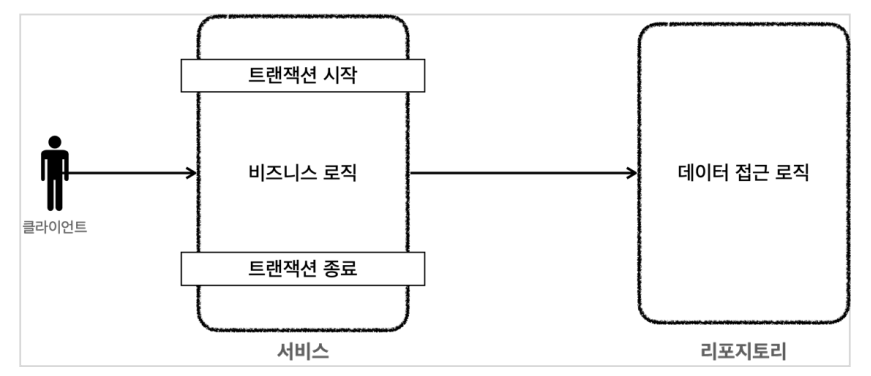

## 트랜잭션 AOP

프록시를 도입하기 전에는 기존처럼 서비스의 로직에서 트랜잭션을 직접 시작한다.



```
//트랜잭션 시작
TransactionStatus status = transactionManager.getTransaction(new DefaultTransactionDefinition());
try {
  //비즈니스 로직
  bizLogic(fromId, toId, money);
  transactionManager.commit(status); //성공시 커밋
} catch (Exception e) {
  transactionManager.rollback(status); //실패시 롤백
  throw new IllegalStateException(e);
}
```


프록시를 사용하면 트랜잭션을 처리하는 객체와 비즈니스 로직을 처리하는 서비스 객체를 명확하게 분리할 수 있다.

트랜잭션 프록시 코드 예시

```
public class TransactionProxy {
  private MemberService target;
  public void logic() {
    //트랜잭션 시작
    TransactionStatus status = transactionManager.getTransaction(..);
    try {
      //실제 대상 호출
      target.logic();
      transactionManager.commit(status); //성공시 커밋
    } catch (Exception e) {
      transactionManager.rollback(status); //실패시 롤백
      throw new IllegalStateException(e);
    }
  }
}
```

트랜잭션 프록시 적용 후 서비스 코드 예시

```
public class Service {
  public void logic() {
    //트랜잭션 관련 코드 제거, 순수 비즈니스 로직만 남음
    bizLogic(fromId, toId, money);
  }
}
```

<br>
<hr>

#### 스프링이 제공하는 트랜잭션 AOP

개발자는 트랜잭션 처리가 필요한 곳에 **@Transactional** 애노테이션만 붙여주면 된다. 스프링의 트랜잭션 AOP는 이 애노테이션을 인식해서 트랜잭션 프록시를 적용해준다.

```
@Slf4j
@RequiredArgsConstructor
public class MemberService {
  private final MemberRepositoryV3 memberRepository;

  @Transactional
  public void accountTransfer(String fromId, String toId, int money) throws SQLException {
    bizLogic(fromId, toId, money);
  }

  private void bizLogic(String fromId, String toId, int money) throws SQLException {
    Member fromMember = memberRepository.findById(fromId);
    Member toMember = memberRepository.findById(toId);
    memberRepository.update(fromId, fromMember.getMoney() - money);
    validation(toMember);
    memberRepository.update(toId, toMember.getMoney() + money);
  }

  private void validation(Member toMember) {
    if (toMember.getMemberId().equals("ex")) {
      throw new IllegalStateException("이체중 예외 발생");
    }
  }
}
```

MemberService Test

```
@Slf4j
@SpringBootTest
class MemberServiceV3_3Test {
  public static final String MEMBER_A = "memberA";
  public static final String MEMBER_B = "memberB";
  public static final String MEMBER_EX = "ex";

  @Autowired
  MemberRepositoryV3 memberRepository;
  @Autowired
  MemberServiceV3_3 memberService;

  @AfterEach
  void after() throws SQLException {
    memberRepository.delete(MEMBER_A);
    memberRepository.delete(MEMBER_B);
    memberRepository.delete(MEMBER_EX);
  }

  @TestConfiguration
    static class TestConfig {
  @Bean

  DataSource dataSource() {
    return new DriverManagerDataSource(URL, USERNAME, PASSWORD);
  }

  @Bean
  PlatformTransactionManager transactionManager() {
    return new DataSourceTransactionManager(dataSource());
  }

  @Bean
  MemberRepositoryV3 memberRepositoryV3() {
    return new MemberRepositoryV3(dataSource());
  }

  @Bean
  MemberServiceV3_3 memberServiceV3_3() {
    return new MemberServiceV3_3(memberRepositoryV3());
  }
  }

  @Test
  void AopCheck() {
    log.info("memberService class={}", memberService.getClass());
    log.info("memberRepository class={}", memberRepository.getClass());
    Assertions.assertThat(AopUtils.isAopProxy(memberService)).isTrue();
    Assertions.assertThat(AopUtils.isAopProxy(memberRepository)).isFalse();
  }

  @Test
  @DisplayName("정상 이체")
  void accountTransfer() throws SQLException {
    //given
    Member memberA = new Member(MEMBER_A, 10000);
    Member memberB = new Member(MEMBER_B, 10000);
    memberRepository.save(memberA);
    memberRepository.save(memberB);
    //when
    memberService.accountTransfer(memberA.getMemberId(),
    memberB.getMemberId(), 2000);
    //then
    Member findMemberA = memberRepository.findById(memberA.getMemberId());
    Member findMemberB = memberRepository.findById(memberB.getMemberId());
    assertThat(findMemberA.getMoney()).isEqualTo(8000);
    assertThat(findMemberB.getMoney()).isEqualTo(12000);
  }

  @Test
  @DisplayName("이체중 예외 발생")
  void accountTransferEx() throws SQLException {
    //given
    Member memberA = new Member(MEMBER_A, 10000);
    Member memberEx = new Member(MEMBER_EX, 10000);
    memberRepository.save(memberA);
    memberRepository.save(memberEx);
    //when
    assertThatThrownBy(() ->
    memberService.accountTransfer(memberA.getMemberId(), memberEx.getMemberId(),
    2000))
    .isInstanceOf(IllegalStateException.class);
    //then
    Member findMemberA = memberRepository.findById(memberA.getMemberId());
    Member findMemberEx =
    memberRepository.findById(memberEx.getMemberId());
    //memberA의 돈이 롤백 되어야함
    assertThat(findMemberA.getMoney()).isEqualTo(10000);
    assertThat(findMemberEx.getMoney()).isEqualTo(10000);
  }
}
```

- @SpringBootTest : 스프링 AOP를 적용하려면 스프링 컨테이너가 필요하다. 이 애노테이션이 있으면 테스트시 스프링 부트를 통해 스프링 컨테이너를 생성한다. 그리고 테스트에서 @Autowired 등을 통해 스프링 컨테이너가 관리하는 빈들을 사용할 수 있다.
- @TestConfiguration : 테스트 안에서 내부 설정 클래스를 만들어서 사용하면서 이 에노테이션을 붙이면, 스프링 부트가 자동으로 만들어주는 빈들에 추가로 필요한 스프링 빈들을 등록하고 테스트를 수행할 수 있다.

- TestConfig
  - DataSource : 스프링에서 기본으로 사용할 데이터소스를 스프링 빈으로 등록한다. 추가로 트랜잭션 매니저에서도 사용한다
  - DataSourceTransactionManager : 트랜잭션 매니저를 스프링 빈으로 등록한다.
    - 스프링이 제공하는 트랜잭션 AOP는 스프링 빈에 등록된 트랜잭션 매니저를 찾아서 사용하기 때문에 트랜잭션 매니저를 스프링 빈으로 등록해두어야 한다.

<br>
<hr>


선언적 트랜잭션 관리 vs 프로그래밍 방식

- 트랜잭션 관리 선언적 트랜잭션 관리(Declarative Transaction Management)
  - @Transactional 애노테이션 하나만 선언해서 매우 편리하게 트랜잭션을 적용하는 것을 선언적 트랜잭션 관리라 한다.
  - 선언적 트랜잭션 관리는 과거 XML에 설정하기도 했다. 이름 그대로 해당 로직에 트랜잭션을 적용하겠다 라고 어딘가에 선언하기만 하면 트랜잭션이 적용되는 방식이다.
- 프로그래밍 방식의 트랜잭션 관리(programmatic transaction management)
  - 트랜잭션 매니저 또는 트랜잭션 템플릿 등을 사용해서 트랜잭션 관련 코드를 직접 작성하는 것을 프로그래밍 방식의 트랜잭션 관리라 한다.

<br>
<hr>

#### 스프링 부트의 자동 리소스 등록

스프링 부트가 등장하기 이전에는 데이터소스와 트랜잭션 매니저를 개발자가 직접 스프링 빈으로 등록해서 사용했다. 하지만 스프링 부트를 이용하면 데이터소스나 트랜잭션 매니저를 직접 등록할 필요가 없다.

데이터소스와 트랜잭션 매니저를 스프링 빈으로 직접 등록

```
@Bean
DataSource dataSource() {
 return new DriverManagerDataSource(URL, USERNAME, PASSWORD);
}

@Bean
PlatformTransactionManager transactionManager() {
 return new DataSourceTransactionManager(dataSource());
}
```

데이터소스 - 자동 등록

스프링 부트는 데이터소스( DataSource )를 스프링 빈에 자동으로 등록한다.
자동으로 등록되는 스프링 빈 이름: dataSource
참고로 개발자가 직접 데이터소스를 빈으로 등록하면 스프링 부트는 데이터소스를 자동으로 등록하지 않는다.

이때 스프링 부트는 다음과 같이 application.properties 에 있는 속성을 사용해서 DataSource 를 생성한다. 그리고 스프링 빈에 등록한다.

application.properties

```
spring.datasource.url=jdbc:h2:tcp://localhost/~/test
spring.datasource.username=sa
spring.datasource.password=
```

<br>
<hr>

트랜잭션 매니저 - 자동 등록

스프링 부트는 적절한 트랜잭션 매니저( PlatformTransactionManager )를 자동으로 스프링 빈에 등록한다.
자동으로 등록되는 스프링 빈 이름: transactionManager
참고로 개발자가 직접 트랜잭션 매니저를 빈으로 등록하면 스프링 부트는 트랜잭션 매니저를 자동으로 등록하지 않는다.

> 어떤 트랜잭션 매니저를 선택할지는 현재 등록된 라이브러리를 보고 판단하는데, JDBC를 기술을 사용하면 DataSourceTransactionManager 를 빈으로 등록하고, JPA를 사용하면 JpaTransactionManager 를 빈으로 등록한다. 둘다 사용하는 경우 JpaTransactionManager 를 등록한다. 참고로 JpaTransactionManager 는 DataSourceTransactionManager 가 제공하는 기능도 대부분 지원한다.

데이터소스, 트랜잭션 매니저 직접 등록

```
@TestConfiguration
static class TestConfig {
 @Bean
 DataSource dataSource() {
 return new DriverManagerDataSource(URL, USERNAME, PASSWORD);
 }
 @Bean
 PlatformTransactionManager transactionManager() {
 return new DataSourceTransactionManager(dataSource());
 }
 @Bean
 MemberRepositoryV3 memberRepositoryV3() {
 return new MemberRepositoryV3(dataSource());
 }
 @Bean
 MemberServiceV3_3 memberServiceV3_3() {
 return new MemberServiceV3_3(memberRepositoryV3());
 }
}
```

자동 등록 후

```
 @TestConfiguration
 static class TestConfig {

  private final DataSource dataSource;

  public TestConfig(DataSource dataSource) {
  this.dataSource = dataSource;
  }

  @Bean
  MemberRepositoryV3 memberRepositoryV3() {
  return new MemberRepositoryV3(dataSource);
  }
  @Bean
  MemberServiceV3_3 memberServiceV3_3() {
  return new MemberServiceV3_3(memberRepositoryV3());
  }
 }
```

<script src="https://utteranc.es/client.js"
        repo="chojs23/comments"
        issue-term="pathname"
        theme="github-dark"
        crossorigin="anonymous"
        async>
</script>
