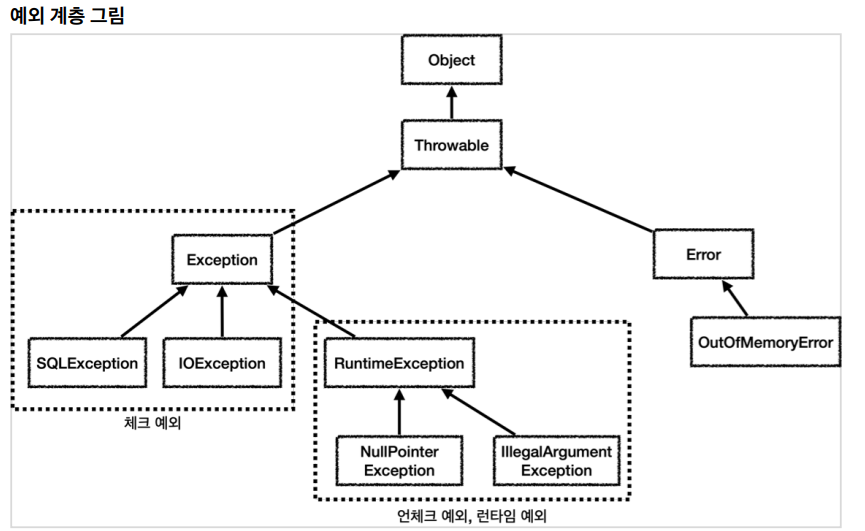
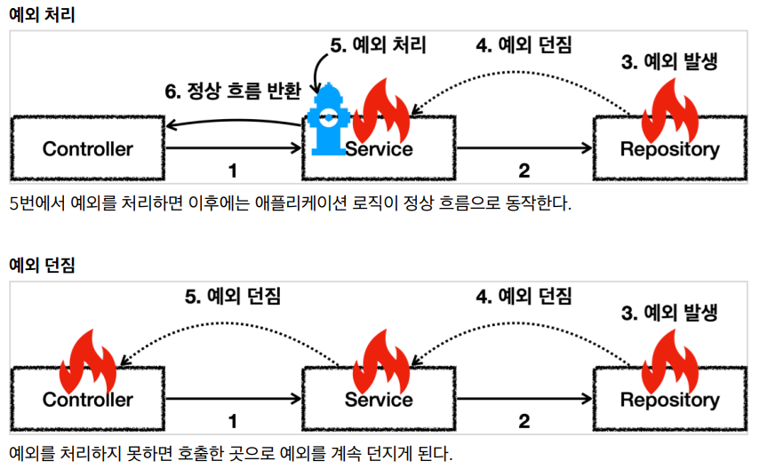

## 예외 계층



### 예외 기본 규칙



1. 예외는 잡아서 처리하거나 던져야 한다.
2. 예외를 잡거나 던질 때 지정한 예외뿐만 아니라 그 예외의 자식들도 함께 처리된다.
   예를 들어서 Exception 을 catch 로 잡으면 그 하위 예외들도 모두 잡을 수 있다.
   예를 들어서 Exception 을 throws 로 던지면 그 하위 예외들도 모두 던질 수 있다.

예외를 처리하지 못하고 계속 던지면 어떻게 될까?

자바 main() 쓰레드의 경우 예외 로그를 출력하면서 시스템이 종료된다.

웹 애플리케이션의 경우 여러 사용자의 요청을 처리하기 때문에 하나의 예외 때문에 시스템이 종료되면 안된다. WAS가 해당 예외를 받아서 처리하는데, 주로 사용자에게 개발자가 지정한, 오류 페이지를 보여준다.

<br>
<hr>

### 체크 예외

Exception 과 그 하위 예외는 모두 컴파일러가 체크하는 체크 예외이다. 단 RuntimeException 은 예외로 한다.

체크 예외는 잡아서 처리하거나, 또는 밖으로 던지도록 선언해야한다. 그렇지 않으면 컴파일 오류가 발생한다.

```
@Slf4j
public class CheckedTest {
  @Test
  void checked_catch() {
    Service service = new Service();
    service.callCatch();
  }

  @Test
  void checked_throw() {
    Service service = new Service();
    assertThatThrownBy(() -> service.callThrow())
    .isInstanceOf(MyCheckedException.class);
  }

  /**
  * Exception을 상속받은 예외는 체크 예외가 된다.
  */
  static class MyCheckedException extends Exception {
    public MyCheckedException(String message) {
      super(message);
    }
  }

  /**
  * Checked 예외는
  * 예외를 잡아서 처리하거나, 던지거나 둘중 하나를 필수로 선택해야 한다.
  */
  static class Service {
    Repository repository = new Repository();
    /**
    * 예외를 잡아서 처리하는 코드
    */
    public void callCatch() {
      try {
        repository.call();
      } catch (MyCheckedException e) {
        //예외 처리 로직
        log.info("예외 처리, message={}", e.getMessage(), e);
      }
    }

    /**
    * 체크 예외를 밖으로 던지는 코드
    * 체크 예외는 예외를 잡지 않고 밖으로 던지려면 throws 예외를 메서드에필수로 선언해야한다.
    */
    public void callThrow() throws MyCheckedException {
      repository.call();
    }
  }

    static class Repository {
    public void call() throws MyCheckedException {
      throw new MyCheckedException("ex");
    }
  }
}
```

service.callCatch() 에서 예외를 처리했기 때문에 테스트 메서드까지 예외가 올라오지 않는다.

실행 순서를 분석해보자.

1. test -> service.callCatch() -> repository.call() [예외 발생, 던짐]
2. test <- service.callCatch() [예외 처리] <- repository.call()
3. test [정상 흐름] <- service.callCatch() <- repository.call()

Repository.call() 에서 MyUncheckedException 예외가 발생하고, 그 예외를 Service.callCatch() 에서 잡는 것을 확인할 수 있다.

체크 예외를 잡아서 처리하는 코드

```
try {
 repository.call();
} catch (MyCheckedException e) {
 //예외 처리 로직
}
```

체크 예외를 잡아서 처리하려면 catch(..) 를 사용해서 예외를 잡으면 된다.
여기서는 MyCheckedException 예외를 잡아서 처리한다.

catch는 해당 타입과 그 하위 타입을 모두 잡을 수 있다.

```
public void callCatch() {
 try {
 repository.call();
 } catch (Exception e) {
 //예외 처리 로직
 }
}
```

catch 에 MyCheckedException 의 상위 타입인 Exception 을 적어주어도 MyCheckedException 을 잡을 수 있다.
catch 에 예외를 지정하면 해당 예외와 그 하위 타입 예외를 모두 잡아준다.
물론 정확하게 MyCheckedException 만 잡고 싶다면 catch 에 MyCheckedException 을 적어주어야 한다.

이번에는 예외를 처리하지 않고, 밖으로 던지는 코드를 살펴보자.

```
@Test
void checked_throw() {
 Service service = new Service();
 assertThatThrownBy(() -> service.callThrow())
 .isInstanceOf(MyCheckedException.class);
}
```

service.callThrow() 에서 예외를 처리하지 않고, 밖으로 던졌기 때문에 예외가 테스트 메서드까지 올라온다.
테스트에서는 기대한 것 처럼 MyCheckedException 예외가 던져지면 성공으로 처리한다.

실행 순서를 분석해보자.

1. test -> service.callThrow() -> repository.call() [예외 발생, 던짐]
2. test -> service.callThrow() [예외 던짐] <- repository.call()
3. test <- [예외 도착] service.callThrow() <- repository.call()

체크 예외의 장단점

체크 예외는 예외를 잡아서 처리할 수 없을 때, 예외를 밖으로 던지는 throws 예외 를 필수로 선언해야 한다. 그렇지 않으면 컴파일 오류가 발생한다. 이것 때문에 장점과 단점이 동시에 존재한다.

- 장점: 개발자가 실수로 예외를 누락하지 않도록 컴파일러를 통해 문제를 잡아주는 훌륭한 안전 장치이다.
- 단점: 하지만 실제로는 개발자가 모든 체크 예외를 반드시 잡거나 던지도록 처리해야 하기 때문에, 너무 번거로운 일이 된다. 크게 신경쓰고 싶지 않은 예외까지 모두 챙겨야 한다. 추가로 의존관계에 따른 단점도 있는데 이 부분은 뒤에서 설명하겠다.

<br>
<hr>

### 언체크 예외

언체크 예외는 말 그대로 컴파일러가 예외를 체크하지 않는다는 뜻이다.
언체크 예외는 체크 예외와 기본적으로 동일하다. 차이가 있다면 예외를 던지는 throws 를 선언하지 않고, 생략할 수 있다. 이 경우 자동으로 예외를 던진다.

체크 예외 VS 언체크 예외

- 체크 예외: 예외를 잡아서 처리하지 않으면 항상 throws 에 던지는 예외를 선언해야 한다.
- 언체크 예외: 예외를 잡아서 처리하지 않아도 throws 를 생략할 수 있다.

```
@Slf4j
public class CheckedTest {
  @Test
  void unchecked_catch() {
    Service service = new Service();
    service.callCatch();
  }

  @Test
  void unchecked_throw() {
    Service service = new Service();
    assertThatThrownBy(() -> service.callThrow())
    .isInstanceOf(MyUncheckedException.class);
  }

  /**
  *  RuntimeException을 상속받은 예외는 언체크 예외가 된다.
  */
  static class MyUncheckedException extends RuntimeException {
    public MyUncheckedException(String message) {
      super(message);
    }
  }

  /**
  * Unchecked 예외는
  * 예외를 잡거나 던지지 않아도 된다.
  * 예외를 잡지 않으면 자동으로 밖으로 던진다.
  */
  static class Service {
    Repository repository = new Repository();
    /**
    * 필요한 경우 예외를 잡아서 처리하면 된다.
    */
    public void callCatch() {
      try {
        repository.call();
      } catch (MyUncheckedException e) {
        //예외 처리 로직
        log.info("예외 처리, message={}", e.getMessage(), e);
      }
    }

    /**
    * 예외를 잡지 않아도 된다. 자연스럽게 상위로 넘어간다.
    * 체크 예외와 다르게 throws 예외 선언을 하지 않아도 된다.
    */
    public void callThrow() {
      repository.call();
    }
  }

    static class Repository {
    public void call() {
      throw new MyUncheckedException("ex");
    }
  }
}
```

참고로 언체크 예외도 throws 예외 를 선언해도 된다. 물론 생략할 수 있다.

언체크 예외의 장단점

언체크 예외는 예외를 잡아서 처리할 수 없을 때, 예외를 밖으로 던지는 throws 예외 를 생략할 수 있다. 이것 때문에 장점과 단점이 동시에 존재한다.

- 장점: 신경쓰고 싶지 않은 언체크 예외를 무시할 수 있다. 체크 예외의 경우 처리할 수 없는 예외를 밖으로 던지려면 항상 throws 예외 를 선언해야 하지만, 언체크 예외는 이 부분을 생략할 수 있다. 이후에 설명하겠지만, 신경쓰고 싶지 않은 예외의 의존관계를 참조하지 않아도 되는 장점이 있다.
- 단점: 언체크 예외는 개발자가 실수로 예외를 누락할 수 있다. 반면에 체크 예외는 컴파일러를 통해 예외 누락을 잡아준다.

<script src="https://utteranc.es/client.js"
        repo="chojs23/comments"
        issue-term="pathname"
        theme="github-dark"
        crossorigin="anonymous"
        async>
</script>
