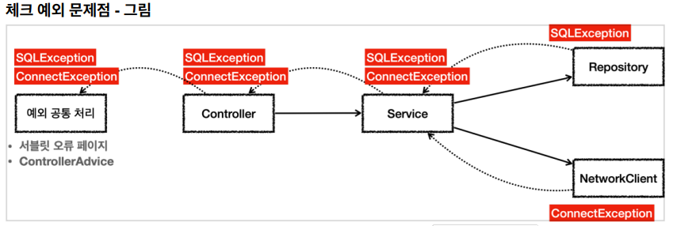
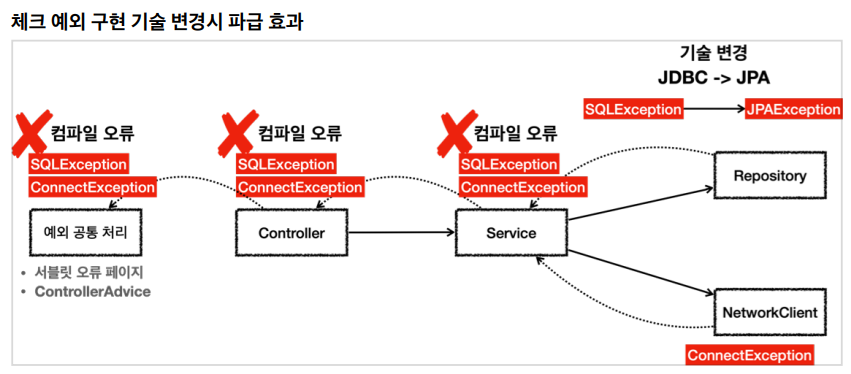
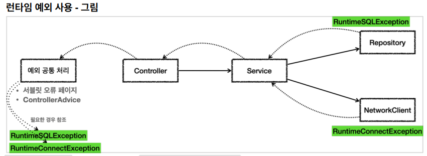
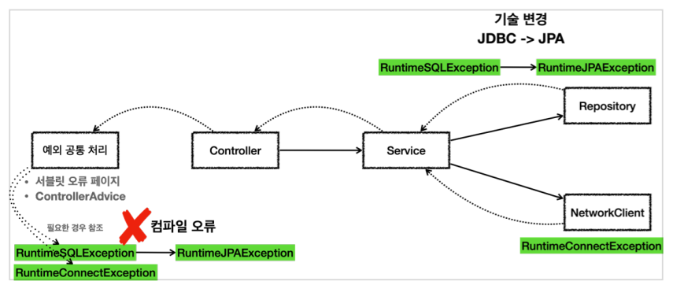

## 체크 예외 활용

언제 체크 예외를 사용하고 언제 언체크(런타임) 예외를 사용하면 좋을까?

기본 원칙은 다음 2가지를 기억하자.

- 기본적으로 언체크(런타임) 예외를 사용하자.
- 체크 예외는 비즈니스 로직상 의도적으로 던지는 예외에만 사용하자.

체크 예외의 문제점

체크 예외는 컴파일러가 예외 누락을 체크해주기 때문에 개발자가 실수로 예외를 놓치는 것을 막아준다.
그래서 항상 명시적으로 예외를 잡아서 처리하거나, 처리할 수 없을 때는 예외를 던지도록 method() throws 예외 로 선언해야 한다.

체크 예외가 런타임 예외보다 더 안전하고 좋아보이는데, 왜 체크 예외를 기본으로 사용하는 것이 문제가 될까?



- 서비스는 리포지토리와 NetworkClient 를 둘다 호출한다.

  - 따라서 두 곳에서 올라오는 체크 예외인 SQLException 과 ConnectException 을 처리해야 한다.
  - 그런데 서비스는 이 둘을 처리할 방법을 모른다. ConnectException 처럼 연결이 실패하거나, SQLException 처럼 데이터베이스에서 발생하는 문제처럼 심각한 문제들은 대부분 애플리케이션 로직에서 처리할 방법이 없다.

- 서비스는 SQLException 과 ConnectException 를 처리할 수 없으므로 둘다 밖으로 던진다.
  - 체크 예외이기 때문에 던질 경우 다음과 같이 선언해야 한다.
  - method() throws SQLException, ConnectException
- 컨트롤러도 두 예외를 처리할 방법이 없다.
  - 다음을 선언해서 예외를 밖으로 던진다.
  - method() throws SQLException, ConnectException
- 웹 애플리케이션이라면 서블릿의 오류 페이지나, 또는 스프링 MVC가 제공하는 ControllerAdvice 에서 이런 예외를 공통으로 처리한다.

```
@Slf4j
public class CheckedAppTest {
  @Test
  void checked() {
    Controller controller = new Controller();
    assertThatThrownBy(() -> controller.request())
    .isInstanceOf(Exception.class);
  }

  static class Controller {
    Service service = new Service();
    public void request() throws SQLException, ConnectException {
      service.logic();
    }
  }

  static class Service {
    Repository repository = new Repository();
    NetworkClient networkClient = new NetworkClient();
    public void logic() throws SQLException, ConnectException {
      repository.call();
      networkClient.call();
    }
  }

  static class NetworkClient {
    public void call() throws ConnectException {
      throw new ConnectException("연결 실패");
    }
  }

  static class Repository {
    public void call() throws SQLException {
      throw new SQLException("ex");
    }
  }
}
```

지금까지 설명한 예시와 코드를 보면 크게 2가지 문제를 알 수 있다.

1. 복구 불가능한 예외

- 복구 불가능한 예외 대부분의 예외는 복구가 불가능하다. 일부 복구가 가능한 예외도 있지만 아주 적다. SQLException 을 예를 들면 데이터베이스에 무언가 문제가 있어서 발생하는 예외이다. SQL 문법에 문제가 있을 수도 있고, 데이터베이스 자체에 뭔가 문제가 발생했을 수도 있다. 데이터베이스 서버가 중간에 다운 되었을 수도 있다. 이런 문제들은 대부분 복구가 불가능하다. 특히나 대부분의 서비스나 컨트롤러는 이런 문제를 해결할 수는 없다. 따라서 이런 문제들은 일관성 있게 공통으로 처리해야 한다. 오류 로그를 남기고 개발자가 해당 오류를 빠르게 인지하는 것이 필요하다. 서블릿 필터, 스프링 인터셉터, 스프링의 ControllerAdvice 를 사용하면 이런 부분을 깔끔하게 공통으로 해결할 수 있다.

2. 의존 관계에 대한 문제

- 의존 관계에 대한 문제 체크 예외의 또 다른 심각한 문제는 예외에 대한 의존 관계 문제이다. 앞서 대부분의 예외는 복구 불가능한 예외라고 했다. 그런데 체크 예외이기 때문에 컨트롤러나 서비스 입장에서는 본인이 처리할 수 없어도 어쩔 수 없이 throws 를 통해 던지는 예외를 선언해야 한다.

throws SQLException, ConnectException 처럼 예외를 던지는 부분을 코드에 선언하는 것이 왜 문제가 될까?

바로 서비스, 컨트롤러에서 java.sql.SQLException 을 의존하기 때문에 문제가 된다.

향후 리포지토리를 JDBC 기술이 아닌 다른 기술로 변경한다면, 그래서 SQLException 이 아니라 예를 들어서 JPAException 으로 예외가 변경된다면 어떻게 될까?

SQLException 에 의존하던 모든 서비스, 컨트롤러의 코드를 JPAException 에 의존하도록 고쳐야 한다.

서비스나 컨트롤러 입장에서는 어차피 본인이 처리할 수 도 없는 예외를 의존해야 하는 큰 단점이 발생하게 된다.
결과적으로 OCP, DI를 통해 클라이언트 코드의 변경 없이 대상 구현체를 변경할 수 있다는 장점이 체크 예외 때문에 발목을 잡게 된다.



JDBC JPA 같은 기술로 변경하면 예외도 함께 변경해야한다. 그리고 해당 예외를 던지는 모든 다음 부분도 함께 변경해야 한다.
logic() throws SQLException -> logic() throws JPAException

처리할 수 있는 체크 예외라면 서비스나 컨트롤러에서 처리하겠지만, 지금처럼 데이터베이스나 네트워크 통신처럼 시스템 레벨에서 올라온 예외들은 대부분 복구가 불가능하다. 그리고 실무에서 발생하는 대부분의 예외들은 이런 시스템 예외들이다.
문제는 이런 경우에 체크 예외를 사용하면 아래에서 올라온 복구 불가능한 예외를 서비스, 컨트롤러 같은 각각의 클래스가 모두 알고 있어야 한다. 그래서 불필요한 의존관계 문제가 발생하게 된다.

<br>
<hr>

## 언체크 예외 활용



SQLException 을 런타임 예외인 RuntimeSQLException 으로 변환했다.
ConnectException 대신에 RuntimeConnectException 을 사용하도록 바꾸었다.

런타임 예외이기 때문에 서비스, 컨트롤러는 해당 예외들을 처리할 수 없다면 별도의 선언 없이 그냥 두면 된다.

```
@Slf4j
public class UncheckedAppTest {
  @Test
  void unchecked() {
    Controller controller = new Controller();
    assertThatThrownBy(() -> controller.request())
    .isInstanceOf(Exception.class);
  }

  @Test
  void printEx() {
    Controller controller = new Controller();
    try {
      controller.request();
    } catch (Exception e) {
      //e.printStackTrace();
      log.info("ex", e);
    }
  }

  static class Controller {
    Service service = new Service();
    public void request() {
      service.logic();
    }
  }

  static class Service {
    Repository repository = new Repository();
    NetworkClient networkClient = new NetworkClient();
    public void logic() {
      repository.call();
      networkClient.call();
    }
  }

  static class NetworkClient {
    public void call() {
      throw new RuntimeConnectException("연결 실패");
    }
  }

  static class Repository {
    public void call() {
      try {
        runSQL();
      } catch (SQLException e) {
        throw new RuntimeSQLException(e);
      }
    }
    private void runSQL() throws SQLException {
      throw new SQLException("ex");
    }
  }

  static class RuntimeConnectException extends RuntimeException {
    public RuntimeConnectException(String message) {
      super(message);
    }
  }

  static class RuntimeSQLException extends RuntimeException {
    public RuntimeSQLException() {
    }
      public RuntimeSQLException(Throwable cause) {
      super(cause);
    }
  }
}
```

**런타임 예외 - 대부분 복구 불가능한 예외**

시스템에서 발생한 예외는 대부분 복구 불가능 예외이다. 런타임 예외를 사용하면 서비스나 컨트롤러가 이런 복구 불가능한 예외를 신경쓰지 않아도 된다. 물론 이렇게 복구 불가능한 예외는 일관성 있게 공통으로 처리해야 한다.

**런타임 예외 - 의존 관계에 대한 문제**

런타임 예외는 해당 객체가 처리할 수 없는 예외는 무시하면 된다. 따라서 체크 예외 처럼 예외를 강제로 의존하지 않아도 된다.



- 런타임 예외를 사용하면 중간에 기술이 변경되어도 해당 예외를 사용하지 않는 컨트롤러, 서비스에서는 코드를 변경하지 않아도 된다.
- 구현 기술이 변경되는 경우, 예외를 공통으로 처리하는 곳에서는 예외에 따른 다른 처리가 필요할 수 있다. 하지만 공통 처리하는 한곳만 변경하면 되기 때문에 변경의 영향 범위는 최소화 된다.

<br>

**정리**

처음 자바를 설계할 당시에는 체크 예외가 더 나은 선택이라 생각했다. 그래서 자바가 기본으로 제공하는 기능들에는 체크 예외가 많다. 그런데 시간이 흐르면서 복구 할 수 없는 예외가 너무 많아졌다. 특히 라이브러리를 점점 더 많이 사용하면서 처리해야 하는 예외도 더 늘어났다. 체크 예외는 해당 라이브러리들이 제공하는 모든 예외를 처리할 수 없을 때마다 throws 에 예외를 덕지덕지 붙어야 했다. 그래서 개발자들은 throws Exception 이라는 극단적인 방법도 자주 사용하게 되었다. 물론 이 방법은 사용하면 안된다. 모든 예외를 던진다고 선언하는 것인데, 결과적으로 어떤 예외를 잡고 어떤 예외를 던지는지 알 수 없기 때문이다. 체크 예외를 사용한다면 잡을 건 잡고 던질 예외는 명확하게 던지도록 선언해야 한다.

체크 예외의 이런 문제점 때문에 최근 라이브러리들은 대부분 런타임 예외를 기본으로 제공한다. 사실 위에서 예시로 설명한 JPA 기술도 런타임 예외를 사용한다. 스프링도 대부분 런타임 예외를 제공한다. 런타임 예외도 필요하면 잡을 수 있기 때문에 필요한 경우에는 잡아서 처리하고, 그렇지 않으면 자연스럽게 던지도록 둔다. 그리고 예외를 공통으로 처리하는 부분을 앞에 만들어서 처리하면 된다.

<br>
<hr>

런타임 예외 문서화

런타임 예외는 문서화를 잘해야 한다.

또는 코드에 throws 런타임예외 을 남겨서 중요한 예외를 인지할 수 있게 해준다.

JPA EntityManager

```
/**
 * Make an instance managed and persistent.
 * @param entity entity instance
 * @throws EntityExistsException if the entity already exists.
 * @throws IllegalArgumentException if the instance is not an
 * entity
 * @throws TransactionRequiredException if there is no transaction when
 * invoked on a container-managed entity manager of that is of type
 * <code>PersistenceContextType.TRANSACTION</code>
 */
public void persist(Object entity);
```

```
/**
 * Issue a single SQL execute, typically a DDL statement.
 * @param sql static SQL to execute
 * @throws DataAccessException if there is any problem
 */
void execute(String sql) throws DataAccessException;
```
