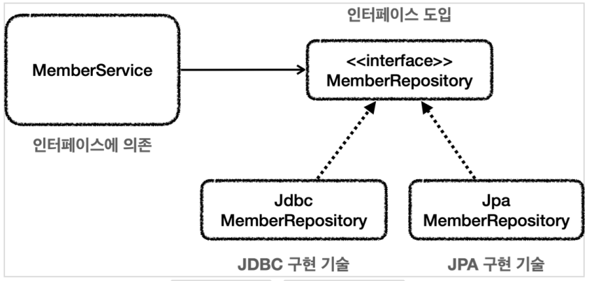

## 체크 예외와 인터페이스

서비스 계층은 가급적 특정 구현 기술에 의존하지 않고, 순수하게 유지하는 것이 좋다. 예를 들어서 서비스가 처리할 수 없는 SQLException 에 대한 의존을 제거하려면 어떻게 해야할까? 서비스가 처리할 수 없으므로 리포지토리가 던지는 SQLException 체크 예외를 런타임 예외로 전환해서 서비스 계층에 던지자.
이렇게 하면 서비스 계층이 해당 예외를 무시할 수 있기 때문에, 특정 구현 기술에 의존하는 부분을 제거하고 서비스 계층을 순수하게 유지할 수 있다.

### 인터페이스 도입



이렇게 인터페이스를 도입하면 MemberService 는 MemberRepository 인터페이스에만 의존하면 된다.

이제 구현 기술을 변경하고 싶으면 DI를 사용해서 MemberService 코드의 변경 없이 구현 기술을 변경할 수 있다.

**런타임 예외 적용**

MemberRepository 인터페이스

```
public interface MemberRepository {
  Member save(Member member);
  Member findById(String memberId);
  void update(String memberId, int money);
  void delete(String memberId);
}
```

MyDbException 런타임 예외

```
public class MyDbException extends RuntimeException {
  public MyDbException() {
  }
  public MyDbException(String message) {
    super(message);
  }
  public MyDbException(String message, Throwable cause) {
    super(message, cause);
  }
  public MyDbException(Throwable cause) {
    super(cause);
  }
}
```

RuntimeException 을 상속받았다. 따라서 MyDbException 은 런타임(언체크) 예외가 된다.

```
@Slf4j
public class MemberRepositoryV4 implements MemberRepository {
  private final DataSource dataSource;
  public MemberRepositoryV4_1(DataSource dataSource) {
    this.dataSource = dataSource;
  }

  @Override
  public Member save(Member member) {
    String sql = "insert into member(member_id, money) values(?, ?)";
    Connection con = null;
    PreparedStatement pstmt = null;
    try {
      con = getConnection();
      pstmt = con.prepareStatement(sql);
      pstmt.setString(1, member.getMemberId());
      pstmt.setInt(2, member.getMoney());
      pstmt.executeUpdate();
      return member;
    } catch (SQLException e) {
      throw new MyDbException(e);
    } finally {
      close(con, pstmt, null);
    }
  }

  @Override
  public Member findById(String memberId) {
    String sql = "select \* from member where member_id = ?";
    Connection con = null;
    PreparedStatement pstmt = null;
    ResultSet rs = null;
    try {
      con = getConnection();
      pstmt = con.prepareStatement(sql);
      pstmt.setString(1, memberId);
      rs = pstmt.executeQuery();
      if (rs.next()) {
        Member member = new Member();
        member.setMemberId(rs.getString("member_id"));
        member.setMoney(rs.getInt("money"));
        return member;
      } else {
        throw new NoSuchElementException("member not found memberId=" + memberId);
      }
    } catch (SQLException e) {
      throw new MyDbException(e);
    } finally {
      close(con, pstmt, rs);
    }
  }

  @Override
  public void update(String memberId, int money) {
    String sql = "update member set money=? where member_id=?";
    Connection con = null;
    PreparedStatement pstmt = null;
    try {
      con = getConnection();
      pstmt = con.prepareStatement(sql);
      pstmt.setInt(1, money);
      pstmt.setString(2, memberId);
      pstmt.executeUpdate();
    } catch (SQLException e) {
      throw new MyDbException(e);
    } finally {
      close(con, pstmt, null);
    }
  }

  @Override
  public void delete(String memberId) {
    String sql = "delete from member where member_id=?";
    Connection con = null;
    PreparedStatement pstmt = null;
    try {
      con = getConnection();
      pstmt = con.prepareStatement(sql);
      pstmt.setString(1, memberId);
      pstmt.executeUpdate();
    } catch (SQLException e) {
      throw new MyDbException(e);
    } finally {
      close(con, pstmt, null);
    }
  }


}
```

예외 변환 코드

```
catch (SQLException e) {
 throw new MyDbException(e);
}
```

기존 예외를 생성자를 통해서 포함하고 있는 것을 확인할 수 있다. 예외는 원인이 되는 예외를 내부에 포함할 수 있는데, 꼭 이렇게 작성해야 한다. 그래야 예외를 출력했을 때 원인이 되는 기존 예외도 함께 확인할 수 있다.
MyDbException 이 내부에 SQLException 을 포함하고 있다고 이해하면 된다. 예외를 출력했을 때 스택 트레이스를 통해 둘다 확인할 수 있다.
