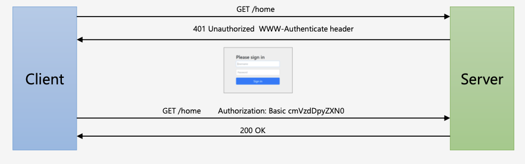

# 스프링 시큐리티 기본 API 및 Filter

## 인증 API

### 사용자 정의 보안 기능 구현

스프링 프로젝트의 pom.xml 파일에 의존성 추가

```
<dependency>
  <groupId>org.springframework.boot</groupId> <artifactId>spring-boot-starter-security</artifactId>
</dependency>
```

스프링 시큐리티 의존성 추가 시 다음 기능 기본 제공

-   서버가 기동되면 스프링 시큐리티의 초기화 작업 및 보안 설정이 이루어진다.
-   별도의 설정이나 구현을 하지 않아도 기본적인 웹 보안 기능이 시스템에 연동되어 작동한다.
    -   모든 요청은 인증이 되어야 자원에 접근 가능
    -   인증 방식은 폼 로그인 방식과 httpBasic 로그인 방식 제공
    -   기본 로그인 페이지 /login 제공
    -   기본 계정 한 개 제공 - username : user / password : 랜덤 생성

스프링 시큐리티가 기본적으로 제공하는 기능에서 계정 추가, 권한 추가, DB 연동 등 기본적인 보안 기능 외에 시스템에서 필요로 하는 더 세부적이고 추가적인 보안기능이 필요하다.

스프링 시큐리티는 이러한 사용자 정의 보안기능을 제공하기 위해 WebSecurityConfigurerAdapter를 제공한다. 스프링 시큐리티의 웹 보안 기능 초기화 및 설정을 할 수 있다.

WebSecurityConfigurerAdapter를 상속하는 사용자 정의 보안 설정 클래스를 만들어서 구현하면 된다.

WebSecurityConfiurerAdapter는 HttpSecurity 클래스를 생성하고 이는 세부적인 보안 기능을 설정할 수 있는 API를 제공한다. (http.formLogin, http.authorizeRequest() 등)

```
@Configuration
@EnableWebSecurity
public class SecurityConfig extends WebSecurityConfigurerAdapter {
    @Override
    protected void configure(HttpSecurity http) throws Exception {
        http
                .authorizeRequests()
                .anyRequest().authenticated()
                .and()
                .formLogin();
    }
}
```

### HTTP Basic 인증, BasicAuthenticationFilter

HTTP Basic 인증



HTTP는 자체적인 인증 관련 기능을 제공하며 HTTP 표준에 정의된 가장 단순한 인증기법이다.

간단한 설정과 Stateless 가 장정 - Session Cookie(JESSIONID) 사용하지 않음

보호자원 접근시 서버가 클라이언트에게 401 Unauthorized 응답과 함께 WWW-Authenticate header를 기술해서 인증요구를 보냄

Client는 ID:Password 값을 Base64로 Encoding한 문자열을 Authorization Header에 추가한 뒤 Server에게 Resource를 요청

-   Authorization: Basic cmVzdDpyZXN0

ID, Password가 Base64로 Encoding되어 있어 ID, Password가 외부에 쉽게 노출되는 구조이기 때문에 SSL이나 TLS는 필수이다.

BasicAuthenticationFilter


By default the SecurityContextHolder uses a ThreadLocal to store these details, which means that the SecurityContext is always available to methods in the same thread, even if the SecurityContext is not explicitly passed around as an argument to those methods.


1.  사용자가 Request 요청
2.  SecurityContextPersistenceFilter는 매 번 요청마다 수행된다.
3.  SecurityContextPersistenceFilter내부적으로 HttpSecurityContextRepository 가 로직 수행
    → HttpSecurityContextRepository: SecurityContext 객체를 생성, 조회 하는 역할을 하는 클래스

-   a.(인증 전)
    i.
    새로운 컨텍스트 생성(SecurityContextHolder)
    → 이 때는 SecurityContext 객체는 null 이다
    ii.
    그 다음 필터로 이동한다(chain.doFIlter)
    iii.
    인증 필터(AuthFilter)가 인증을 처리 한다.
    iv.
    인증이 완료되면 인증객체(Authentication)생성 후 SecurityContext 객체안에 저장된다.
    v.
    다음 필터 수행(chain.doFilter)
    vi.
    Client에게 응답하는 시점에서 Session에 SecurityContext저장
    → SecurityContextPerstenceFIlter가 하는 것이다.
    vii.
    SecurityContext 제거(Clear())
    viii.
    응답(Response)

-   b. (인증 후)
    i.
    Session에서 SecurityContext가 있는지 확인
    → 인증이 된 이후이기에 존재한다.
    ii.
    SecurityContext를 꺼내어 SecurityContextHolder에 집어넣는다.
    iii.
    다음 필터 수행(chain.doFilter)

### UsernamePasswordAuthenticationFilter

Login Form 인증


1. AntPathRequestmatcher(/login)
   → 사용자가 요청한 요청정보를 확인하여 요청정보 Url이 /login으로 시작하는지 확인한다.
   요청한다면 다음단계로(인증처리) 진행되고, 일치하지 않는다면 다음 필터로 진행된다.(chain.doFilter)
   /login url은 .loginProcessingUrl()으로 변경 가능하다.

2. Authentication 에서 실제 인증처리를 하게 되는데, 로그인 페이지에서 입력한 Username과 Password를 인증객체(Authentication)에 저장해서 인증처리(AuthenticationManager)를 맡기는 역할을 한다.
   → 여기까지가 인증처리를 하기전에 필터가 하는 역할.

3. 인증관리자(AuthenticationManager)는 내부적으로 AuthenticationProvider 에게 인증처리를 위임하게 된다. 해당 Provider가 인증처리를 담당하는 클래스로써 인증에 성공/실패를 반환하는데 실패할 경우 AuthenticationException 예외를 반환하여 UsernamePasswordAuthenticationFilter로 돌아가서 예외처리를 수행하고, 인증에 성공하게 되면, Authentication 객체를 생성하여
   User객체와 Authorities객체를 담아서 AuthenticationManager에게 반환한다.

4. AuthenticationManager는 Provider로부터 반환받은 인증객체(인증결과 유저(User), 유저권한정보(Authorities))를 SecurityContext객체에 저장한다.

5. SecurityContext는 Session에도 저장되어 전역적으로 SecurityContext를 참조할 수 있다.

6. 인증 성공 이후에는 SuccessHandler에서 인증 성공이후의 로직을 수행하게 된다.

UsernamePasswordAuthenticationFilter


### Logout, LogoutFilter

클라이언트가 로그아웃 요청을 보내면 서버는 저장된 세션을 무효화, 인증토큰(Security Context에 있는) 삭제, 쿠키정보 삭제, 로그인 페이지로 리다이렉트 시킴


1. 요청이 Logout Url 인지 확인
2. 맞을 경우 SecurityContext에서 인증객체(Authentication)객체를 꺼내옴
3. SecurityContextLogoutHandler에서 세션 무효화, 쿠키삭제, clearContext()를통해 SecurityContext객체를 삭제하고 인증객체도 null로 만든다.
4. SimpleUrlLogoutSuccessHandler를 통해 로그인페이지로 리다이렉트 시킨다

LogoutFilter


```
@Configuration
@EnableWebSecurity
public class SecurityConfig extends WebSecurityConfigurerAdapter {

    @Override
    protected void configure(HttpSecurity http) throws Exception {
        http
                .logout()//로그아웃 처리
                .logoutUrl("/logout")// 로그아웃 처리 URL
                .logoutSuccessUrl("/login")//로그아웃 성공 후 이동페이지
                .deleteCookies("JSESSIONID","remember-me")//로그아웃 후 쿠키 삭제
                .addLogoutHandler(new LogoutHandler() {
                    @Override
                    public void logout(HttpServletRequest request,
																			 HttpServletResponse response,
																			 Authentication authentication) {
                        HttpSession session = request.getSession();
                        session.invalidate();
                    }
                })//로그아웃 핸들러
                .logoutSuccessHandler(new LogoutSuccessHandler() {
                    @Override
                    public void onLogoutSuccess(HttpServletRequest request,
																								HttpServletResponse response,
																								Authentication authentication) throws IOException, ServletException {
                        response.sendRedirect("/login");
                    }
                })//로그아웃 성공 후 핸들러
                .deleteCookies("remember-me");//쿠키 삭제
    }
```

### Remember Me 인증

세션이 만료되고 웹 브라이저가 종료된 후에도 어플리케이션이 사용자를 기억하는 기능이다.
Remember-Me 쿠키에 대한 Http 요청을 확인한 후 토큰 기반 인증을 사용해 유효성을 검사하고 토큰이 검증되면 사용자는 로그인 된다.

사용자 라이프 사이클

-   인증 성공(Remember-Me 쿠키 설정)
-   인증 실패(쿠키가 존재하면 쿠키 무효화)
-   로그아웃(쿠키가 존재하면 쿠키 무효화)

http.rememberMe() : rememberMe 기능 적용

Remember-me 를 적용하고 로그인을 하면 서버의 응답 헤더에 remember-me 쿠키 설정을 함께 보내고 사용자 브라우저에 remember-me 쿠키가 설정된다. 이 쿠키의 값은 사용자의 아이디와 비밀번호가 인코딩 되어있다. 사용자가 이 쿠키정보를 요청 헤더에 함께 서버에 요청을 보내면 RememberMeAuthenticationFilter에서 해당 쿠키 값을 디코딩하여 아이디와 비밀번호를 통해 다시 인증을 시도한다.

```
@Configuration
@EnableWebSecurity
public class SecurityConfig extends WebSecurityConfigurerAdapter {
		@Autowired
    UserDetailsService userDetailsService;

    @Override
    protected void configure(HttpSecurity http) throws Exception {
				http
                .rememberMe()//rememberMe기능 작동
                .rememberMeParameter("remember-me") //기본 파라미터명은 remember-me
                .tokenValiditySeconds(3600)//default는 14일
                .alwaysRemember(true)//remember me 기능이 활성화되지 않아도 항상 실행. default false
                .userDetailsService(userDetailsService);//Remember me에서 시스템에 있는 사용자 계정을 조회할때 사용할 클래스
		}
}
```


RememberMeAuthenticationFilter는 먼저 인증객체가 null 일 경우에 작동한다. 인증객체는 Security Context에 있는데 인증객체가 null 인 경우는 사용자 세션이 만료되어 해당 세션에 저장된 Security Context가 삭제되어 인증객체를 못찾을 때 null 이다. 그리고 사용자가 Remember-me 쿠키를 가지고 있는 경우이다.


세션에는 SecurityContext 가 저장.

스프링 시큐리티에서는 SecurityContext 안에 Authentication 객체가 존재하는지의 유무를 체크해서 인증여부를 결정.

그렇기 때문에 SecurityContext 는 사용자가 재접속하더라도 인증 당시의 데이터가 보존이 되어 있어야 함.

사용자가 인증처리가 완료된 후 다시 사이트를 접속했을 때 세션에 저장된 SecurityContext 를 꺼내어 와서 SecurityContextHolder 에 저장하게 되고 이는 전역으로 SecurityContext 를 참조할 수 있게 하는 원리가 됩니다.

### AnonymousAuthenticationFilter


인증에 실패하면 원래는 인증객체가 null이 되지만 익명사용자 인증 처리 필터를 쓰면 익명 인증객체를 만들어 SecurityContextHolder안의 SecurityContext에 저장한다.

익명사용자와 인증 사용자를 구분해서 처리하기 위한 용도로 사용된다.
화면에서 인증 여부를 구현할 때 isAnonymous() 와 isAuthenticated()로 구분해서 사용.
인증객체를 세션에 저장하지 않는다.

### 동시 세션 제어 / 세션고정보호 / 세션정책


1.이전 사용자 세션 만료

사용자1과 사용자2가 동일한 아이디를 사용하고 있다고 하자. 사용자1이 먼저 서버에 로그인을 하여 서버에는 해당 아이디에 대한 세션이 생성되었다. 만약 최대 세션 허용 개수가 1개라하면, 사용자2가 동일한 아이디로 로그인하였을 때, 서버에 세션이 이미 존재하므로 이전 사용자(사용자1)의 세션을 만료시켜서 사용자2에게 세션을 만들어준다.

2.현재 사용자 인증 실패

1과 같은 상황에서 사용자2가 로그인할 때 인증예외를 발생시켜서 사용자2의 접근을 막고 사용자1의 세션을 유지시킨다.

```
@Configuration
@EnableWebSecurity
public class SecurityConfig extends WebSecurityConfigurerAdapter {
    @Autowired
    UserDetailsService userDetailsService;

    @Override
    protected void configure(HttpSecurity http) throws Exception {
        http
                .sessionManagement() //세션 관리 기능이 작동함
                .invalidSessionUrl("/invalid")//세션이 유효하지 않을 때 이동 할 페이지
                .maximumSessions(1)//최대 허용 가능 세션 수, (-1: 무제한)
                .maxSessionsPreventsLogin(true)//동시 로그인 차단함, false: 기존 세션 만료(default)
                .expiredUrl("/expired");//세션이 만료된 경우 이동할 페이지
		}
}
```

세션 고정 보호


세션 고정 공격
공격자가 서버에 접속을해서 JSSEIONID를 발급받아서 사용자에게 자신이 발급받은 세션쿠키를 심어놓게되면 사용자가 세션쿠키로 로그인 시도했을 경우 공격자는 같은 쿠키값으로 인증되어 있기 때문에 공격자는 사용자 정보를 공유하게 된다.

세션 고정 보호
사용자가 공격자 세션쿠키로 로그인을 시도하더라도 로그인시마다 새로운 세션ID를 발급하여 제공하게 되면, JSSEIONID가 다르기 때문에, 공격자는 같은 쿠키값으로 사용자 정보를 공유받을 수 없다.

```
@Configuration
@EnableWebSecurity
public class SecurityConfig extends WebSecurityConfigurerAdapter {
    @Autowired
    UserDetailsService userDetailsService;

    @Override
    protected void configure(HttpSecurity http) throws Exception {

        http
                .sessionManagement()
                .sessionFixation().changeSessionId();// 기본값 -> 세션은 유지하되 세션아이디는 계속 새로 발급(servlet 3.1이상 기본 값)
                                                     // none, migrateSession, newSession
		}
}
```

none() : 세션이 새로 생성되지 않고 그대로 유지되기 때문에 세션 고정 공격에 취약하다.
migrateSession() : 새로운 세션도 생성되고 세션아이디도 발급된다. (sevlet 3.1 이하 기본 값) + 이전 세션의 속성값들도 유지된다.
newSession() : 세션이 새롭게 생성되고, 세션아이디도 발급되지만, 이전 세션의 속성값들을 유지할 수 없다.

세션 정책

인증처리를 할 때 꼭 스프링 시큐리티에서 세션을 생성할 필요는 없고, 오히려 외부 서비스를 통해 인증 토큰을 발급하는 방식을 사용 할 수도 있다. 예를들어 JWT 토큰을 사용하거나, KeyCloak같은 외부 서비스를 사용할수도 있다. 이런 경우에는 굳이 스프링 시큐리티를 통해 세션을 생성할 필요가 없다. 그래서 이런 세션 생성 정책도 설정을 통해 지정해 줄 수 있다.

```
@Configuration
@EnableWebSecurity
public class SecurityConfig extends WebSecurityConfigurerAdapter {
    @Autowired
    UserDetailsService userDetailsService;

    @Override
    protected void configure(HttpSecurity http) throws Exception {

        http
                .sessionManagement()// 세션 관리 기능이 작동함.
                .sessionCreationPolicy(SessionCreationPolicy.IF_REQUIRED);
		}
}
```

SessionCreationPolicy.Always : 스프링 시큐리티가 항상 세션 생성
SessionCreationPolicy.IF_REQUIRED : 스프링 시큐리티가 필요 시 생성(default)
SessionCreationPolicy.Never : 스프링 시큐리티가 생성하지 않지만 이미 존재하면 사용
SessionCreationPolicy.Stateless: 스프링 시큐리티가 생성하지 않고 존재해도 사용하지 않음.
→ JWT 토큰방식을 사용할 때는 Stateless 정책을 사용한다.

### SessionManagementFilter, ConcurrentSessionFilter

SessionManagementFilter

1. 세션관리 → 인증 시 사용자의 세션정보를 등록, 조회, 삭제 등의 세션 이력을 관리
2. 동시적 세션 제어 → 동일 계정으로 접속이 허용되는 최대 세션수를 제한
3. 세션 고정 보호 → 인증 할 때마다 세션 쿠키를 새로 발급하여 공격자의 쿠키 조작을 방지
4. 세션 생성 정책 → Always, if_required, Never, Stateless

ConcurrentSessionFilter

매 요청 마다 현재 사용자의 세션 만료 여부 체크
세션이 만료되었을 경우 즉시 만료 처리
session.isExired() == true

-   로그아웃 처리
-   즉시 오류 페이지 응답(This session has been expired)


<br>
<hr>

## 인가 API

### 권한 설정 및 표현식

권한 설정

-   선언적 방식
    -   URL
        -   http.antMatchers("/users/\*\*").hasRole("USER")
    -   Method
        -   @PreAuthorize("hasRole('USRE')")
            -   public void user(){System.out.println("user")}
-   동적 방식 - DB 연동 프로그래밍
    -   URL
    -   Method

```
@Override
protected void configure(HttpSecurity http) throws Exception {
    http
            .antMatcher("/shop/**") //특정 경로를 지정 해당 메서드를 생략하면 모든 경로에 대해 검색하게 된다.
            .authorizeRequests() //보안 검사기능 시작
            .antMatchers("/shop/login", "/shop/users/**").permitAll() //해당경로에 대한 모든 접근을 하용한다.
            .antMatchers("/shop/mypage").hasRole("USER") // /show/mypage는 USER권한을 가지고있는 사용자에게만 허용한다.
            .antMatchers("/shop/admin/pay").access("hasRole('ADMIN')")
            .antMatchers("/shop/admin/**").access("hasRole('ADMIN') or hasRole('SYS ')")
            .anyRequest().authenticated();
}
```

설정시 구체적인 경로("/shop/admin/pay")가 먼저 설정되고 그 다음에 더 넓은 범위가 설정되어야 한다. 이유는 불필요한 검사를 막기 위해서이다.
예를들어, .antMatchers("/shop/admin/\*\*").access("hasRole('ADMIN') or hasRole('SYS ')") 설정이 더 위로간다면, SYS유저는 해당 검사를 통과하고 그 아래에서 걸리게 된다.

표현식


```
/*Application*/
@Slf4j
@Configuration
@EnableWebSecurity
public class SecurityConfig extends WebSecurityConfigurerAdapter {
    @Autowired
    UserDetailsService userDetailsService;


		/*메모리방식으로 사용자 생성및 비밀번호와 권한 설정 메서드*/
    @Override
    protected void configure(AuthenticationManagerBuilder auth) throws Exception {
				//{noop}비밀번호 형식을 적어준 것으로 noop은 따로 인코딩방식X
        auth.inMemoryAuthentication().withUser("user").password("{noop}1111").roles("USER");
        auth.inMemoryAuthentication().withUser("sys").password("{noop}1111").roles("SYS","USER");
        auth.inMemoryAuthentication().withUser("admin").password("{noop}1111").roles("ADMIN","SYS","USER");
    }

    @Override
    protected void configure(HttpSecurity http) throws Exception {
        http
                .authorizeRequests()
                .antMatchers("/user").hasRole("USER")
                .antMatchers("/admin/pay").hasRole("ADMIN")
                .antMatchers("/admin/**").access("hasRole('ADMIN') or hasRole('SYS')")
                .anyRequest().authenticated();
        http
                .formLogin();
    }
}

/*Controller*/
@RestController
public class SecurityController {

    @GetMapping("/")
    public String index(){
        return "home";
    }

    @GetMapping("loginPage")
    public String loginPage(){
        return "loginPage";
    }

    @GetMapping("/user")
    public String user(){
        return "user";
    }

    @GetMapping("/admin/pay")
    public String adminPay(){
        return "adminPay";
    }

    @GetMapping("/admin/**")
    public String adminAll(){
        return "admin";
    }
}
```

configure()메서드의 순서 /admin/** 과 /admin/pay 의 순서를 바꾸면 어떻게 될 것인가?
-> SYS권한 유저가 /admin/pay 에 접근 권한 검사를 하기전 /admin/** 권한 검사에서 통과가 되버리기 때문에 /admin/pay 경로 접속이 허용되게 된다. 그렇기 때문에 접속 권한 설정시 작은 부분에서 큰부분으로 설정을 해야 한다.

### ExceptionTranslationFilter, RequestCacheAwareFilter

ExceptionTranslationFilter

SpringSecurity가 관리하는 보안 필터중 마지막 필터가 FilterSecurityInterceptor이고, 바로 전 필터가 ExceptionTranslationFilter이다. 해당 필터에서 사용자의 요청을 받을 때, 그 다음 필터로 그 요청을 전달할 때 try-catch로 감싸서 FilterSecurityInterceptor 를 호출하고 있고, 해당 필터에서 생기는 인증및 인가 예외는
ExceptionTranslationFilter로 throw 하고 있다. 그 예외를 ExceiptionTranslationFilter에서 처리한다.

-   AuthenticationException
    인증 예외 처리

    1.  AuthenticationEntryPoint 호출
        → 로그인 페이지 이동, 401(Unauthorized) 오류 코드 전달 등

    2.  인증 예외가 발생하기 전의 요청정보를 저장
        → RequestCache - 사용자의 이전 요청 정보를 세션에 저장하고 이를 꺼내 오는 캐시 메커니즘
        → SavedRequest - 사용자가 요청했던 request 파라미터 값들, 그 당시의 헤더값들 등이 저장

-   AccessDeniedException
    인가 예외 처리
    AccessDeniedHandler 에서 예외 처리하도록 제공


1.익명 사용자가 /user에 접근을 시도한다고 가정한다.

2.FilterSecurityInterceptor 권한 필터가 해당 요청(/user)을 받았지만, 해당 유저는 인증을 받지 않은 상태.

3.해당 필터는 인증 예외를 발생한다.
→ 정확히는 인가 예외를 던진다. 왜냐하면 해당 사용자는 익명(anonymouse)사용자이기에 인증을 받지 않은 상태라서 인가 예외(AccessDeniedException)로 빠진다.

4.인가 예외(AccessDeniedException)는 익명 사용자이거나 RememberMe사용자일 경우 AccessDeniedHandler를 호출하지 않고 AuthenticationException 에서 처리하는 로직으로 보내게 된다.

5.인증 예외 (AuthenticationException) 두 가지 일을 한다.

-   a.AuthenticationEntryPoint 구현체 안에서 login페이지로 리다이렉트 한다. (인증 실패 이후)
    → Security Context를 null로 초기화해주는 작업도 해준다.
-   b.예외 발생 이전에 유저가 가고자 했던 요청정보를 DefaultSavedRequest객체에 저장하고 해당 객체는 Session에 저장되고 Session 에 저장하는 역할을 HttpSessionRequestCache에서 해준다.

1.인증절차를 밟은 일반 유저가 /user자원에 접근을 시도하는데 해당 자원에 설정된 허가 권한이 ADMIN일 경우.

2.권한이 없기 때문에 인가 예외 발생

3.AccessDeniedException이 발생한다.

4.AccessDeniedHandler 호출해서 후속작업을 처리한다.
→ 보통은 denied 페이지로 이동한다.

```
Override
    protected void configure(HttpSecurity http) throws Exception {
        http
                .authorizeRequests()
                .antMatchers("/login").permitAll()
                .antMatchers("/user").hasRole("USER")
                .antMatchers("/admin/**").access("hasRole('ADMIN') or hasRole('SYS')")
                .antMatchers("/admin/pay").hasRole("ADMIN")
                .anyRequest().authenticated();
        http
                .formLogin()
                .successHandler(new AuthenticationSuccessHandler() {
                    @Override
                    public void onAuthenticationSuccess(HttpServletRequest request,
                                                        HttpServletResponse response,
                                                        Authentication authentication) throws IOException, ServletException {
                        RequestCache requestCache = new HttpSessionRequestCache();
                        SavedRequest savedRequest = requestCache.getRequest(request, response);
                        String redirectUrl = savedRequest.getRedirectUrl();
                        response.sendRedirect(redirectUrl);
                    }
                });

        http
                .exceptionHandling() //예외처리 기능이 작동
                .authenticationEntryPoint(new AuthenticationEntryPoint() {
                    @Override
                    public void commence(HttpServletRequest request,
                                         HttpServletResponse response,
                                         AuthenticationException authException) throws IOException, ServletException {
                        response.sendRedirect("/login");
                    }
                }) //인증실패 시 처리
                .accessDeniedHandler(new AccessDeniedHandler() {
                    @Override
                    public void handle(HttpServletRequest request,
                                       HttpServletResponse response,
                                       AccessDeniedException accessDeniedException) throws IOException, ServletException {
                        response.sendRedirect("/denied");
                    }
                });//인증실패 시 처리

    }
```


### CSRF, CsrfFilter

Form 인증 - CSRF(사이트 간 요청 위조)


사용자의 의도와는 무관하게 공격자가 심어놓은 특정 방식을 통해 자원 요청을 하게되고 그것을 응답을 받을 수 있도록 하는 것을 CSRF(사이트 간 요청 위조) 라 한다.

CsrfFilter

-   모든 요청에 랜덤하게 생성된 토큰을 HTTP 파라미터로 요구
-   요청 시 전달되는 토큰 값과 서버에 저장된 실제 값과 비교한 후 만약 일치하지 않으면 요청은 실패한다.

*   Client
    -   `<input type="hidden" name="${_csrf.parameterName}" value="${_csrf.token}" />`
    -   HTTP 메소드 : PATCH, POST, PUT, DELETE
*   Spring Security
    -   http.csrf() : 기본 활성화되어 있음
    -   http.csrf().disabled() : 비활성화

<script src="https://utteranc.es/client.js"
        repo="chojs23/comments"
        issue-term="pathname"
        theme="github-light"
        crossorigin="anonymous"
        async>
</script>

```

```
